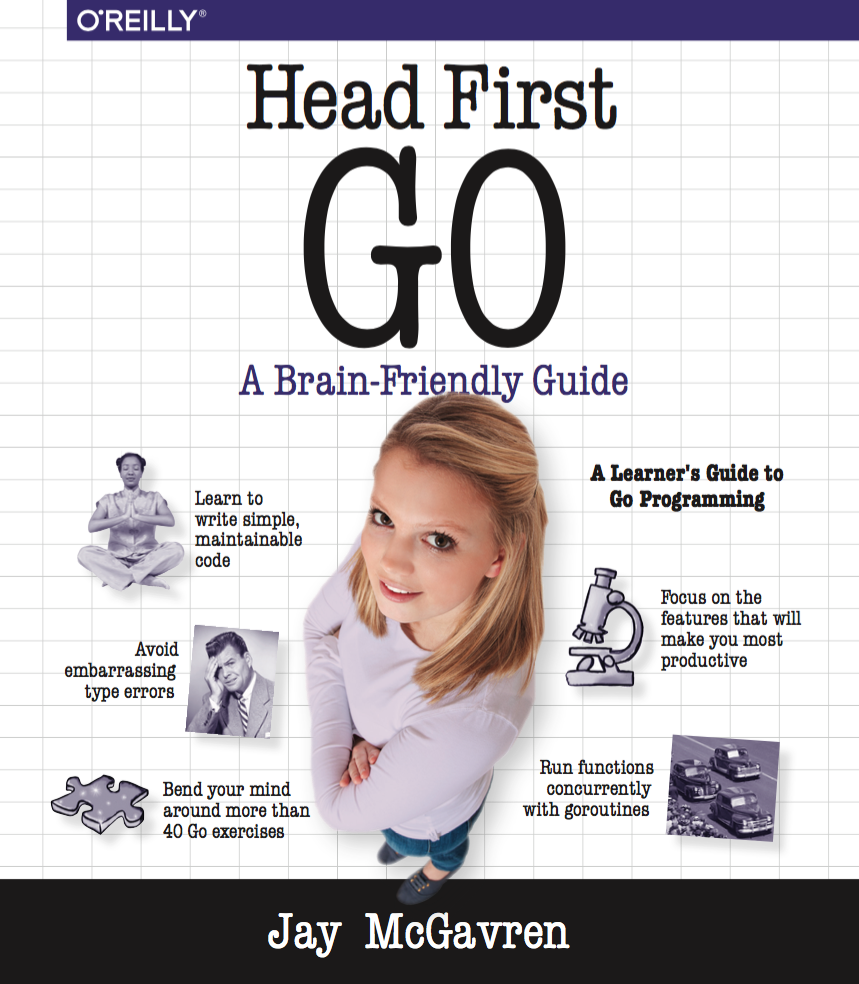
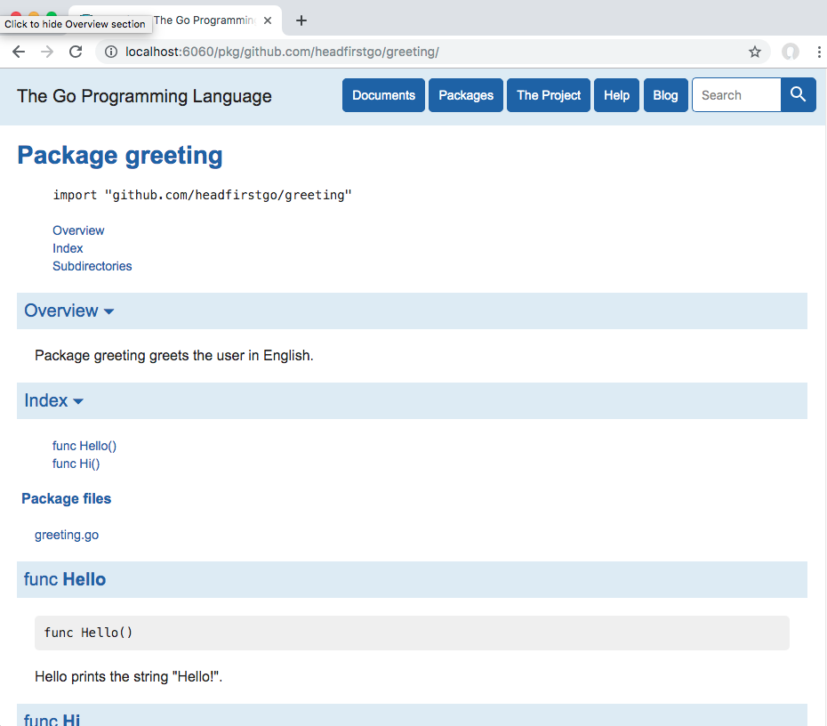
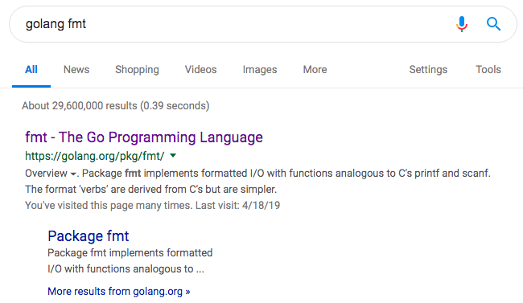
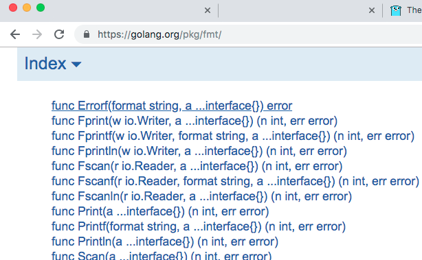

## Get set up

* Please sit as close as possible - some slides have small print!
* Introduce yourself to your neighbors - we're counting on you to help each other out!
* We'll be using the Go Playground website (`play.golang.org`) a lot, so get connected to conference WiFi - see me or a TA if you're having trouble.
* Hopefully you already have the Go compiler installed. If not, please see me or a TA ASAP!


# Introduction to the Go Programming Language

## About me

* Author, _Head First Go_



## About me

* Online software development instructor
* See my courses at `https://teamtreehouse.com`

## Talk overview

TODO

## Talk overview

You can review these slides at:

`https://github.com/jaymcgavren/presentations`

We'll show that URL again at the end.


# Why Go?

## Go at a glance

* C-like syntax
* Compiles to native code
* Type-safe
* Garbage collected
* Concurrency built into language

## OK, but what can you do with Go?

## Docker


## Docker

* "'go build' will embed everything you need. (No more 'install this in order to run my stuff'.)"
* "Extensive standard library and data types."
* "Strong duck typing."

—Jérôme Petazzoni, "Docker and Go: why did we decide to write Docker in Go?"

::: notes

https://www.slideshare.net/jpetazzo/docker-and-go-why-did-we-decide-to-write-docker-in-go

:::

## Kubernetes


## Kubernetes

* "Code in Go isn't overly complex. People don't create FactoryFactory objects."
* "Something with the feel of C with more advanced features like anonymous functions is a great combo."
* "Garbage Collection: We all know how to clean up after our selves but it is so nice to not have to worry about it."

—Joe Beda, "Kubernetes + Go = Crazy Delicious"

## Playground

* You don't even have to install Go to try it!
* Edit and run Go code in your browser


## Exercises for this training

* The Go Playground lets you save your code and share it at a URL
* Others can edit that code
* We'll use that ability for most of our exercises
* We'll post a link
* You visit it and follow the instructions there (add code, fill in blanks, etc.)


# A Sneak Peek

## Sneak peek: Hello, world

``` go
package main

import "fmt"

func main() {
	fmt.Println("Hello, world!") // => Hello, world!
}
```

## Sneak peek: A tiny web app

``` go
package main

import (
	"log"
	"net/http"
)

func helloHandler(writer http.ResponseWriter, request *http.Request) {
	writer.Write([]byte("<h1>Hello, web!</h1>"))
}

func main() {
	http.HandleFunc("/hello", helloHandler)
	err := http.ListenAndServe("localhost:8080", nil)
	log.Fatal(err)
}
```

## Sneak peek: goroutines and channels

``` go
package main

import (
	"fmt"
	"io/ioutil"
	"net/http"
	"time"
)

func responseSize(url string, channel chan int) {
	fmt.Println("Getting", url)
	response, _ := http.Get(url)
	defer response.Body.Close()
	body, _ := ioutil.ReadAll(response.Body)
	channel <- len(body)
}
```

## Sneak peek: goroutines and channels

``` go
func main() {
	sizes := make(chan int)
	go responseSize("https://example.com/", sizes)
	go responseSize("https://golang.org/", sizes)
	go responseSize("https://golang.org/doc", sizes)
	fmt.Println(<-sizes) // => 1270
	fmt.Println(<-sizes) // => 8158
	fmt.Println(<-sizes) // => 12558
}
```

## Sneak peek

We'll take a more detailed look at each of these programs later.


# Tools Included with Go

## "go fmt"

* Automatically fixes code style
* Acts as community's style guide
* No more arguing tabs vs. spaces!

## "go fmt"

Before

``` go
package main

import "fmt"

func main() {
repeatLine("hello", 3     )
}

func repeatLine( line string ,times  int) {
	for i := 0; i < times; i++ {
fmt.Println(line)
	}
}
```

## "go fmt"

``` go
$ go fmt repeat.go
```

## "go fmt"

After

``` go
package main

import "fmt"

func main() {
	repeatLine("hello", 3)
}

func repeatLine(line string, times int) {
	for i := 0; i < times; i++ {
		fmt.Println(line)
	}
}
```

## "go run"

* Compiles a Go source file and runs it
* No executable is saved

``` go
$ go run repeat.go
hello
hello
hello
```

## "go build"

* Compiles Go source file(s) into an executable

``` go
$ go build repeat.go
$ ls -l
-rwxr-xr-x 1 jay staff 2106512 May  1 21:13 repeat
-rw-r--r-- 1 jay staff     166 May  1 21:13 repeat.go
$ ./repeat
hello
hello
hello
```

## Cross-compilation

Compile for Windows from Mac:

```
$ env GOOS=windows ENV=amd64 go build repeat.go
$ ls -l
-rwxr-xr-x 1 jay staff 2065920 May  1 21:13 repeat.exe
-rw-r--r-- 1 jay staff     166 May  1 21:13 repeat.go
```

## Cross-compilation

Compile for Mac from Windows:

```
C:\work> set GOOS=darwin
C:\work> set ENV=amd64
C:\work> go build repeat.go
```

* Also supports Linux, and more!
* Google "golang goos" to learn the various options.


# Writing Go Programs

## Go file layout

* Package clause
* Imports
* Code

``` go
package main

import "fmt"

func main() {
	fmt.Println("Hello, Go!")
}
```

## The "main" package

* The `main` package defines an executable program rather than a library.
* When the program runs, Go will look for a function (also) named `main` and call that first.
* The `main` function body needs to call any other functions needed by the program.

``` go
package main

import "fmt"

func main() {
	fmt.Println("Hello, Go!")
}
```

## Calling Functions

* If the function's in another package, write the package name followed by a dot.
* Write the function name.
* Write a pair of parentheses containing arguments to the function (if any).

``` go
package main

import "fmt"

func main() {
	fmt.Println() // No arguments
	fmt.Println("argument 1")
	fmt.Println("argument 1", "argument 2")
}
```

## Calling Functions

* `fmt.Println` can take any number and type of arguments.
* Most functions require a _specific_ number and type of arguments.

``` go
package main

import "math"

func main() {
	math.Floor(3.1415)        // valid...
	math.Floor()              // not enough arguments
	math.Floor(3.1415, 12.34) // too many arguments
	math.Floor("a string")    // wrong type
}
```

## Calling Functions

Prior program results in compile errors like this:

``` go
./prog.go:7:12: not enough arguments in call to math.Floor
	have ()
	want (float64)
./prog.go:8:12: too many arguments in call to math.Floor
	have (number, number)
	want (float64)
./prog.go:9:13: cannot use "a string" (type string) as type float64 in argument to math.Floor
```

## Imports

Other packages have to be imported before you can call their functions.

``` go
package main

func main() {
	fmt.Println(math.Floor(2.75))
	fmt.Println(strings.Title("head first go"))
}
```

Compile errors:

```
prog.go:4:2: undefined: fmt
prog.go:4:14: undefined: math
prog.go:5:2: undefined: fmt
prog.go:5:14: undefined: strings
```

## Imports

Need to add `import` statement:

``` go
package main

import (
	"fmt"
	"math"
	"strings"
)

func main() {
	fmt.Println(math.Floor(2.75)) // => 2
	fmt.Println(strings.Title("head first go")) // => Head First Go
}
```

## Unused imports not allowed

``` go
package main

import (
	"fmt"
	"os"
)

func main() {
	fmt.Println("Hello, Go!")
}
```

Compile error:

```
temp.go:5:5: imported and not used: "os"
```

## "goimports"

* Wrapper for `go fmt`
* Automatically adds/removes imports

Install:

``` go
$ go get golang.org/x/tools/cmd/goimports
```

Do a web search for "goimports" for directions on integrating with your editor.

## "goimports"

Before saving

``` go
package main

func main() {
	fmt.Println(math.Floor(2.75))
	fmt.Println(strings.Title("head first go"))
}
```

## "goimports"

After saving

``` go
package main

import (
	"fmt"
	"math"
	"strings"
)

func main() {
	fmt.Println(math.Floor(2.75))
	fmt.Println(strings.Title("head first go"))
}
```

## Exercise: A short program

`https://is.gd/goex_short`

## Exercise: A short program

``` go
// Replace the blanks ("____") in the below code so that it
// compiles, runs, and prints the message "Hello, Gophers!".
____ main

____ "fmt"

____ main() {
	fmt.Println____"Hello, Gophers!"____
}
```

## Exercise: A short program solution

``` go
package main

import "fmt"

func main() {
	fmt.Println("Hello, Gophers!")
}
```

## Variables

* Variables need to be declared.
    * Write the `var` keyword.
    * Write a variable name.
    * Write the variable type.
* Then you can assign values to a variable using `=`.

``` go
var myInteger int
myInteger = 1
var myFloat float64
myFloat = 3.1415
fmt.Println(myInteger)                 // => 1
fmt.Println(myFloat)                   // => 3.1415
fmt.Println(reflect.TypeOf(myInteger)) // => int
fmt.Println(reflect.TypeOf(myFloat))   // => float64
```

## Short Variable Declarations

If you're assigning an initial value, you can let Go derive the variable's type from the value being assigned with a short variable declaration (`:=`).

``` go
myInteger := 1
myFloat := 3.1415
fmt.Println(myInteger)                 // => 1
fmt.Println(myFloat)                   // => 3.1415
fmt.Println(reflect.TypeOf(myInteger)) // => int
fmt.Println(reflect.TypeOf(myFloat))   // => float64
```

## Must use every variable you declare

``` go
subtotal := 24.70
tax := 1.89
fmt.Println(subtotal)
```

Compile error:

```
prog.go:9:2: tax declared and not used
```

## Naming requirements

* Must begin with a letter
* Can have any number of additional numbers and letters

OK:

* `i`
* `length`
* `sheetLength`
* `stack2`

Not OK:

* `sheet length` (Can't have spaces!)
* `2stack` (Can't start with a number!)

## Naming requirements

Can't use Go keywords as names

```
break        default      func         interface    select
case         defer        go           map          struct
chan         else         goto         package      switch
const        fallthrough  if           range        type
continue     for          import       return       var
```

## Naming requirements

Can't use Go keywords as names

``` go
package main

import "fmt"

func main() {
	var var string = "instant replay" // unexpected var, expecting name
	var package string = "FedEx"      // unexpected package, expecting name
	var import string = "BMW"         // unexpected import, expecting name
	fmt.Println(var, package, import) // unexpected var, expecting expression
}
```

## Naming conventions

Use `camelCase` when there are multiple words

OK:

* `sheetLength`
* `SheetLength`

Not OK:

* `sheetlength`
* `sheet_length` (Underscores are legal, but frowned upon.)

## Exercise: Variables

`https://is.gd/goex_variables`

<!-- https://play.golang.org/p/R6SSSyc-uai -->

## Exercise: Variables

``` go
package main

import "fmt"

func main() {
	// YOUR CODE HERE:
	// Declare originalCount and eatenCount variables
	// and assign them values so that the code below
	// will compile and produce the output shown.
	// Do "var" declarations first. Once you've run
	// your code and confirmed it's working, convert
	// the "var" declarations to short declarations.

	fmt.Println("I started with", originalCount, "apples.")            // => I started with 10 apples.
	fmt.Println("Some jerk ate", eatenCount, "apples.")                // => Some jerk ate 4 apples.
	fmt.Println("There are", originalCount-eatenCount, "apples left.") // => There are 6 apples left.
}
```

## Exercise: Variables cheat sheet

TODO

## Exercise: Variables solution ("var" declarations)

``` go
package main

import "fmt"

func main() {
	var originalCount int = 10
	var eatenCount int = 4

	fmt.Println("I started with", originalCount, "apples.")
	fmt.Println("Some jerk ate", eatenCount, "apples.")
	fmt.Println("There are", originalCount-eatenCount, "apples left.")
}

```

## Exercise: Variables solution (short declarations)

``` go
package main

import "fmt"

func main() {
	originalCount := 10
	eatenCount := 4

	fmt.Println("I started with", originalCount, "apples.")
	fmt.Println("Some jerk ate", eatenCount, "apples.")
	fmt.Println("There are", originalCount-eatenCount, "apples left.")
}
```

## Unexported variables

This is a package variable. It's a variable that's in scope anywhere within a package. We'll talk more about these in a bit, so just bear with us for now.

`go/src/mypkg/mypkg.go`

``` go
package mypkg

var packageVariable string
```

## Unexported variables

`go/src/mypkg/mypkg.go`

``` go
package mypkg

// Name starts with lower-case letter, so it's unexported
var packageVariable string
```

`temp.go`

``` go
package main

import(
	"fmt"
	"mypkg"
)

func main() {
	mypkg.packageVariable = "a value"
	fmt.Println(mypkg.packageVariable)
}
```

Compile errors:

```
temp.go:9:2: cannot refer to unexported name mypkg.packageVariable
temp.go:9:2: undefined: mypkg.packageVariable
temp.go:10:14: cannot refer to unexported name mypkg.packageVariable
temp.go:10:14: undefined: mypkg.packageVariable
```

## Exported variables

`go/src/mypkg/mypkg.go`

``` go
package mypkg

// Name capitalized, so it's exported
var PackageVariable string
```

`temp.go`

``` go
package main

import(
	"fmt"
	"mypkg"
)

func main() {
	mypkg.PackageVariable = "a value"
	fmt.Println(mypkg.PackageVariable) // => a value
}
```

## Naming conventions

Same for functions, types, struct fields, etc.

``` go
type myType struct {
	field1 string
	field2 float64
}

func myFunction(m myType) {
	fmt.Println(m)
}
```

## Avoid shadowing

``` go
func main() {
	var int int = 12
	var append string = "minutes of bonus footage"
	var fmt string = "DVD"
	var count int
	var languages = append([]string{}, "Español")
	fmt.Println(int, append, "on", fmt, languages)
}
```

``` go
imported and not used: "fmt"
int is not a type
cannot call non-function append (type string), declared at prog.go:7:6
fmt.Println undefined (type string has no field or method Println)
```

## Zero Values

* A default value for every type.
* For numeric types, the zero value is `0`:

``` go
var myInteger int
fmt.Println(myInteger) // => 0
var myFloat float64
fmt.Println(myFloat)   // => 0
```

## Zero Values

* For `string`, the zero value is `""`.
* For `bool`, the zero value is `false`.

``` go
var myString string
fmt.Println(myString) // => 
var myBool bool
fmt.Println(myBool)   // => false
```

## Zero Values

* The idea is to make it safe to operate on values that aren't explicitly initialized.

``` go
func main() {
	var counter int // Zero value is 0
	fmt.Println(counter) // => 0
	counter++
	fmt.Println(counter) // => 1
	counter++
	fmt.Println(counter) // => 2
}
```

## Zero Values

* The idea is to make it safe to operate on values that aren't explicitly initialized.

``` go
func main() {
	var sentence string // Zero value is ""
	sentence += "I "
	sentence += "love "
	sentence += "zero "
	sentence += "values."
	fmt.Println(sentence) // => I love zero values.
}
```

## "fmt.Printf"

Sometimes the default formatting for a value isn't what you need. Remember this?

``` go
var myString string
fmt.Println(myString) // => 
```

And here's a number formatted with way too many decimal places of precision:

``` go
fmt.Println(1.0 / 3.0) // => 0.3333333333333333
```

## "fmt.Printf"

The `fmt` package's `Printf` function can help us with both of these issues and more:

``` go
package main

import "fmt"

func main() {
	var myString string
	fmt.Printf("A string variable: %#v\n", myString) // => A string variable: ""
	fmt.Printf("One-third: %0.3f\n", 1.0/3.0)        // => One-third: 0.333
}
```

## "fmt.Printf"

`Printf` stands for "print, with formatting". It takes a string and inserts one or more values into it, formatted in specific ways. Then it prints the resulting string.

``` go
fmt.Printf("An integer: %d, a floating-point number: %f, and a string: %s\n", 42, 1.23, "hi")
```

Output:

```
An integer: 42, a floating-point number: 1.230000, and a string: hi
```

## "fmt.Printf" common verbs

``` go
// Floating point numbers: %f
fmt.Printf("%f\n", 1.234)      // => 1.234000
// Decimal integers:       %d
fmt.Printf("%d\n", 1)          // => 1
// Strings:                %s
fmt.Printf("%s\n", "a string") // => a string
// Boolean values:         %t
fmt.Printf("%t\n", true)       // => true
// Literal % sign:         %%
fmt.Printf("%%\n")             // => %
```

## Some Go-specific verbs

``` go
// Any value:     %v
fmt.Printf("%v\n", 1.234)      // => 1.234
fmt.Printf("%v\n", 1)          // => 1
fmt.Printf("%v\n", "a string") // => a string
fmt.Printf("%v\n", true)       // => true
// Type of value: %T
fmt.Printf("%T\n", 1.234)      // => float64
fmt.Printf("%T\n", 1)          // => int
fmt.Printf("%T\n", "a string") // => string
fmt.Printf("%T\n", true)       // => bool
```

## "fmt.Printf" field widths

``` go
fmt.Printf("%12s | %s\n", "Product", "Cost in Cents")
fmt.Println("-----------------------------")
fmt.Printf("%12s | %2d\n", "Stamps", 50)
fmt.Printf("%12s | %2d\n", "Paper Clips", 5)
fmt.Printf("%12s | %2d\n", "Tape", 99)
```

Output:

```
     Product | Cost in Cents
----------------------------
      Stamps | 50
 Paper Clips |  5
        Tape | 99
```

## "fmt.Printf" decimal precision

``` go
fmt.Printf("%%7.3f: %7.3f\n", 12.3456) // => %7.3f:  12.346
fmt.Printf("%%7.2f: %7.2f\n", 12.3456) // => %7.2f:   12.35
fmt.Printf("%%7.1f: %7.1f\n", 12.3456) // => %7.1f:    12.3
fmt.Printf("%%.1f: %.1f\n", 12.3456)   // => %.1f: 12.3
fmt.Printf("%%.2f: %.2f\n", 12.3456)   // => %.2f: 12.35
```

## "fmt.Printf" decimal precision

So, remember this excessively precise fractional number from before?

``` go
fmt.Println(1.0 / 3.0) // => 0.3333333333333333
```

`fmt.Printf` can help us round it off!

``` go
fmt.Printf("%0.3f\n", 1.0/3.0) // => 0.333
```

Rounds last decimal up if appropriate:

``` go
fmt.Printf("%0.3f\n", 2.0/3.0) // => 0.667
```

## "%#v" verb

What about this variable with an empty string we can't see? How can `Printf` help with that?

```
var myString string
fmt.Println(myString) // => 
```

## "%#v" verb

The `%v` verb formats any value:

``` go
fmt.Printf("%v %v %v\n", 1, true, "hi")    // => 1 true hi
```

But the `%#v` verb is an alternate format; it formats any value _as it would appear in Go code_:

``` go
fmt.Printf("%#v %#v %#v\n", 1, true, "hi") // => 1 true "hi"
```

## "%#v" verb

`%#v` is really useful for debugging!

``` go
// Println won't show you the difference between an empty string, a space, and a tab:
fmt.Println("", " ", "\t")                                          // =>
// But fmt.Printf("%#v") will!
fmt.Printf("%#v %#v %#v\n", "", " ", "\t")                          // => "" " " "\t"
// Println won't show you what's in a slice:
fmt.Println([]string{"a", "b", "c"}, []string{"a b c"})             // => [a b c] [a b c]
// But fmt.Printf("%#v") will!
fmt.Printf("%#v %#v\n", []string{"a", "b", "c"}, []string{"a b c"}) // => []string{"a", "b", "c"} []string{"abc"}
```

## "%#v" verb

With `%#v`, seeing empty strings is easy!

```
var myString string
fmt.Println(myString)         // =>
fmt.Printf("%#v\n", myString) // => ""
```

## "fmt.Sprintf"

Need to store a string instead of printing? Just call `fmt.Sprintf` instead of `fmt.Printf`!

``` go
string1 := fmt.Sprintf("An integer: %d, a floating-point number: %f, and a string: %s\n", 42, 1.23, "hi")
string2 := fmt.Sprintf("%12s | %2d\n", "Stamps", 50)
fmt.Print(string1) // => An integer: 42, a floating-point number: 1.230000, and a string: hi
fmt.Print(string2) // =>       Stamps | 50
```

## Exercise: "fmt.Printf"

TODO

## Type conversions

``` go
var length float64 = 1.2
var width int = 2
// Can't assign an `int` value
// to a `float64` variable:
length = width
fmt.Println(length)
```

Compile error:

```
cannot use width (type int) as type float64 in assignment
```

## Type conversions

``` go
var length float64 = 1.2
var width int = 2
// But you can if you do a type
// conversion!
length = float64(width)
fmt.Println(length) // => 2
```

## Type conversions

``` go
var length float64 = 1.2
var width int = 2
// Can't do a math operation with a float64 and an int:
fmt.Println("Area is", length*width)
// Or a comparison:
fmt.Println("length > width?", length > width)
```

## Type conversions

``` go
var length float64 = 1.2
var width int = 2
// But you can if you do type conversions!
fmt.Println("Area is", length*float64(width))
fmt.Println("length > width?", length > float64(width))
```

Output:

```
Area is 2.4
length > width? false
```

## Exercise: Type conversions

TODO

## "if"

``` go
if 1 < 2 {
	fmt.Println("It's true!")
}
```

Output:

```
It's true!
```

## "if"

Parentheses discouraged. `go fmt` will remove these:

``` go
if (1 < 2) {
	fmt.Println("It's true!")
}
```

Opening curly brace _must_ be on same line as `if`. This is a syntax error:

``` go
if (1 < 2)
{
	fmt.Println("It's true!")
}
```

## Comparison operators

``` go
if 1 == 1 {
	fmt.Println("I'll be printed!")
}
if 1 > 2 {
	fmt.Println("I won't!")
}
if 1 < 2 {
	fmt.Println("I'll be printed!")
}
```

## Comparison operators

``` go
if 1 >= 2 {
	fmt.Println("I won't!")
}
if 2 <= 2 {
	fmt.Println("I'll be printed!")
}
if 2 != 2 {
	fmt.Println("I won't!")
}
```

## Boolean negation operator

``` go
if !true {
	fmt.Println("I won't be printed!")
}
if !false {
	fmt.Println("I will!")
}
```

## Boolean "and"

``` go
if true && true {
	fmt.Println("I'll be printed!")
}
if true && false {
	fmt.Println("I won't!")
}
```

## Boolean "or"

``` go
if false || true {
	fmt.Println("I'll be printed!")
}
if false || false {
	fmt.Println("I won't!")
}
```

## "else"

``` go
i := 52
if i%2 == 0 {
	fmt.Println("i is even")
} else {
	fmt.Println("i is odd")
}
```

Output:

``` go
i is even
```

## "else"

``` go
i := 51
if i%2 == 0 {
	fmt.Println("i is even")
} else {
	fmt.Println("i is odd")
}
```

Output:

``` go
i is odd
```

## "else if"

``` go
grade := 100
if grade == 100 {
	fmt.Println("Perfect!")
} else if grade >= 60 {
	fmt.Println("You pass.")
} else {
	fmt.Println("You fail!")
}
```

Output:

``` go
Perfect!
```

## "else if"

``` go
grade := 65
if grade == 100 {
	fmt.Println("Perfect!")
} else if grade >= 60 {
	fmt.Println("You pass.")
} else {
	fmt.Println("You fail!")
}
```

Output:

``` go
You pass.
```

## "else if"

``` go
grade := 54
if grade == 100 {
	fmt.Println("Perfect!")
} else if grade >= 60 {
	fmt.Println("You pass.")
} else {
	fmt.Println("You fail!")
}
```

Output:

``` go
You fail!
```

## "if" and variable scope

A variable declared within an `if` block is in scope only within that block.

``` go
if grade >= 60 {
	status := "passing"
} else {
	status := "failing"
}
fmt.Println(status) // out of scope!
```

## "if" and variable scope

Solution is to declare variable _before_ the `if` block:

``` go
var status string // declare up here
if grade >= 60 {
	status = "passing" // still in scope
} else {
	status = "failing" // still in scope
}
fmt.Println(status) // still in scope
```

## "for"

* Initialization statement
* Condition expression
* Post statement

``` go
for x := 4; x <= 6; x++ {
	fmt.Println("x is now", x)
}
```

Output:

```
x is now 4
x is now 5
x is now 6
```

## "for"

* Init and post statements optional

``` go
x := 4
for x <= 6 {
    fmt.Println(x)
    x++
}
```

Output:

``` go
4
5
6
```

## "for" and variable scope

As with `if`, a variable declared within a `for` block is in scope only within that block.

``` go
for x := 1; x <= 3; x++ {
	y := x + 1
	fmt.Println(y)
}
fmt.Println(y) // undefined: y
```

## "for" and variable scope

As with `if`, solution is to declare variable _before_ the `for` block:

``` go
var y int // declare up here
for x := 1; x <= 3; x++ {
	y = x + 1 // still in scope
	fmt.Println(y)
}
fmt.Println(y) // still in scope
```

## "if" Initialization Statement

``` go
if err := os.Chmod("log.txt", 0644); err != nil {
	log.Fatal(err)
}
```

``` go
2019/06/26 04:09:34 chmod log.txt: no such file or directory
exit status 1
```

## Exercise: "if" and "for"

[https://is.gd/goex_fizzbuzz](https://is.gd/goex_fizzbuzz)

<!-- https://play.golang.org/p/mdCEglCzJEH -->

``` go
// Write a program that prints the integers from 1 to 100.
// But for multiples of 3, print "Fizz" instead of the number.
// And for multiples of 5, print "Buzz" instead of the number.
// For multiples of both 3 and 5, print "FizzBuzz" instead of the number.
// Hint: i%3 == 0 will be true if i is a multiple of 3.
// Hint: i%5 == 0 will be true if i is a multiple of 5.
package main

import "fmt"

func main() {

}
```

## Exercise: "if" and "for" solution

``` go
// Write a program that prints the integers from 1 to 100.
// But for multiples of 3, print "Fizz" instead of the number.
// And for multiples of 5, print "Buzz" instead of the number.
// For multiples of both 3 and 5, print "FizzBuzz" instead of the number.
// Hint: i%3 == 0 will be true if i is a multiple of 3.
// Hint: i%5 == 0 will be true if i is a multiple of 5.
package main

import "fmt"

func main() {
	for i := 1; i <= 100; i++ {
		var s string
		if i%3 == 0 {
			s += "Fizz"
		}
		if i%5 == 0 {
			s += "Buzz"
		}
		if s == "" {
			fmt.Println(i)
		} else {
			fmt.Println(s)
		}
	}
}
```


# Declaring Functions

## Declaring functions

``` go
func sayHi() {
	fmt.Println("Hi!")
}

func main() {
	sayHi()
}
```

## Function names

Same rules as variable names:

* Use `CamelCase`: capitalize each word after the first.
* If the first letter of a function name is `Capitalized`, it's considered exported.
* If the first letter of a function name is `uncapitalized`, it's considered unexported.
* This is why all the names of standard library functions we've been calling are capitalized. (E.g. `fmt.Println`, `math.Floor`, etc.)

## Parameters

``` go
// In parentheses, list parameter name(s)
// followed by type(s).
func say(phrase string, times int) {
	for i := 0; i < times; i++ {
		fmt.Print(phrase)
	}
	fmt.Print("\n")
}

func main() {
	// Provide argument(s) when calling.
	say("Hi", 4)  // => HiHiHiHi
	say("Bye", 2) // => ByeBye
}
```

## Variable scope

Variable scope limited to function where it's declared.

``` go
func myFunction() {
	myVariable := 10
}

func main() {
	myFunction()
	fmt.Println(myVariable) // out of scope!
}
```

Compile error:

```
prog.go:11:14: undefined: myVariable
```

## Package variables

* Package variables are declared outside of any function.
* In scope for an entire package's code.

``` go
package main

import "fmt"

// Declare a package variable.
var myPackageVariable string

func otherFunction() {
	// Still in scope here!
	fmt.Println(myPackageVariable) // => contents of package variable
}

func main() {
	// Notice we're assigning, not declaring
	myPackageVariable = "contents of package variable"
	otherFunction()
}
```

## Exercise: variable scope

TODO

## Function return values

What's the best way to get a value from a function to its caller?

``` go
func myFunction() {
	myVariable := 10
}

func main() {
	myFunction()
	fmt.Println(myVariable) // out of scope!
}
```

## Function return values

Add a return value!

``` go
// Add return value type after parentheses
func myFunction() int {
	// Use "return" keyword
	return 10
}

func main() {
	// Assign returned value to variable
	myVariable := myFunction()
	fmt.Println(myVariable)
}
```

## Multiple return values

* The `strconv` package's `ParseBool` function converts a `string` to a `bool` value.
* But this code won't compile:

``` go
flag := strconv.ParseBool("true")
fmt.Println(flag)
```

Compile error:

```
prog.go:9:7: assignment mismatch: 1 variable but strconv.ParseBool returns 2 values
prog.go:10:7: assignment mismatch: 1 variable but strconv.ParseBool returns 2 values
```

## Multiple return values

* Why? Because `ParseBool` returns *two* values, not just one:
    * The `bool` value converted from the string...
    * ...and a second value with the type `error`.
* `ParseBool` needs to be able to indicate an error because it might be passed a value that can't be converted to a `bool`, e.g. `strconv.ParseBool("foobar")`.

## Multiple return values

We need to provide a second variable for the `error` value.

``` go
flag, err := strconv.ParseBool("true")
fmt.Println(flag)
```

But of course we can't just declare a variable, we have to use it:

``` go
./prog.go:11:8: err declared and not used
```

## Multiple return values

* For valid values, `err` will be `nil`.
* So we add an `if` block that logs `err` and exits if it _isn't_ nil.
* That way we only handle the `flag` value if it's valid.

``` go
flag, err := strconv.ParseBool("true")
if err != nil {
	log.Fatal(err)
}
fmt.Println(flag) // => true
```

## Multiple return values

* For invalid values, `err` will _not_ be `nil`.
* `flag` will have a value, but it will be meaningless and unusable. We need to ignore it.
* In this case, we just print out `err` and exit the program, though you can handle errors any way you want.

``` go
flag, err := strconv.ParseBool("foobar")
if err != nil {
	log.Fatal(err)
}
fmt.Println(flag)
```

Output:

```
2009/11/10 23:00:00 strconv.ParseBool: parsing "foobar": invalid syntax
```

## Error handling

"In Go, error handling is important. The language's design and conventions encourage you to explicitly check for errors where they occur (as distinct from the convention in other languages of throwing exceptions and **sometimes** catching them)." (Emphasis mine)

-Andrew Gerrand, https://blog.golang.org/error-handling-and-go

* You're required to provide a variable to hold error values.
* You're required to do something with that error value.
* Your functions _could_ just return the error to their callers, but it's often best to just handle the error on the spot.

## Blank identifier

* If you _really_ want to ignore a return value, you can use the blank identifier, `_`.
* Just write `_` in place of a variable to discard that value.

``` go
// Discard the second return value.
flag, _ := strconv.ParseBool("foobar")
// The boolean value is invalid!
fmt.Println(flag)
```

## Writing functions with multiple return values

Here we have a `divide` function. It's possible to divide by `0`, which we don't want. Let's set it up to return an `error` in that event.

``` go
func divide(dividend float64, divisor float64) float64 {
	return dividend / divisor
}

func main() {
	quotient := divide(5.6, 0.0)
	fmt.Printf("%0.2f\n", quotient) // => +Inf
}
```

## Writing functions with multiple return values

* Types for multiple return values specified in second set of parentheses.
* `fmt.Errorf` function is one common way to make an error value.
* If there is an error, still have to return a primary value, but callers should know to ignore it.
* If there is _no_ error, convention is to return `nil` for error value.

``` go
func divide(dividend float64, divisor float64) (float64, error) {
	if divisor == 0.0 {
		return 0, fmt.Errorf("can't divide by 0")
	}
	return dividend / divisor, nil
}
```

## Writing functions with multiple return values

* If a function provides multiple return values, callers have to accept them all.
* If `err` is `nil`, caller can use primary value.

``` go
func main() {
	quotient, err := divide(5.6, 1.2)
	if err != nil {
		fmt.Println(err)
	} else {
		fmt.Printf("%0.2f\n", quotient) // => 4.67
	}
}
```

## Writing functions with multiple return values

* If `err` is _not_ `nil`, caller should ignore primary value and handle error.

``` go
func main() {
	quotient, err := divide(5.6, 0)
	if err != nil {
		fmt.Println(err) // => can't divide by 0
	} else {
		fmt.Printf("%0.2f\n", quotient)
	}
}
```

## Exercise: Declaring functions

TODO

## Exercise: Declaring functions extra credit

TODO return error

## Pass-by-value

* Go is a "pass-by-value" language (as opposed to "pass-by-reference").
* This means Go functions receive a copy of whatever values you pass to them.
* That's fine, until you want a function to alter a value...

## Pass-by-value

``` go
func main() {
	amount := 6
	// We want to set "amount" to 12
	double(amount)
	fmt.Println(amount) // But this prints 6!
}

// double is SUPPOSED to take a value and double it
func double(number int) {
	// But this doubles the COPY, not the original
	number *= 2
}
```

## Pass-by-value

* In a pass-by-value language like Go, functions alter the copy of the value they receive, not the original.
* We'd like the option to mimic pass-by-reference languages, which modify the original value.

[https://www.mathwarehouse.com/programming/gifs.php#pbv-pbr-code-gif](https://www.mathwarehouse.com/programming/gifs.php#pbv-pbr-code-gif)

## Pointers

The `&` ("address of") operator gets a pointer to a value.

``` go
amount := 6
fmt.Println(amount)  // => 6
fmt.Println(&amount) // => 0x1040a124
```

## Pointers

We can get pointers to values of any type.

``` go
var myInt int
fmt.Println(&myInt)   // => 0x1040a128
var myFloat float64
fmt.Println(&myFloat) // => 0x1040a140
var myBool bool
fmt.Println(&myBool)  // => 0x1040a148
```

## Pointers

A pointer to an `int` is written `*int`, a pointer to a `bool` as `*bool`, and so on.

``` go
var myInt int
fmt.Println(reflect.TypeOf(&myInt))   // => *int
var myFloat float64
fmt.Println(reflect.TypeOf(&myFloat)) // => *float64
var myBool bool
fmt.Println(reflect.TypeOf(&myBool))  // => *bool
```

## Pointers

You can declare variables that hold pointers:

``` go
var myInt int
var myIntPointer *int
myIntPointer = &myInt
fmt.Println(myIntPointer) // => 0x1040a128

var myFloat float64
var myFloatPointer *float64
myFloatPointer = &myFloat
fmt.Println(myFloatPointer) // => 0x1040a140
```

## Pointers

The `*` _operator_ gets the value a pointer refers to.

``` go
myInt := 4
myIntPointer := &myInt
fmt.Println(myIntPointer)    // => 0x1040a124
fmt.Println(*myIntPointer)   // => 4

myFloat := 98.6
myFloatPointer := &myFloat
fmt.Println(myFloatPointer)  // => 0x1040a140
fmt.Println(*myFloatPointer) // => 98.6
```

## Pointers

The `*` operator can also be used to update the value at a pointer:

``` go
myInt := 4
fmt.Println(myInt)         // => 4
myIntPointer := &myInt
// Update the value at the pointer.
*myIntPointer = 8
fmt.Println(*myIntPointer) // => 8
fmt.Println(myInt)         // => 8
```

## Pointers

We can use pointers to fix our `double` function:

``` go
func main() {
	amount := 6
	// Pass pointer instead of value
	double(&amount)
	fmt.Println(amount) // => 12
}

// Accept pointer instead of value
func double(number *int) {
	// Update value at pointer
	*number *= 2
}
```

## Exercise: Passing pointers

`https://is.gd/goex_pointers`

## Exercise: Passing pointers

``` go
// Update this program as described below.

package main

import "fmt"

// negate takes a boolean value and returns its
// opposite. E.g.: negate(false) returns true.
// But we WANT this function to accept a POINTER
// to a boolean value, and update the value at
// the pointer to its opposite. Once this change
// is made, the function doesn't need to return
// anything.
func negate(myBoolean bool) bool {
	return !myBoolean
}

func main() {
	truth := true
	// Change this to pass a pointer.
	negate(truth)
	// Prints "true", but we want "false".
	fmt.Println(truth)
	lies := false
	// Change this to pass a pointer.
	negate(lies)
	// Prints "false", but we want "true".
	fmt.Println(lies)
}
```

<!-- https://play.golang.org/p/wGKDcFH1Hr0 -->

<!-- ./solutions/pointers.go -->

## Exercise: Passing pointers solution

``` go
package main

import "fmt"

func negate(myBoolean *bool) {
	*myBoolean = !*myBoolean
}

func main() {
	truth := true
	negate(&truth)
	fmt.Println(truth) // => false
	lies := false
	negate(&lies)
	fmt.Println(lies) // => true
}
```


# Declaring Packages

## The "main" package

* Code intended for direct execution goes in the `main` package.
* Go looks for a `main` function and calls that first.

``` go
package main

import "fmt"

func Hello() {
	fmt.Println("Hello!")
}
func Hi() {
	fmt.Println("Hi!")
}
func main() {
	Hello()
}
```

## The "main" package

But putting thousands of lines of code in one package will get hard to maintain...

## The Go workspace

* A directory to hold package code.
* `~/go` by default.
* Or set `$GOPATH` environment variable to a different directory.

## Workspace subdirectories

* `bin`: holds binary executables.
    * Add it to your `$PATH` and you can run them from anywhere.
* `pkg`: holds compiled package files.
    * You generally don't need to touch this.
* `src`: holds source code.
    * Including your code!

## Setting up a package

Let's move our functions to another package.

`~/go/src/greeting/greeting.go`

``` go
package greeting

import "fmt"

func Hello() {
	fmt.Println("Hello!")
}

func Hi() {
	fmt.Println("Hi!")
}
```

## Importing our package

`random_directory/hi.go`

``` go
package main

import "greeting"

func main() {
	greeting.Hello()
	greeting.Hi()
}
```

## "go run"

```
$ go run hi.go
Hello!
Hi!
```

## Moving "main" to the workspace

`~/go/src/hi/main.go`

``` go
package main

import "greeting"

func main() {
	greeting.Hello()
	greeting.Hi()
}
```

## "go install"

```
$ go install hi
$ tree ~/go
go
|-- bin
|   `-- hi
`-- src
    |-- greeting
    |   `-- greeting.go
    `-- hi
        `-- main.go
```

## "go install"

```
$ export PATH=$PATH:$HOME/go/bin
```

(Go installer does this for you.)

## "go install"

```
$ hi
Hello!
Hi!
```

TODO demo

TODO Exercise: Create `$GOPATH/src/hi/main.go`, `go install hi`, `hi`

## Exported

We ensured our function names were capitalized so they were exported:

`~/go/src/greeting/greeting.go`

``` go
package greeting

import "fmt"

func Hello() {
        fmt.Println("Hello!")
}

func Hi() {
        fmt.Println("Hi!")
}
```

## Unexported

What if we made them unexported?

`~/go/src/greeting/greeting.go`

``` go
package greeting

import "fmt"

func hello() {
	fmt.Println("Hello!")
}

func hi() {
	fmt.Println("Hi!")
}
```

## Unexported

Even if we update the function calls in `main` to match...

`~/go/src/hi/main.go`

``` go
package main

import "greeting"

func main() {
	greeting.hello()
	greeting.hi()
}
```

## Unexported

We're not allowed to call unexported functions from another package.

``` go
$ go install hi
# hi
go/src/hi/main.go:6:9: cannot refer to unexported name greeting.hello
go/src/hi/main.go:6:9: undefined: greeting.hello
go/src/hi/main.go:7:9: cannot refer to unexported name greeting.hi
go/src/hi/main.go:7:9: undefined: greeting.hi
```

## Unexported

So why would you ever make functions unexported?

* Unexported methods are Go's equivalent to Java's `private` methods.
* Use for helper functions that other packages shouldn't call.
* Once you export a function, you shouldn't change it any more.
    * You can change how it works _internally_...
    * But you shouldn't change its parameters, return value, etc.
    * If you do, you risk breaking others' code!
* But you can change unexported functions all you want!

## Import paths

Suppose we want to add support for other languages...

We can nest them under the `greeting` directory.

``` go
$ tree ~/go/
go
`-- src
    `-- greeting
        |-- dansk
        |   `-- dansk.go
        |-- deutsch
        |   `-- deutsch.go
        `-- greeting.go
```

## Import paths

`~/go/src/greeting/deutsch/deutsch.go`

``` go
// Notice it's not "greeting/deutsch",
// it's just "deutsch".
package deutsch

import "fmt"

func Hallo() {
	fmt.Println("Hallo!")
}

func GutenTag() {
	fmt.Println("Guten Tag!")
}
```

## Import paths

`~/go/src/greeting/dansk/dansk.go`

``` go
// Notice it's not "greeting/dansk",
// it's just "dansk".
package dansk

import "fmt"

func Hej() {
	fmt.Println("Hej!")
}

func GodMorgen() {
	fmt.Println("God morgen!")
}
```

## Import paths

Now we can import and use these packages as well.

~/go/src/hi/main.go`

``` go
package main

import (
	"greeting"
	"greeting/dansk"
	"greeting/deutsch"
)

func main() {
	greeting.Hello()   // => Hello!
	greeting.Hi()      // => Hi!
	dansk.Hej()        // => Hej!
	dansk.GodMorgen()  // => God morgen!
	deutsch.Hallo()    // => Hallo!
	deutsch.GutenTag() // => Guten Tag!
}
```

## Import paths

* Notice the import paths are not the same as the package names!
* Package name is whatever is used in `package` clause in files: `package dansk`
* By convention, last segment of import path is used as package name.

| Import Path | Package Name |
| ----------- | ------------ |
| _greeting_ | _greeting_ |
| greeting/_dansk_ | _dansk_ |
| greeting/_deutsch_ | _deutsch_ |

## "go get"

I set up a repo at `https://github.com/headfirstgo/greeting`, and pushed the package code there...


## "go get"

Now anyone can retrieve the package with `go get github.com/headfirstgo/greeting`:

```
$ go get github.com/headfirstgo/greeting
$ tree ~/go
go
`-- src
    `-- github.com
        `-- headfirstgo
            `-- greeting
                |-- dansk
                |   `-- dansk.go
                |-- deutsch
                |   `-- deutsch.go
                `-- greeting.go
```

## "go get"

`~/go/src/hi/main.go`

``` go
package main

import (
        "github.com/headfirstgo/greeting"
        "github.com/headfirstgo/greeting/dansk"
        "github.com/headfirstgo/greeting/deutsch"
)

func main() {
        greeting.Hello()   // => Hello!
        dansk.Hej()        // => Hej!
        deutsch.GutenTag() // => Guten Tag!
}
```

## Exercise: "go get"

[https://github.com/jaymcgavren/car/blob/master/car.go](https://github.com/jaymcgavren/car/blob/master/car.go)

* Use `go get` to install the `github.com/jaymcgavren/car` package. Create a program that calls the `car` package's `OpenDoor` function.
* The `github.com/jaymcgavren/car/headlights` package should have been installed along with the previous `go get` command. Add a call to the `headlights` package's `TurnOn` function.

(The Go Playground now also supports third party packages. Try `go get` on your computer first, but if it won't work for some reason, just write your solution at `https://play.golang.org`. The Playground should automatically install the packages and run your code. It may take a little longer than usual to run, since it has to download the packages first.)

## Exercise: "go get" solution

`$ go get github.com/jaymcgavren/car`

``` go
package main

import (
	"github.com/jaymcgavren/car"
	"github.com/jaymcgavren/car/headlights"
)

func main() {
	car.OpenDoor()
	headlights.TurnOn()
}
```

## Package Naming Conventions

* All lower-case.
* Abbreviate if the meaning is fairly obvious (e.g. `fmt`).
* Use one word if possible, but if you need two words, don't use underscores or capitalization (e.g. `strconv`).
* Package names can conflict with variable names. Don't use a name your users are going to want to use for variables. (E.g. `total` or `tax` would be bad package names.)

## "go doc"

* To document a package, just add an ordinary comment before its `package` clause.
* Comments can span as many lines as you need.

``` go
// Package greeting greets the user in English.
package greeting

import "fmt"

func Hello() {
	fmt.Println("Hello!")
}

func Hi() {
	fmt.Println("Hi!")
}
```

## "go doc"

* To document functions, add an ordinary comment before each.

``` go
// Package greeting greets the user in English.
package greeting

import "fmt"

// Hello prints the string "Hello!".
func Hello() {
	fmt.Println("Hello!")
}

// Hi prints the string "Hi!".
func Hi() {
	fmt.Println("Hi!")
}
```

## "go doc"

Get documentation on a package:

```
$ go doc github.com/headfirstgo/greeting
package greeting // import "github.com/headfirstgo/greeting"

Package greeting greets the user.

func Hello()
func Hi()
```

## "go doc"

Get documentation on a function:

```
$ go doc github.com/headfirstgo/greeting Hello
func Hello()
    Hello prints the string "Hello!".
```

## Web documentation

```
$ godoc -http=:6060
```

Then visit `http://localhost:6060/pkg/`...

## Web documentation



## Web documentation

* Other servers like `godoc.org` make package documentation available on the web.
* For example, [https://godoc.org/github.com/headfirstgo/greeting](https://godoc.org/github.com/headfirstgo/greeting) got created automatically for the `greeting` package.


## Web documentation

* Want to know more about the `fmt` package?
* Just Google "golang fmt"!



## Web documentation



## Exercise: Using package documentation

`https://is.gd/goex_documentation`

<!-- https://play.golang.org/p/0IoS8oGzrnw -->

## Exercise: Using package documentation

``` go
package main

import (
	"fmt"
	"log"
)

func main() {
	string1 := "12.345"
	string2 := "1.234"
	
	// YOUR CODE HERE:
	// Look up documentation for the "strconv" package's
	// ParseFloat function. (You can use either "go doc"
	// or a search engine.) Use ParseFloat to convert
	// string1 to a float64 value. Assign the converted
	// number to the variable number1, and any error value
	// to the variable err. Use the integer 64 for
	// ParseFloat's bitSize argument.
	
	if err != nil {
		log.Fatal("Could not parse string")
	}
	
	// YOUR CODE HERE:
	// Use ParseFloat to convert string2 to a float64
	// value. Assign the converted number to the variable
	// number2, and any error value to the variable err.
	
	if err != nil {
		log.Fatal("Could not parse string")
	}
	
	fmt.Println(number1 - number2)
}
```

## Exercise: Using package documentation solution

<!-- ./solutions/documentation.go -->

``` go
package main

import (
	"fmt"
	"log"
	"strconv"
)

func main() {
	string1 := "12.345"
	string2 := "1.234"
	number1, err := strconv.ParseFloat(string1, 64)
	if err != nil {
		log.Fatal("Could not parse string")
	}
	number2, err := strconv.ParseFloat(string2, 64)
	if err != nil {
		log.Fatal("Could not parse string")
	}
	fmt.Println(number1 - number2)
}
```


# Data Structures


# Arrays

## Arrays

``` go
// Array type written as [size]ContainedType
var primes [3]int
// Array indices start at 0
primes[0] = 2
primes[1] = 3
fmt.Println(primes[0]) // => 2
fmt.Println(primes[1]) // => 3
```

## Arrays

Arrays can hold any type

``` go
var flags [2]bool
flags[0] = true
flags[1] = false
fmt.Println(flags) // => [true false]
var names [5]string
names[0] = "Tracy"
names[2] = "Gerard"
fmt.Println(names) // => [Tracy  Gerard  ]
```

## Arrays and "fmt.Printf"

Hmm, spacing on that last one is weird...

``` go
var names [5]string
names[0] = "Tracy"
names[2] = "Gerard"
fmt.Println(names) // => [Tracy  Gerard  ]
```

Let's look at it with `fmt.Printf("%#v")`:

``` go
fmt.Printf("%#v\n", names) // => [5]string{"Tracy", "", "Gerard", "", ""}
```

## Arrays and zero values

Unless otherwise assigned, array elements hold the zero values for their type.

``` go
var primes [3]int
fmt.Printf("%#v\n", primes) // => [3]int{0, 0, 0}
var flags [2]bool
fmt.Printf("%#v\n", flags)  // => [2]bool{false, false}
var names [5]string
fmt.Printf("%#v\n", names)  // => [5]string{"", "", "", "", ""}
```

## Array literals

* Remember `fmt.Printf("%#v")` prints values as they would appear in Go code.

``` go
var names [5]string
names[0] = "Tracy"
names[2] = "Gerard"
fmt.Printf("%#v\n", names) // => [5]string{"Tracy", "", "Gerard", "", ""}
```

* That syntax is an array __literal__.

## Array literals

Use array literals to create an array and initialize its elements all at once.

``` go
names := [5]string{"Tracy", "", "Gerard", "", ""}
fmt.Println(names[0]) // => Tracy
fmt.Println(names[1]) // => 
fmt.Println(names[2]) // => Gerard
fmt.Println(names[3]) // => 
fmt.Println(names[4]) // => 
```

## Array literals

Slices and maps have a similar literal syntax; we'll get to those in a bit.

``` go
myArray := [3]string{"Amy", "Jose", "Ben"}
mySlice := []string{"Amy", "Jose", "Ben"}
myMap := map[string]int{"Amy": 84, "Jose": 96, "Ben": 78}
```

## Arrays and loops

Array elements can be accessed using a loop.

``` go
names := [3]string{"Amy", "Jose", "Ben"}
for i := 0; i < len(names); i++ {
	fmt.Println(names[i])
}
```

Output:

``` go
Amy
Jose
Ben
```

## Arrays and loops

Don't access/assign outside array bounds; program will panic (a runtime error that crashes the program).

``` go
names := [3]string{"Amy", "Jose", "Ben"}
for i := 0; i <= len(names); i++ {
	fmt.Println("index", i, names[i])
}
```

```
index 0 Amy
index 1 Jose
index 2 Ben
panic: runtime error: index out of range

goroutine 1 [running]:
main.main()
	/tmp/sandbox741567581/prog.go:10 +0x180
```

## "for ... range" loops

It's safer to use a `for ... range` loop:

``` go
names := [3]string{"Amy", "Jose", "Ben"}
for index, name := range names {
	fmt.Println(index, name)
}
```

## "for ... range" loops and blank identifier

Don't want the index, or don't want the element? Assign it to the blank identifier.

``` go
names := [3]string{"Amy", "Jose", "Ben"}
for _, name := range names {
	fmt.Println(name)
}
for index, _ := range names {
	fmt.Println(index)
}
```

Output:

```
Amy
Jose
Ben
0
1
2
```

## "for ... range" loops and other types

`for ... range` also available with slices...

``` go
mySlice := []string{"Amy", "Jose", "Ben"}
for index, name := range mySlice {
	fmt.Println(index, name)
}
```

Output:

``` go
0 Amy
1 Jose
2 Ben
```

## "for ... range" loops and other types

`for ... range` also available with maps.

``` go
myMap := map[string]int{"Amy": 84, "Jose": 96, "Ben": 78}
for name, score := range myMap {
	fmt.Println(name, score)
}
```

Output:

``` go
Amy 84
Jose 96
Ben 78
```

More on these later.

## Limitations of arrays

* Arrays are fixed size - can't grow when needed.
* To me, they're only useful as a basis for slices.


# Slices

## Slices

Slice type is written just like array type, but with nothing between the `[]`.

``` go
var myArray [3]int
var mySlice []int
```

## Zero value for slices

Unlike with arrays, the zero value for a slice is `nil`.

``` go
var mySlice []int
if mySlice == nil {
	fmt.Println("mySlice is nil") // => mySlice is nil
}
```

## Slices and "make()"

Make a new slice with the built-in `make` function.

``` go
var mySlice []int
mySlice = make([]int, 3)
if mySlice == nil {
	fmt.Println("mySlice is nil") // doesn't run
}
fmt.Println(len(mySlice))  // => 3
fmt.Printf("%#v\n", mySlice) // => []int{0, 0, 0}
```

## Slices and "make()"

Could rewrite that using a short variable declaration:

``` go
mySlice := make([]int, 3)
if mySlice == nil {
	fmt.Println("mySlice is nil") // doesn't run
}
fmt.Println(len(mySlice))  // => 3
fmt.Printf("%#v\n", mySlice) // => []int{0, 0, 0}
```

## Zero values of slice elements

Just like with arrays, the zero value of each slice element is the zero value for the type the slice holds.

``` go
myFloats := make([]float64, 2)
fmt.Printf("%#v\n", myFloats) // => []float64{0, 0}
myStrings := make([]string, 4)
fmt.Printf("%#v\n", myStrings) // => []string{"", "", "", ""}
```

## Slices

Use slices just like an array!

``` go
primes := make([]int, 2)
primes[0] = 2
primes[1] = 3
fmt.Println(primes[0])      // => 2
fmt.Println(primes[1])      // => 3
fmt.Printf("%#v\n", primes) // => []int{2, 3}
```

## Slices and "append"

Need to add more items? Use the built-in `append` function!

``` go
primes := make([]int, 2)
primes[0] = 2
primes[1] = 3
fmt.Println(len(primes))    // => 2
fmt.Printf("%#v\n", primes) // => []int{2, 3}
primes = append(primes, 5)
fmt.Println(len(primes))    // => 3
fmt.Printf("%#v\n", primes) // => []int{2, 3, 5}
```

## Slice literals

A slice literal looks just like an array literal, except the `[]` is empty:

``` go
primes := []int{2, 3, 5}
fmt.Println(primes[0]) // => 2
fmt.Println(primes[1]) // => 3
fmt.Println(primes[2]) // => 5
```

## Slices and "for ... range"

Use `for ... range` with a slice just like you do with an array.

``` go
names := []string{"Amy", "Jose", "Ben"}
for index, name := range names {
	fmt.Println(index, name)
}
```

Output:

``` go
0 Amy
1 Jose
2 Ben
```


## Exercise: Slices

TODO

## Slice operator

Slice operator looks a lot like accessing a single element, but you provide a _range_ of indexes to get.

``` go
myArray := [5]string{"a", "b", "c", "d", "e"}
// Access one element.
fmt.Printf("%#v\n", myArray[1]) // => "b"
// Use slice operator to get a slice.
fmt.Printf("%#v\n", myArray[1:4]) // => []string{"b", "c", "d"}
```

## Slice operator

Second element is the index you want the result to stop _before_. (I know, it doesn't make sense to me either, but Python is the same way.)

``` go
myArray := [5]string{"a", "b", "c", "d", "e"}
// Get some 2-element slices.
fmt.Printf("%#v\n", myArray[0:2]) // => []string{"a", "b"}
fmt.Printf("%#v\n", myArray[1:3]) // => []string{"b", "c"}
fmt.Printf("%#v\n", myArray[2:4]) // => []string{"c", "d"}
fmt.Printf("%#v\n", myArray[3:5]) // => []string{"d", "e"}
// Get some 3-element slices.
fmt.Printf("%#v\n", myArray[0:3]) // => []string{"a", "b", "c"}
fmt.Printf("%#v\n", myArray[1:4]) // => []string{"b", "c", "d"}
fmt.Printf("%#v\n", myArray[2:5]) // => []string{"c", "d", "e"}
```

## Slice operator

Can use slice operator on other slices in the same way.

``` go
mySlice := []string{"a", "b", "c", "d", "e"}
// Get some 2-element slices.
fmt.Printf("%#v\n", mySlice[0:2]) // => []string{"a", "b"}
fmt.Printf("%#v\n", mySlice[1:3]) // => []string{"b", "c"}
fmt.Printf("%#v\n", mySlice[2:4]) // => []string{"c", "d"}
fmt.Printf("%#v\n", mySlice[3:5]) // => []string{"d", "e"}
// Get some 3-element slices.
fmt.Printf("%#v\n", mySlice[0:3]) // => []string{"a", "b", "c"}
fmt.Printf("%#v\n", mySlice[1:4]) // => []string{"b", "c", "d"}
fmt.Printf("%#v\n", mySlice[2:5]) // => []string{"c", "d", "e"}
```

## Slice operator defaults

Start index defaults to `0` (the start of the array/slice)

``` go
myArray := []string{"a", "b", "c", "d", "e"}
fmt.Printf("%#v\n", myArray[:3]) // => []string{"a", "b", "c"}
```

Omit the end index to get all elements up to the end of the array/slice

``` go
myArray := []string{"a", "b", "c", "d", "e"}
fmt.Printf("%#v\n", myArray[2:]) // => []string{"c", "d", "e"}
```

## "os.Args"

A slice that holds the command-line arguments passed to your program

`myprog.go`

``` go
package main

import (
	"fmt"
	"os"
)

func main() {
	fmt.Printf("%#v\n", os.Args)
}
```

## "os.Args"

```
$ go build myprog.go
$ ./myprog hello
[]string{"./myprog", "hello"}
$ ./myprog first second third
[]string{"./myprog", "first", "second", "third"}
```

## "os.Args"

Notice that first element is program name:

``` go
$ ./myprog first second third
[]string{"./myprog", "first", "second", "third"}
```

Let's update the program to omit the first element:

``` go
func main() {
    fmt.Printf("%#v\n", os.Args[1:])
}
```

## "os.Args"

```
$ go build myprog.go
$ ./myprog hello
[]string{"hello"}
$ ./myprog first second third
[]string{"first", "second", "third"}
```

## Exercise: "os.Args"

* ...is not now!
* We can't do it on the Go Playground, and we don't want to risk delaying the rest of the workshop due to troubleshooting local environment issues.
* But we _will_ practice `os.Args` near the end!

## Underlying arrays

* A slice is just a "view" into an underlying array.
* A slice doesn't hold any data itself; the underlying array does.
* If you use `make` or a slice literal to create a slice, that underlying array is hidden from you. You don't have to worry about it.
* But if you use a slice operator on an array, then that array is the resulting slice's underlying array.

``` go
myArray := [5]string{"a", "b", "c", "d", "e"}
slice1 := myArray[0:3]
slice2 := myArray[2:5]
// myArray is the underlying array that holds the data
// for both slice1 and slice2.
fmt.Printf("%#v\n", slice1) // => []string{"a", "b", "c"}
fmt.Printf("%#v\n", slice2) // => []string{"c", "d", "e"}
```

## Underlying arrays

Change an element of the underlying array, and you change the apparent contents of any and _all_ slices based on that array!

``` go
myArray := [5]string{"a", "b", "c", "d", "e"}
slice1 := myArray[0:3]
slice2 := myArray[2:5]
// Change an element of the underlying array!
myArray[2] = "X"
fmt.Printf("%#v\n", myArray) // => [5]string{"a", "b", "X", "d", "e"}
// Apparent contents of both slices change!
fmt.Printf("%#v\n", slice1) // => []string{"a", "b", "X"}
fmt.Printf("%#v\n", slice2) // => []string{"X", "d", "e"}
```

## Variadic functions

Most Go functions take only a specific number of arguments.

``` go
// OK
math.Floor(3.1415)
// too many arguments in call to math.Floor
// have (number, number)
// want (float64)
math.Floor(3.1415, 98.6)
```

## Variadic functions

But we've seen some functions that can take _any_ number of arguments!

``` go
fmt.Println()                        // =>
fmt.Println("a")                     // => a
fmt.Println("a", "b", "c", "d", "e") // => a b c d e
```

## Variadic functions

* `go doc` for `fmt.Println` looks like this.
* What's with the ellipsis (`...`)? [The `interface{}` means "any type"; more on that later.]

```
$ go doc fmt Println
func Println(a ...interface{}) (n int, err error)
    Println formats using the default formats for its operands and writes to
    standard output. ...
```

## Variadic functions

There are other functions like that too:

``` go
$ go doc html/template Template.ParseFiles
func (t *Template) ParseFiles(filenames ...string) (*Template, error)
    ParseFiles parses the named files and associates the resulting templates
    with t. ...
```

``` go
$ go doc log Fatal
func Fatal(v ...interface{})
    Fatal is equivalent to Print() followed by a call to os.Exit(1).
```

## Variadic functions

* The `...` indicates that a function is __variadic__: it can be called with a _varying_ number of arguments.

```
$ go doc fmt Println
func Println(a ...interface{}) (n int, err error)
    Println formats using the default formats for its operands and writes to
    standard output. ...
```

``` go
fmt.Println()
fmt.Println("a")
fmt.Println("a", "b", "c", "d", "e")
```

## Variadic functions

* To make a function variadic, write an ellipsis (`...`) before the type of the last (or only) function parameter in the function declaration.
* The last parameter will receive the variadic arguments as a slice.

``` go
func myFunc(param1 int, param2 ...string) {
	fmt.Printf("param1: %#v, param2: %#v\n", param1, param2)
}

func main() {
	myFunc(1, "a")           // => param1: 1, param2: []string{"a"}
	myFunc(2, "a", "b", "c") // => param1: 2, param2: []string{"a", "b", "c"}
	myFunc(3)                // => param1: 3, param2: []string(nil)
}
```

## Variadic functions

``` go
func maximum(numbers ...float64) float64 {
	max := math.Inf(-1)
	for _, number := range numbers {
		if number > max {
			max = number
		}
	}
	return max
}

func main() {
	fmt.Println(maximum(71.8, 56.2, 89.5))       // => 89.5
	fmt.Println(maximum(90.7, 89.7, 98.5, 92.3)) // => 98.5
}
```


# Maps

## Maps

* Heard of "dictionaries" or "hashes"? Maps are Go's equivalent.
* Like arrays and slices, maps store a collection of values.
* But arrays and slices use indexes to access their elements. Indexes can only be sequential integers.
* Maps use keys to store values under. A map's keys can be _any_ type you want!

``` go
ranks := make(map[string]int)
ranks["gold"] = 1
ranks["silver"] = 2
ranks["bronze"] = 3
fmt.Println(ranks["gold"], ranks["bronze"]) // => 1 3
```

## Maps

* Though maps work differently than slices, the syntax is similar.
* You're going to get some deja vu from the slices section.

## Map types

Map type is written `map[keyType]valueType`.

``` go
var myArray [3]bool
var mySlice []bool
var myMap   map[string]bool
```

## Zero value for maps

* The zero value for a map is `nil`.
* Unlike arrays.
* Just like slices.

``` go
var myMap map[int]string
if myMap == nil {
	fmt.Println("myMap is nil") // => myMap is nil
}
```

## Maps and "make()"

Make a new map with the built-in `make` function.

``` go
var atomicNumbers map[int]string
atomicNumbers = make(map[int]string)
if atomicNumbers == nil {
	fmt.Println("atomicNumbers is nil") // doesn't run
}
fmt.Printf("%#v\n", atomicNumbers) // => map[int]string{}
```

## Maps and "make()"

Could rewrite that using a short variable declaration:

``` go
atomicNumbers := make(map[int]string)
if atomicNumbers == nil {
	fmt.Println("atomicNumbers is nil") // doesn't run
}
fmt.Printf("%#v\n", atomicNumbers) // => map[int]string{}
```

## Accessing map values

* Syntax to assign to set/get a map value is similar to that for arrays/slices.
* Just use a value of your specified key type instead of an integer index.

``` go
ranks := make(map[string]int)
ranks["gold"] = 1
ranks["silver"] = 2
ranks["bronze"] = 3
fmt.Println(ranks["gold"], ranks["bronze"]) // => 1 3
```

## Zero values of map values

If you access a map value that hasn't been assigned to, you'll get a zero value back.

``` go
myFloats := make(map[string]float64)
fmt.Printf("%#v\n", myFloats["nonexistent"]) // => 0
myStrings := make(map[int]string)
fmt.Printf("%#v\n", myStrings[12345])        // => ""
```

## Zero values of map values

* This is _not_ the same as saying the map contains those values, though; it doesn't!
* It's just giving you a default that will (sometimes) be useful.

## The "comma ok" idiom

Sometimes you need to know the difference between a zero value and an assigned value that happens to match the zero value:

``` go
func status(name string) {
	grades := make(map[string]float64)
	grades["Alma"] = 0
	grades["Rohit"] = 86.5
	grade := grades[name]
	if grade < 60 {
		fmt.Println(name, "is failing!")
	}
}

func main() {
	status("Alma") // => Alma is failing!
	// Carl isn't actually failing; no grade is recorded!
	status("Carl") // => Carl is failing!
}
```

## The "comma ok" idiom

Accessing a map optionally returns a second, boolean value indicating whether that key has been assigned to.

``` go
counters := make(map[string]int)
counters["a"] = 3
counters["b"] = 0
var value int
var ok bool
value, ok = counters["a"]
fmt.Println(value, ok) // => 3 true
value, ok = counters["b"]
fmt.Println(value, ok) // => 0 true
value, ok = counters["c"]
fmt.Println(value, ok) // => 0 false
```

## The "comma ok" idiom

* By convention that second value is usually assigned to a variable named `ok`, so this is usually called the "comma ok idiom".
* A similar idiom is used with type assertions, as we'll see later.

``` go
value, ok = counters["a"]
fmt.Println(value, ok) // => 3 true
value, ok = counters["b"]
fmt.Println(value, ok) // => 0 true
value, ok = counters["c"]
fmt.Println(value, ok) // => 0 false
```

## The "comma ok" idiom

``` go
func status(name string) {
	grades := make(map[string]float64)
	grades["Alma"] = 0
	grades["Rohit"] = 86.5
	grade, ok := grades[name]
	if !ok {
		fmt.Println("No grade recorded for", name)
	} else if grade < 60 {
		fmt.Println(name, "is failing!")
	}
}

func main() {
	status("Alma") // => Alma is failing!
	status("Carl") // => No grade recorded for Carl
}
```

## Map literals

* `fmt.Printf("%#v")` can be used to quickly view an entire map's contents.
* `Printf` outputs the values in __map literal__ syntax.

``` go
ranks := make(map[string]int)
ranks["gold"] = 1
ranks["silver"] = 2
ranks["bronze"] = 3
fmt.Printf("%#v\n", ranks)
// => map[string]int{"bronze":3, "gold":1, "silver":2}
```

## Map literals

* Map literals can be used to quickly initialize a map with several keys/values.
* No need for `make` when using a literal.

``` go
ranks := map[string]int{"gold": 1, "silver": 2, "bronze": 3}
fmt.Println(ranks["gold"])   // => 1
fmt.Println(ranks["silver"]) // => 2
fmt.Println(ranks["bronze"]) // => 3
```

## The "delete" function

Pass a map and a key to the built-in `delete` function to delete the given key (and its value) from the map.

``` go
ranks := map[string]int{"gold": 1, "silver": 2, "bronze": 3}
fmt.Printf("%#v\n", ranks) // => map[string]int{"bronze":3, "gold":1, "silver":2}
delete(ranks, "bronze")
fmt.Printf("%#v\n", ranks) // => map[string]int{"gold":1, "silver":2}
rank, ok := ranks["bronze"]
fmt.Println(rank, ok)      // 0 false
```

## Maps and "for ... range"

* `for ... range` works with a map in much the same way as an array or slice.
* Provide two variables:
    * First will be assigned a key (instead of an integer index).
    * Second will be assigned the corresponding value.

``` go
scores := map[string]int{"Amy": 84, "Jose": 96, "Ben": 78}
for name, score := range scores {
	fmt.Println(name, score)
}
```

Output:

``` go
Amy 84
Jose 96
Ben 78
```

## Maps and "for ... range"

Want to process only the keys? Provide only one variable.

``` go
scores := map[string]int{"Amy": 84, "Jose": 96, "Ben": 78}
for name := range scores {
	fmt.Println(name)
}
```

Output:

``` go
Jose
Ben
Amy
```

## Maps and "for ... range"

Want to process only the values? Use the blank identifier for the first variable.

``` go
scores := map[string]int{"Amy": 84, "Jose": 96, "Ben": 78}
for _, score := range scores {
	fmt.Println(score)
}
```

Output:

``` go
78
84
96
```

## Iteration order with maps is random!

* `for ... range` will process the key/value pairs in a different order every time you run the program!
* (Well, the Go Playground caches its output so you'll always see the same result there, but on your computer it will be random.)

``` go
$ go run maptest.go
Jose 96
Ben 78
Amy 84
$ go run maptest.go
Ben 78
Amy 84
Jose 96
```

## Iteration order with maps is random!

If you want consistent order, you'll need to order the keys yourself.

``` go
scores := map[string]int{"Amy": 84, "Jose": 96, "Ben": 78}
// Build a sorted list of the keys.
var names []string
for name := range scores {
	names = append(names, name)
}
sort.Strings(names) // Be sure to import "sort".
// Iterate over the sorted list.
for _, name := range names {
	fmt.Println(name, scores[name])
}
```

## Iteration order with maps is random!

Do that, and it will be in sorted order every run:

```
$ go run maptest.go
Amy 84
Ben 78
Jose 96
$ go run maptest.go
Amy 84
Ben 78
Jose 96
```

## Arrays/slices/maps compared

TODO

## Exercise: Maps

TODO


# Structs

## Structs

* Arrays, slices, and maps only hold values of _one_ type.
* __Structs__ are built out of multiple values of _different_ types.
* Values structs hold are called __fields__
* A struct type is written like this:

``` go
struct {
	firstField  float64
	secondField string
	thirdField  bool
}
```

## Anonymous struct types

You can declare a variable that holds a struct:

``` go
var bucket struct {
	number float64
	word   string
	toggle bool
}
bucket.number = 3.14
bucket.word = "pie"
bucket.toggle = true
fmt.Println(bucket.number) // => 3.14
fmt.Println(bucket.word)   // => pie
fmt.Println(bucket.toggle) // => true
```

## Anonymous struct types

Using anonymous struct types everywhere would require you to repeat yourself a lot...

``` go
var bucket struct {
	number float64
	word   string
	toggle bool
}
var bucket2 struct {
	number float64
	word   string
	toggle bool
}
```

## Custom types

* So you can declare a type and give it a name you can use everywhere.
* `type myType` followed by an underlying type declares a new type.

``` go
type myType struct {
	number float64
	word   string
	toggle bool
}
```

## Custom types

Then just use the type name when defining variables, function return values, etc.

``` go
func main() {
	var bucket myType
	bucket.number = 3.14
	bucket.word = "pie"
	bucket.toggle = true
	fmt.Println(bucket.number) // => 3.14
	fmt.Println(bucket.word)   // => pie
	fmt.Println(bucket.toggle) // => true
}
```

## Custom types

(It's most common to use structs as an underlying type but you _can_ use other types. We'll look at custom types more soon.)

## Struct literals

`fmt.Printf("%#v")` with a struct prints a __struct literal__:

``` go
var bucket myType
bucket.number = 3.14
bucket.word = "pie"
bucket.toggle = true
fmt.Printf("%#v\n", bucket)
// => myType{number:3.14, word:"pie", toggle:true}
```

## Struct literals

* Struct literals look similar to map literals.
    * The type followed by curly braces
    * `fieldName: "field value"`

``` go
myArray  := [3]string{"Amy", "Jose", "Ben"}
mySlice  := []string{"Amy", "Jose", "Ben"}
myMap    := map[string]int{"Amy": 84, "Jose": 96, "Ben": 78}
myStruct := myType{number: 3.14, word: "pie", toggle: true}
```

## Pass structs to functions

Use struct types as function parameters:

``` go
func main() {
	bucket := myType{number: 3.14, word: "pie", toggle: true}
	showInfo(bucket)
}

func showInfo(myStruct myType) {
	fmt.Println("number:", myStruct.number) // => number: 3.14
	fmt.Println("word:", myStruct.word)     // => word: pie
	fmt.Println("toggle:", myStruct.toggle) // => toggle: true
}
```

## Return structs from functions

``` go
func newBucket() myType {
	var bucket myType
	bucket.word = "pie"
	return bucket
}

func main() {
	bucket := newBucket()
	fmt.Printf("%#v", bucket)
	// => myType{number:0, word:"pie", toggle:false}
}
```

## Zero values for structs

The zero value for a struct type isn't `nil`, it's a struct with all its fields set to the zero values for that type.

``` go
func main() {
	var bucket myType
	fmt.Printf("%#v", bucket)
	// => myType{number:0, word:"", toggle:false}
}
```

## Structs are passed by value too

Here's a struct representing a magazine subscriber:

``` go
type subscriber struct {
	name   string
	rate   float64 // Amount they're charged monthly
	active bool    // If false, subscription cancelled
}
```

## Structs are passed by value too

Here's a function that's _supposed_ to set a `subcriber`'s `rate` to `4.99`:

``` go
func applyDiscount(s subscriber) {
	s.rate = 4.99
}

func main() {
	s := subscriber{name: "Aman Singh", rate: 6.99}
	// Attempt to set s.rate to 4.99
	applyDiscount(s)
	fmt.Println(s.rate) // => 6.99
}
```

## Structs are passed by value too

But structs are passed by value too, so functions get a _copy_ of the original struct.

``` go
// Get a copy of the subscriber.
func applyDiscount(s subscriber) {
    // Modifies a field on the copy, not the original!
	s.rate = 4.99
}

func main() {
	s := subscriber{name: "Aman Singh", rate: 6.99}
	applyDiscount(s)
	fmt.Println(s.rate) // => 6.99
}
```

## Structs are passed by value too

Need to pass a pointer if you want to alter the original struct:

``` go
// Accept a pointer to a struct instead.
func applyDiscount(s *subscriber) {
	s.rate = 4.99
}

func main() {
	s := subscriber{name: "Aman Singh", rate: 6.99}
	// Pass a pointer instead of the struct itself.
	applyDiscount(&s)
	fmt.Println(s.rate) // => 4.99
}
```

## Implicit dereference of struct pointers

Now you might be wondering why we didn't have to deference the pointer:

``` go
func applyDiscount(s *subscriber) {
	*s.rate = 4.99
}
```

But this actually gives a compile error because Go thinks you're trying to dereference a pointer in `s.rate`:

``` go
invalid indirect of s.rate (type float64)
```

## Implicit dereference of struct pointers

Instead, we'd have to write this:

``` go
func applyDiscount(s *subscriber) {
	(*s).rate = 4.99
}
```

## Implicit dereference of struct pointers

So Go just implicitly dereferences struct pointers for you when you access a field.

``` go
func applyDiscount(s *subscriber) {
	s.rate = 4.99
}
```

## Exporting custom types

* Naming rule is the same for custom types as for variables and functions: Capitalized is exported, uncapitalized is unexported.
* Let's say I tried moving `subscriber` to another package:

`$GOPATH/src/magazine/subscriber.go`

``` go
package magazine

type subscriber struct {
	name   string
	rate   float64
	active bool
}
```

## Exporting custom types

`subscriber` isn't capitalized, so it's unexported:

``` go
package main

import(
	"fmt"
	"magazine"
)

func main() {
	var s magazine.subscriber
    // cannot refer to unexported name magazine.subscriber
}
```

## Exporting custom types

All I have to do is capitalize it to export it:

``` go
package magazine

type Subscriber struct {
	name   string
	rate   float64
	active bool
}
```

## Exporting custom types

Once the type is exported from the `magazine` package, I can use it from other packages.

``` go
package main

import(
	"fmt"
	"magazine"
)

func main() {
	var s magazine.Subscriber
    fmt.Printf("%#v", s)
    // => magazine.Subscriber{name:"", rate:0, active:false}
}
```

## Exporting fields

But then I can't assign or access the fields of a `Subscriber`!

``` go
func main() {
	var s magazine.Subscriber
    s.name = "Beth Ryan"
    fmt.Println(s.name)
}
```

Compile errors:

```
s.name undefined (cannot refer to unexported field or method name)
s.name undefined (cannot refer to unexported field or method name)
```

## Exporting fields

In addition to the type name, names of fields must also be capitalized to be exported.

``` go
package magazine

type Subscriber struct {
	Name   string
	Rate   float64
	Active bool
}
```

## Exporting fields

Any exported field can be assigned or accessed from other packages.

``` go
func main() {
	var s magazine.Subscriber
    s.Name = "Beth Ryan"
    s.Rate = 6.99
    s.Active = true
    fmt.Println(s.Name, s.Rate, s.Active) // => Beth Ryan 6.99 true
}
```

## Embedding structs is like inheriting fields

``` go
type Coordinates struct {
	Latitude  float64
	Longitude float64
}

type Landmark struct {
	Name string
	// An "anonymous field"
	// Has no name of its own, just a type
	Coordinates
}
```

``` go
func main() {
	var l Landmark
	l.Name = "The Googleplex"
	// Fields for "embedded struct" are "promoted"
	l.Latitude = 37.42
	l.Longitude = -122.08
	fmt.Println(l.Name, l.Latitude, l.Longitude)
	// => The Googleplex 37.42 -122.08
}
```

## Exercise: Struct types

[https://is.gd/goex_structs](https://is.gd/goex_structs)

## Exercise: Struct types

``` go
package main

import (
	"fmt"
)

type Subscriber struct {
	Name   string
	Rate   float64
	Active bool
}

type Employee struct {
	Name   string
	Salary float64
}

// YOUR CODE HERE:
// Define a struct type named Address that has Street, City, State,
// and PostalCode fields, each with a type of "string".
// Then embed the Address type within the Subscriber and Employee
// types using anonymous fields, so that the code in "main" will
// compile, run, and produce the output shown.

func main() {
	var subscriber Subscriber
	subscriber.Name = "Aman Singh"
	subscriber.Street = "123 Oak St"
	subscriber.City = "Omaha"
	subscriber.State = "NE"
	subscriber.PostalCode = "68111"
	fmt.Println("Name:", subscriber.Name)              // => Name: Aman Singh
	fmt.Println("Street:", subscriber.Street)          // => Street: 123 Oak St
	fmt.Println("City:", subscriber.City)              // => City: Omaha
	fmt.Println("State:", subscriber.State)            // => State: NE
	fmt.Println("Postal Code:", subscriber.PostalCode) // => Postal Code: 68111

	var employee Employee
	employee.Name = "Joy Carr"
	employee.Street = "456 Elm St"
	employee.City = "Portland"
	employee.State = "OR"
	employee.PostalCode = "97222"
	fmt.Println("Name:", employee.Name)              // => Name: Joy Carr
	fmt.Println("Street:", employee.Street)          // => Street: 456 Elm St
	fmt.Println("City:", employee.City)              // => City: Portland
	fmt.Println("State:", employee.State)            // => State: OR
	fmt.Println("Postal Code:", employee.PostalCode) // => Postal Code: 97222
}
```

<!-- https://play.golang.org/p/6TXfzxpTiCj -->

## Exercise: Struct types solution

<!-- ./solutions/structs.go -->

``` go
type Subscriber struct {
	Name   string
	Rate   float64
	Active bool
	Address
}

type Employee struct {
	Name   string
	Salary float64
	Address
}

type Address struct {
	Street     string
	City       string
	State      string
	PostalCode string
}
```


# Defined Types

## Underlying basic types

A custom type can have an underlying basic type, not just structs

``` go
type Liters float64
type Gallons float64

func main() {
	var carFuel Gallons
	var busFuel Liters
	// Defining a type defines a conversion
	// from the underlying type to the new type
	carFuel = Gallons(10.0)
	busFuel = Liters(240.0)
	fmt.Println(carFuel) // => 10
	fmt.Println(busFuel) // => 240
}
```

## Methods

``` go
type MyType string

// Specify a "receiver parameter" within a function
// definition to make it a method. The receiver 
// parameter's type will be the type the method 
// gets defined on.
func (m MyType) sayHi() {
	fmt.Println("Hi")
}
```

## Methods

``` go
type MyType string

func (m MyType) sayHi() {
	fmt.Println("Hi")
}

func main() {
	value := MyType("a MyType value")
	value.sayHi() // => Hi
	anotherValue := MyType("another value")
	anotherValue.sayHi() // => Hi
}
```

## Receiver parameter acts like just another parameter

``` go
type MyType string

func (m MyType) sayHi() {
	fmt.Println("Hi from", m)
}

func main() {
	value := MyType("a MyType value")
	value.sayHi() // => Hi from a MyType value
	anotherValue := MyType("another value")
	anotherValue.sayHi() // => Hi from another value
}
```

## Underlying type is _not_ a superclass

The underlying type specifies how a type's data will be stored, so this is OK...

``` go
type MyType string

func (m MyType) sayHi() {
	fmt.Println("Hi from", m)
}

type MyType2 MyType

func main() {
	value2 := MyType2("a MyType2 value")
	fmt.Println(value2)
}
```

## Underlying type is _not_ a superclass

But a type does _not_ inherit methods from its underlying type.

``` go
type MyType string

func (m MyType) sayHi() {
	fmt.Println("Hi from", m)
}

type MyType2 MyType

func main() {
	value2 := MyType2("a MyType2 value")
	value2.sayHi()
}
```

Compile error:

``` go
prog.go:15:8: value2.sayHi undefined (type MyType2 has no field or method sayHi)
```

## Underlying type is _not_ a superclass

"Although Go has types and methods and allows an object-oriented style of programming, there is no type hierarchy."

—https://golang.org/doc/faq

* There is no method inheritance!
* But there's another way to get the same benefits...

## Embedding structs is like inheriting fields

Remember how fields for an embedded struct get promoted to the outer struct?

``` go
type Coordinates struct {
	Latitude  float64
	Longitude float64
}

type Landmark struct {
	Name string
	// An "anonymous field"
	// Has no name of its own, just a type
	Coordinates
}
```

``` go
func main() {
	var l Landmark
	l.Name = "The Googleplex"
	// Fields for "embedded struct" are "promoted"
	l.Latitude = 37.42
	l.Longitude = -122.08
	fmt.Println(l.Name, l.Latitude, l.Longitude)
	// => The Googleplex 37.42 -122.08
}
```

## Promotion of embedded types' methods

Methods for an embedded type get promoted too!

``` go
func (c Coordinates) Location() string {
	return fmt.Sprintf("(%0.2f, %0.2f)",
		c.Latitude, c.Longitude)
}

func main() {
	var l Landmark
	l.Name = "The Googleplex"
	l.Latitude = 37.42
	l.Longitude = -122.08
	// Methods from embedded type are promoted to outer type
	fmt.Println(l.Location()) // => (37.42, -122.08)
}
```

## Promotion of embedded types' methods

* Embed additional types to gain additional methods.
* You've heard "favor composition over inheritance"...
* Go implements that principle at the language level.

``` go
type Coordinates struct {
	Latitude  float64
	Longitude float64
}
func (c Coordinates) Location() string {
	return fmt.Sprintf("(%0.2f, %0.2f)",
		c.Latitude, c.Longitude)
}
type Landmark struct {
	Name string
	Coordinates
}
```

## Exercise: Defined types

`https://is.gd/goex_defined_types`

## Exercise: Defined types

``` go
package main

import "fmt"

// YOUR CODE HERE:
// Define a Rectangle struct type with Length and Width
// fields, each of which has a type of float64.

// YOUR CODE HERE:
// Define an Area method on the Rectangle type. It should
// accept no parameters (other than the receiver parameter).
// It should return a float64 value calculated by multiplying
// the receiver's Length by its Width.

// YOUR CODE HERE:
// Define a Perimeter method on the Rectangle type. It should
// accept no parameters. It should return a float64 value
// representing the receiver's perimeter (2 times its Length
// plus 2 times its Width).

func main() {
	// Once you've defined the above code correctly,
	// this code should compile and run.
	var myRectangle Rectangle
	myRectangle.Length = 2
	myRectangle.Width = 3
	fmt.Println("Area:", myRectangle.Area())           // => Area: 6
	fmt.Println("Perimeter:", myRectangle.Perimeter()) // => Perimeter: 10
}
```

<!-- https://play.golang.org/p/TeMJ9D6bBOz -->

## Exercise: Defined types solution

``` go
package main

import (
	"fmt"
)

type Rectangle struct {
	Length float64
	Width  float64
}

func (r Rectangle) Area() float64 {
	return r.Length * r.Width
}

func (r Rectangle) Perimeter() float64 {
	return (2 * r.Length) + (2 * r.Width)
}

func main() {
	var myRectangle Rectangle
	myRectangle.Length = 2
	myRectangle.Width = 3
	fmt.Println("Area:", myRectangle.Area())
	fmt.Println("Perimeter:", myRectangle.Perimeter())
}
```

<!-- ./solutions/defined_types.go -->

## Pointer receiver parameters

To protect privacy, we've added an `Obfuscate` method to `Coordinates`. But it's not working!

``` go
func (c Coordinates) Obfuscate() {
	c.Latitude = math.Round(c.Latitude)
	c.Longitude = math.Round(c.Longitude)
}

func main() {
	c := Coordinates{Latitude: 37.42, Longitude: -122.08}
	c.Obfuscate()
	fmt.Println(c.Latitude, c.Longitude) // => 37.42 -122.08
}
```

## Pointer receiver parameters

* This is the same old pass-by-value issue.
* Receiver parameters get a copy of the original value (the receiver).
* Modify the receiver parameter, and you're only modifying the copy.

``` go
func (c Coordinates) Obfuscate() {
	c.Latitude = math.Round(c.Latitude)
	c.Longitude = math.Round(c.Longitude)
}

func main() {
	c := Coordinates{Latitude: 37.42, Longitude: -122.08}
	c.Obfuscate()
	fmt.Println(c.Latitude, c.Longitude) // => 37.42 -122.08
}
```

## Pointer receiver parameters

* To fix it, change the type of the receiver parameter to a pointer.
* The method will be defined on the `Coordinates` type just like before.
* And the `Obfuscate` method will modify the value at the pointer.

``` go
func (c *Coordinates) Obfuscate() {
	c.Latitude = math.Round(c.Latitude)
	c.Longitude = math.Round(c.Longitude)
}

func main() {
	c := Coordinates{Latitude: 37.42, Longitude: -122.08}
	c.Obfuscate()
	fmt.Println(c.Latitude, c.Longitude) // => 37 -122
}
```

## Pointer receiver parameters

Wait - you just have to change the receiver to a pointer?? (Yes!)

``` go
func (c *Coordinates) Obfuscate() {
    // Pointer is automatically dereferenced in these lines.
	c.Latitude = math.Round(c.Latitude)
	c.Longitude = math.Round(c.Longitude)
}

func main() {
	c := Coordinates{Latitude: 37.42, Longitude: -122.08}
    // Go automatically converts method recievers
    // to pointers, if needed.
	c.Obfuscate()
	fmt.Println(c.Latitude, c.Longitude) // => 37 -122
}
```

## Exercise

TODO update Rectangle with Scale(factor float64) method that modifies Length and Width

## Encapsulation

* Latitude is supposed to be between -90 and 90.
* Longitude is supposed to be between -180 and 180.
* But there's nothing preventing someone from setting a `Coordinates` value's fields to invalid values:

``` go
var c Coordinates
c.Latitude = 999.99
c.Longitude = 999999.9
```

## Encapsulation

Let's control access to the field with a new `SetLatitude` method.

``` go
// Don't forget to make the receiver parameter a pointer!
func (c *Coordinates) SetLatitude(latitude float64) error {
	// Return an error if the new value is invalid.
	if latitude < -90 || latitude > 90 {
		return errors.New("invalid latitude")
	}
	// Otherwise, set the field...
	c.Latitude = latitude
	// And return nil for the error.
	return nil
}
```

## Encapsulation

* Now, when we want to set the field, we call `SetLatitude`.
* Invalid values return an `error`:

``` go
func main() {
	var c Coordinates
	err := c.SetLatitude(999.99)
	if err != nil {
		log.Fatal(err) // => 2009/11/10 23:00:00 invalid latitude
	}
	fmt.Println("Latitude:", c.Latitude) // Doesn't run
}
```

## Encapsulation

* But valid values cause the field to be set.
* Return value is `nil` in this case.

``` go
func main() {
	var c Coordinates
	err := c.SetLatitude(37.42)
	if err != nil {
		log.Fatal(err) // Doesn't run
	}
	fmt.Println("Latitude:", c.Latitude) // => Latitude: 37.42
}
```

## Encapsulation

TODO But we can still set `Latitude` directly

## Encapsulation

TODO unexport

## Encapsulation

TODO but now we can't access the field

## Encapsulation

TODO add getter method

## Encapsulation

TODO works good

## Encapsulation

TODO Let's do the same for Longitude

## Exercise

TODO update Rectangle with setter methods that prevent negative Width/Height.


# Interfaces

## Interfaces

A type with `Play` and `Stop` methods...

``` go
type TapePlayer struct {
	Batteries string
}
func (t TapePlayer) Play(song string) {
	fmt.Println("Playing", song)
}
func (t TapePlayer) Stop() {
	fmt.Println("Stopped!")
}
```

## Interfaces

_Another_ type with `Play` and `Stop` methods...

``` go
type TapeRecorder struct {
	Microphones int
}
func (t TapeRecorder) Play(song string) {
	fmt.Println("Playing", song)
}
func (t TapeRecorder) Record() {
	fmt.Println("Recording")
}
func (t TapeRecorder) Stop() {
	fmt.Println("Stopped!")
}
```

## Interfaces

A function that accepts a `TapePlayer`...

``` go
func playList(device TapePlayer, songs []string) {
	for _, song := range songs {
		device.Play(song)
	}
	device.Stop()
}
```

## Interfaces

``` go
func main() {
	mixtape := []string{"Jessie's Girl", "Whip It", "9 to 5"}
	var player TapePlayer
	playList(player, mixtape)
}
```

Output:

```
Playing Jessie's Girl
Playing Whip It
Playing 9 to 5
Stopped!
```

## Interfaces

But don't try to pass a `TapeRecorder` to `playList`!

``` go
func main() {
	mixtape := []string{"Jessie's Girl", "Whip It", "9 to 5"}
	var recorder TapeRecorder
	playList(recorder, mixtape)
}
```

Compile error:

```
prog.go:40:10: cannot use recorder (type TapeRecorder) as type TapePlayer in argument to playList
```

## Interfaces

Define a `Player` interface with the methods you want:

``` go
type Player interface {
	// Must have a Play method with
	// a single string parameter
	Play(string)
	// Must have a Stop method with
	// no parameters
	Stop()
}
```

* Notice we don't have to modify the `TapePlayer` or `TapeRecorder` type definitions!
* Any type with `Play(string)` and `Stop()` methods automatically _satisfies_ this interface.

## Interfaces

Modify the `playList` function to accept a value of the `Player` (interface) type:

``` go
func playList(device Player, songs []string) {
	for _, song := range songs {
		device.Play(song)
	}
	device.Stop()
}
```

## Interface

Now, you can pass in a `TapePlayer` _or_ a `TapeRecorder` (or any other type with `Play` and `Stop` methods)!

``` go
func main() {
	mixtape := []string{"Jessie's Girl", "Whip It", "9 to 5"}
	var player TapePlayer
	playList(player, mixtape)
	var recorder TapeRecorder
	playList(recorder, mixtape)
}
```

## Interfaces

Output:

```
Playing Jessie's Girl
Playing Whip It
Playing 9 to 5
Stopped!
Playing Jessie's Girl
Playing Whip It
Playing 9 to 5
Stopped!
```

## Type assertions

* If you have a value with an interface type, you can only call methods included in that interface.
* This is true even if the concrete value has that method!

## Type assertions

``` go
func main() {
	// Even though we're passing in a TapeRecorder...
	TryOut(TapeRecorder{})
}

func TryOut(player Player) {
	player.Play("Test Track")
	player.Stop()
	// Player interface doesn't include this method!
	player.Record()
}
```

Compile error:

```
player.Record undefined (type Player has no field or method Record)
```

## Type assertions

``` go
func main() {
	TryOut(TapeRecorder{})
}

func TryOut(player Player) {
	player.Play("Test Track")
	player.Stop()
	// Do a type assertion to get the concrete value back...
	recorder := player.(TapeRecorder)
	// Then you can call Record on that.
	recorder.Record()
}
```

## Type assertions

Output:

```
Playing Test Track
Stopped!
Recording
```

## Exercise: Interfaces

[https://is.gd/goex_interfaces](https://is.gd/goex_interfaces)

## Exercise: Interfaces

``` go
package main

import "fmt"

type Whistle string
func (w Whistle) MakeSound() {
	fmt.Println("Tweet!")
}

type Horn string
func (h Horn) MakeSound() {
	fmt.Println("Honk!")
}

type Robot string
func (r Robot) MakeSound() {
	fmt.Println("Beep Boop")
}
func (r Robot) Walk() {
	fmt.Println("Powering legs")
}

// YOUR CODE HERE:
// Define a NoiseMaker interface type, which the above
// Whistle, Horn, and Robot types will all satisfy.
// It should require one method, MakeSound, which has
// no parameters and no return values.

// YOUR CODE HERE:
// Define a Play function that accepts a parameter with
// the NoiseMaker interface. Play should call MakeSound
// on the parameter it receives.

func main() {
	// When the above code has been implemented
	// correctly, this code should run and produce
	// the output shown.
	Play(Whistle("Toyco Canary")) // => Tweet!
	Play(Horn("Toyco Blaster"))   // => Honk!
	Play(Robot("Botco Ambler"))   // => Beep Boop
}
```

<!-- https://play.golang.org/p/6g4_wz89Jes -->

## Exercise: Interfaces solution

``` go
package main

import "fmt"

type Whistle string

func (w Whistle) MakeSound() {
	fmt.Println("Tweet!")
}

type Horn string

func (h Horn) MakeSound() {
	fmt.Println("Honk!")
}

type Robot string

func (r Robot) MakeSound() {
	fmt.Println("Beep Boop")
}
func (r Robot) Walk() {
	fmt.Println("Powering legs")
}

type NoiseMaker interface {
	MakeSound()
}

func play(n NoiseMaker) {
	n.MakeSound()
}

func main() {
	play(Whistle("Toyco Canary")) // => Tweet!
	play(Horn("Toyco Blaster"))   // => Honk!
	play(Robot("Botco Ambler"))   // => Beep Boop
}
```

<!-- ./solutions/interfaces.go -->

## "error" interface

TODO

## "stringer" interface

TODO

## Empty interface

TODO


# Handling Errors

## "defer"

TODO consider replacing below slides with this example

```go
func Camp() error {
	var fire Fire
	fire.Light()
	// All you have to do is defer a call to Extinguish
	// right after you make a call to Light! Extinguish
	// will be called when Camp exits, whether Camp does
	// so normally or due to an error.
	defer fire.Extinguish()
	return fmt.Errorf("spotted a bear")
	fmt.Println("Toasting marshmallows")
	return nil
}
```


It's usually polite to end conversations with "goodbye":

``` go
func Socialize() {
	fmt.Println("Hello!")
	fmt.Println("Nice weather, eh?")
	fmt.Println("Goodbye!")
}

func main() {
	Socialize()
}
```

Output:

```
Goodbye!
Hello!
Nice weather, eh?
```

## "defer"

Write `defer` before a function call, and it will be "deferred" until enclosing function ends.

``` go
func Socialize() {
	// This call will be made when Socialize ends.
	defer fmt.Println("Goodbye!")
	fmt.Println("Hello!")
	fmt.Println("Nice weather, eh?")
}
```

Output:

```
Hello!
Nice weather, eh?
Goodbye!
```

## "defer" calls made no matter what

``` go
func Socialize() error {
	// Deferred call is made even if Socialize
	// exits early (say, due to an error).
	defer fmt.Println("Goodbye!")
	fmt.Println("Hello!")
	return fmt.Errorf("I don't want to talk.")
	// The below code won't be run!
	fmt.Println("Nice weather, eh?")
	return nil
}

func main() {
	err := Socialize()
	if err != nil {
		log.Fatal(err)
	}
}
```

## "defer" calls made no matter what

Output:

```
Hello!
Goodbye!
2019/04/22 11:22:29 I don't want to talk.
exit status 1
```

## A (somewhat) more realistic example

``` go
func PrintLines(fileName string) error {
	file, err := os.Open(fileName)
	if err != nil {
		return err
	}
	defer file.Close()
	scanner := bufio.NewScanner(file)
	for scanner.Scan() {
		fmt.Println(scanner.Text())
	}
	if scanner.Err() != nil {
		return scanner.Err()
	}
	return nil
}
```

## A (somewhat) more realistic example

``` go
func main() {
	err := PrintLines("lorem_ipsum.txt")
	if err != nil {
		log.Fatal(err)
	}
}
```

## "panic"

* `panic` usually signals an _unanticipated_ error.
* This example is just to show its mechanics.

``` go
func Socialize() {
	fmt.Println("Hello!")
	panic("I need to get out of here!")
	// The below code won't be run!
	fmt.Println("Nice weather, eh?")
	fmt.Println("Goodbye!")
}
```

## "panic"

Output:

``` go
Hello!
panic: I need to get out of here.

goroutine 1 [running]:
main.Socialize()
        /Users/jay/socialize4_panic.go:9 +0x79
main.main()
        /Users/jay/socialize4_panic.go:16 +0x20
exit status 2
```

## "panic" and "defer"

``` go
func Socialize() {
	defer fmt.Println("Goodbye!")
	fmt.Println("Hello!")
	panic("I need to get out of here!")
	// The below code won't be run!
	fmt.Println("Nice weather, eh?")
}
```

## "panic" and "defer"

Output:

```
Hello!
Goodbye!
panic: I need to get out of here!

goroutine 1 [running]:
main.Socialize()
        /Users/jay/socialize5_panic_defer.go:10 +0xd5
main.main()
        /Users/jay/socialize5_panic_defer.go:16 +0x20
exit status 2
```

## "recover"

``` go
func CalmDown() {
	// Halt the panic.
	panicValue := recover()
	// Print value passed to panic().
	fmt.Println(panicValue)
}

func Socialize() {
	defer fmt.Println("Goodbye!")
	defer CalmDown()
	fmt.Println("Hello!")
	panic("I need to get out of here!")
	// The below code won't be run!
	fmt.Println("Nice weather, eh?")
}
```

## "recover"

Output:

```
Hello!
I need to get out of here!
Goodbye!
```

* Deferred `CalmDown` prints the `panic` value.
* Deferred `Println` prints "Goodbye!".

## "panic" should not be used like an exception

I know of one place in the standard library that `panic` is used in normal program flow: in a recursive parsing function that panics to unwind the call stack after a parsing error. (The function then recovers and handles the error normally.)

## "panic" should not be used like an exception

Generally, `panic` should be used only to indicate "impossible" situations:

``` go
func awardPrize() {
	doorNumber := rand.Intn(3) + 1
	if doorNumber == 1 {
		fmt.Println("You win a cruise!")
	} else if doorNumber == 2 {
		fmt.Println("You win a car!")
	} else if doorNumber == 3 {
		fmt.Println("You win a goat!")
	} else {
        // This should never happen.
		panic("invalid door number")
	}
}
```

## "panic" should not be used like an exception

* If you know an error could happen, use normal control flow statements to handle it.
* Google "golang errors are values" (which should take you to `https://blog.golang.org/errors-are-values`) for some tips on making error handling more pleasant.

## Exercise: Handling errors

[https://is.gd/goex_recovery](https://is.gd/goex_recovery)

## Exercise: Handling errors

``` go
package main

import "fmt"

type Refrigerator struct {
	Brand string
}

type Food string

func (r Refrigerator) Open() {
	fmt.Println("Opening refrigerator")
}
func (r Refrigerator) Close() {
	fmt.Println("Closing refrigerator")
}
func (r Refrigerator) FindFood(food string) (Food, error) {
	// Food storage not implemented yet; always return error!
	// Note: don't change FindFood as part of this exercise!
	return Food(""), fmt.Errorf("%s not found", food)
}

// YOUR CODE HERE:
// Modify the code in the Eat function so that fridge.Close will
// always be called at the end, even if fridge.FindFood returns
// an error. Once you've figured the solution out, your changes
// will actually be quite small! Note: it wouldn't be appropriate
// to use either "panic" or "recover" in this exercise; we won't
// be using either one.
func Eat(fridge Refrigerator) error {
	fridge.Open()
	food, err := fridge.FindFood("bananas")
	if err != nil {
		return err
	}
	fmt.Println("Eating", food)
	fridge.Close()
	return nil
}

// CURRENT OUTPUT:
// Opening refrigerator
// bananas not found
// DESIRED OUTPUT:
// Opening refrigerator
// Closing refrigerator
// bananas not found
func main() {
	var fridge Refrigerator
	err := Eat(fridge)
	if err != nil {
		fmt.Println(err)
	}
}
```

<!-- https://play.golang.org/p/I16x3MSub57 -->

## Exercise: Handling errors solution

``` go
package main

import "fmt"

type Refrigerator struct {
	Brand string
}

type Food string

func (r Refrigerator) Open() {
	fmt.Println("Opening refrigerator")
}
func (r Refrigerator) Close() {
	fmt.Println("Closing refrigerator")
}
func (r Refrigerator) FindFood(food string) (Food, error) {
	// Food storage not implemented yet; always return error!
	return Food(""), fmt.Errorf("%s not found", food)
}

func Eat(fridge Refrigerator) error {
	fridge.Open()
	defer fridge.Close()
	food, err := fridge.FindFood("bananas")
	if err != nil {
		return err
	}
	fmt.Println("Eating", food)
	return nil
}

func main() {
	var fridge Refrigerator
	err := Eat(fridge)
	if err != nil {
		fmt.Println(err)
	}
}
```

<!-- ./solutions/defer.go -->


# Concurrency

## A non-concurrent program

``` go
// responseSize retrieves "url" and prints
// the response length in bytes.
func responseSize(url string) {
	fmt.Println("Getting", url)
	// Note: errors ignored with _!
	response, _ := http.Get(url)
	defer response.Body.Close()
	body, _ := ioutil.ReadAll(response.Body)
	fmt.Println(len(body))
}
```

## A non-concurrent program

``` go
func main() {
	// Note the time we started.
	start := time.Now()
	responseSize("https://example.com/")
	responseSize("https://golang.org/")
	responseSize("https://golang.org/doc")
	// Print how long everything took.
	fmt.Println(time.Since(start).Seconds(), "seconds")
}
```

## A non-concurrent program

Output:

```
Getting https://example.com/
1270
Getting https://golang.org/
8158
Getting https://golang.org/doc
12558
1.5341211000000001 seconds
```

If only we could make additional calls to `responseSize` while we were waiting for HTTP responses...

## Goroutines

* `responseSize` function unchanged.
* Just add `go` keyword before each call to it.

``` go
func main() {
	start := time.Now()
	go responseSize("https://example.com/")
	go responseSize("https://golang.org/")
	go responseSize("https://golang.org/doc")
	fmt.Println(time.Since(start).Seconds())
}
```

## Goroutines

Output:

``` go
3.1e-06
```

* Run time so brief the duration is printed in scientific notation.
* None of the `responseSize` goroutines get to even request their URL.
* Problem is, `main` goroutine exits, ending the program, without waiting for `responseSize` goroutines.

## Channels

* Modify `responseSize` to accept a "channel" as a parameter.

``` go
// A channel type is written as "chan" followed by data type.
func responseSize(url string, channel chan int) {
	fmt.Println("Getting", url)              // Unchanged
	response, _ := http.Get(url)             // Unchanged
	defer response.Body.Close()              // Unchanged
	body, _ := ioutil.ReadAll(response.Body) // Unchanged
	// Send body length value via channel.
	channel <- len(body)
}
```

## Channels

``` go
func main() {
	start := time.Now() // Unchanged
	// Make a channel to carry ints.
	sizes := make(chan int)
	// Pass channel to each call to responseSize.
	go responseSize("https://example.com/", sizes)
	go responseSize("https://golang.org/", sizes)
	go responseSize("https://golang.org/doc", sizes)
	// Read and print values from channel.
	fmt.Println(<-sizes)
	fmt.Println(<-sizes)
	fmt.Println(<-sizes)
	fmt.Println(time.Since(start).Seconds()) // Unchanged
}
```

## Channels

```
Getting https://golang.org/doc
Getting https://golang.org/
Getting https://example.com/
1270
8158
12558
0.695384291
```

* Finishes in half the time of the original! (YMMV.)
* The channel accomplishes two things:
    * Channel reads cause `main` goroutine to block until `responseSize` goroutines send, so they have time to finish before program ends.
    * The channel transmits data from the `responseSize` goroutines back to the `main` goroutine.

## Channels carrying structs

TODO page sizes printed in whatever order the servers responded. Implement struct that pairs URL with response size and have channel carry that.

## Exercise: Goroutines and channels

[https://is.gd/goex_goroutines](https://is.gd/goex_goroutines)

## Exercise: Goroutines and channels

``` go
// This program should call the "repeat" function twice, using two
// separate goroutines. The first goroutine should print the string
// "x" repeatedly, and the second goroutine should print "y"
// repeatedly. You'll also need to create a channel that carries
// boolean values to pass to "repeat", so the goroutine can signal
// when it's done.
// 
// Output will vary, but here's one possible result:
// yyyyyyyyyyyyyyyyyyyyxxxxxxxxxxxxxxxxxxxxxyyyyyyyyyxxxxxxxxxy
// 
// Replace the blanks ("____") in the code so the program will
// compile and run.
package main

import (
	"fmt"
)

// repeat prints a string multiple times, then writes "true" to the
// provided channel to signal it's done.
func repeat(s string, channel ____ bool) {
	for i := 0; i < 30; i++ {
		fmt.Print(s)
	}
	channel ____ true
}

func main() {
	channel := ____(chan bool)
	____ repeat("x", channel)
	____ repeat("y", channel)
	<-channel
	<-channel
}
```

<!-- https://play.golang.org/p/mtfvNLts6Vm -->

## Exercise: Goroutines and channels

``` go
package main

import "fmt"

func repeat(s string, channel chan bool) {
	for i := 0; i < 30; i++ {
		fmt.Print(s)
	}
	channel <- true
}

func main() {
	channel := make(chan bool)
	go repeat("x", channel)
	go repeat("y", channel)
	<-channel
	<-channel
}
```

<!-- solutions/goroutines.go -->


# Local development

## Exercise: "os.Args"

TODO


# Where to Go Next

## Buffered channels

## "go test"

Suppose we're not certain this function works correctly...

``` go
func JoinWithCommas(phrases []string) string {
	if len(phrases) == 2 {
		return phrases[0] + " and " + phrases[1]
	} else {
		result := strings.Join(phrases[:len(phrases)-1], ", ")
		result += ", and "
		result += phrases[len(phrases)-1]
		return result
	}
}
```

## "go test"

We can use the `testing` package to write a test function...

``` go
import (
	"fmt"
	"testing"
)

func TestTwoElements(t *testing.T) {
	list := []string{"apple", "orange"}
	want := "apple and orange"
	got := JoinWithCommas(list)
	if got != want {
		t.Error(errorString(list, got, want))
	}
}
```

## "go test"

Add tests for all the functionality we want...

``` go
import (
	"fmt"
	"testing"
)

func TestOneElement(t *testing.T) {
	list := []string{"apple"}
	want := "apple"
	got := JoinWithCommas(list)
	if got != want {
		t.Error(errorString(list, got, want))
	}
}

func TestTwoElements(t *testing.T) {
	list := []string{"apple", "orange"}
	want := "apple and orange"
	got := JoinWithCommas(list)
	if got != want {
		t.Error(errorString(list, got, want))
	}
}

func TestThreeElements(t *testing.T) {
	list := []string{"apple", "orange", "pear"}
	want := "apple, orange, and pear"
	got := JoinWithCommas(list)
	if got != want {
		t.Error(errorString(list, got, want))
	}
}

func errorString(list []string, got string, want string) string {
	return fmt.Sprintf("JoinWithCommas(%#v) = \"%s\", want \"%s\"", list, got, want)
}
```

## "go test"

Then just run `go test` and get a summary of the tests that failed!

``` go
$ go test github.com/headfirstgo/prose
--- FAIL: TestOneElement (0.00s)
lists_test.go:13: JoinWithCommas([]string{"apple"}) = ", and apple", want "apple"
FAIL
FAIL    github.com/headfirstgo/prose    0.006s
```

## Web development

The standard library includes the `net/http` package:

``` go
package main

import "net/http"

func helloHandler(writer http.ResponseWriter, request *http.Request) {
	// Note: unhandled error!
	writer.Write([]byte("<h1>Hello, web!</h1>"))
}

func main() {
	http.HandleFunc("/hello", helloHandler)
	// Note: unhandled error!
	http.ListenAndServe("localhost:8080", nil)
}
```

## Web development


## Gorilla

TODO

## Buffalo

TODO


# Wrapping Up

## Go Gopher

By Renee French, used under a CC-Attribution-3.0 license.


## Other resources

* Other resources
    * Go Tour: `https://tour.golang.org`
    * Go Playground: `https://play.golang.org`
    * How to Write Go Code: `https://golang.org/doc/code.html`
    * Effective Go: `https://golang.org/doc/effective_go.html`
    * Standard Library Documentation: `https://golang.org/pkg/`
    * Official Go Blog: `https://blog.golang.org/`
    * This presentation: `https://is.gd/gophercon_beginners`
* Community
    * Gophers Slack: `https://invite.slack.golangbridge.org/`
* Books
    * Tutorial: Head First Go (by me): `https://headfirstgo.com`
    * Reference: The Go Programming Language (by Alan Donovan and Brian Kernighan): `https://www.gopl.io/`
