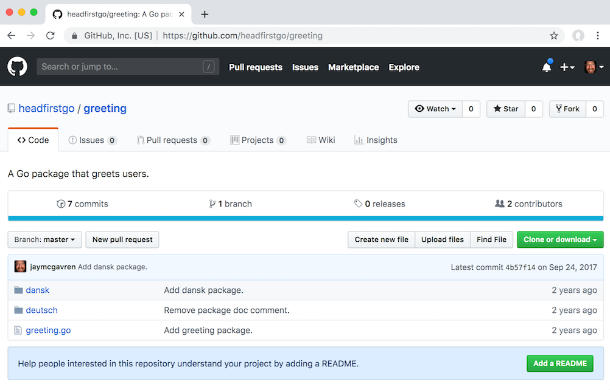
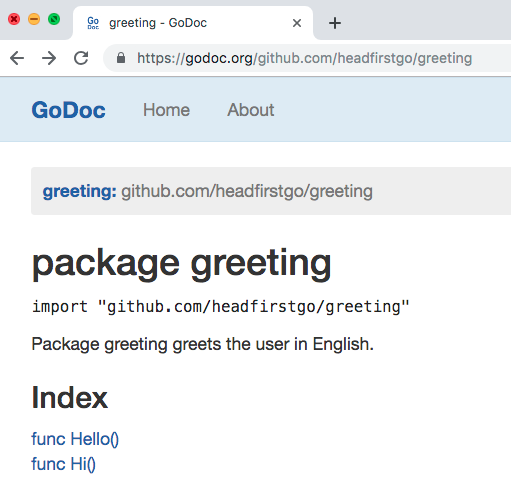
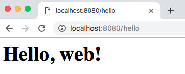

# Introduction to the Go Programming Language

## About me

* Author, _Head First Ruby_ and _Head First Go_
* 4 years experience as online software development instructor
* See my recent courses at `https://teamtreehouse.com`

## Where to Learn Go

`https://tour.golang.org`


(We'll repeat that link at the end.)

## Another humble recommendation


# Why Go?

## Go at a glance

* C-like syntax
* Compiles to native code
* Type-safe
* Garbage collected
* Concurrency built into language

## OK, but what can you do with Go?

## Docker


## Docker

* "'go build' will embed everything you need. (No more 'install this in order to run my stuff'.)"
* "Extensive standard library and data types."
* "Strong duck typing."

—Jérôme Petazzoni, "Docker and Go: why did we decide to write Docker in Go?"

::: notes

https://www.slideshare.net/jpetazzo/docker-and-go-why-did-we-decide-to-write-docker-in-go

:::

## Kubernetes


## Kubernetes

* "Code in Go isn't overly complex. People don't create FactoryFactory objects."
* "Something with the feel of C with more advanced features like anonymous functions is a great combo."
* "Garbage Collection: We all know how to clean up after our selves but it is so nice to not have to worry about it."

—Joe Beda, "Kubernetes + Go = Crazy Delicious"

## Poll: What do you want to make with Go?

1. A system utility
1. A web app or service
1. Something else entirely
1. I don't know yet

## Playground

* You don't even have to install Go to try it!
* Edit and run Go code in your browser


## Exercises for this training

* The Go Playground lets you save your code and share it at a URL
* Others can edit that code
* We'll use that ability for most of our exercises
* We'll post a link
* You visit it and follow the instructions there (add code, fill in blanks, etc.)


# Syntax

## Go file layout

* Package clause
* Imports
* Code

``` go
package main

import "fmt"

func main() {
	fmt.Println("Hello, Go!")
}
```

## "go fmt"

* Automatically fixes code style
* Acts as community's style guide
* No more arguing tabs vs. spaces!

## "go fmt"

Before

``` go
package main

import "fmt"

func main() {
repeatLine("hello", 3     )
}

func repeatLine( line string ,times  int) {
	for i := 0; i < times; i++ {
fmt.Println(line)
	}
}
```

## "go fmt"

``` go
$ go fmt repeat.go
```

## "go fmt"

After

``` go
package main

import "fmt"

func main() {
	repeatLine("hello", 3)
}

func repeatLine(line string, times int) {
	for i := 0; i < times; i++ {
		fmt.Println(line)
	}
}
```

## "go run"

* Compiles a Go source file and runs it
* No executable is saved

``` go
$ go run repeat.go
hello
hello
hello
```

## "go build"

* Compiles Go source file(s) into an executable

``` go
$ go build repeat.go
$ ls -l
total 2064
-rwxr-xr-x 1 jay staff 2106512 May  1 21:13 repeat
-rw-r--r-- 1 jay staff     166 May  1 21:13 repeat.go
$ ./repeat
hello
hello
hello
```

## Calling Functions

``` go
package main

import "fmt"

func main() {
	fmt.Println() // No arguments
	fmt.Println("argument 1")
	fmt.Println("argument 1", "argument 2")	
}
```

## Calling Functions

* `fmt.Println` can take any number and type of arguments.
* Most functions require a _specific_ number and type of arguments.

``` go
package main

import "math"

func main() {
	math.Floor(3.1415)        // valid...
	math.Floor()              // not enough arguments
	math.Floor(3.1415, 12.34) // too many arguments
	math.Floor("a string")    // wrong type
}
```

## Imports

``` go
package main

func main() {
	fmt.Println(math.Floor(2.75))
	fmt.Println(strings.Title("head first go"))
}
```

Compile errors:

```
prog.go:4:2: undefined: fmt
prog.go:4:14: undefined: math
prog.go:5:2: undefined: fmt
prog.go:5:14: undefined: strings
```

## Imports

Need to add `import` statement:

``` go
package main

import (
	"fmt"
	"math"
	"strings"
)

func main() {
	fmt.Println(math.Floor(2.75)) // => 2
	fmt.Println(strings.Title("head first go")) // => Head First Go
}
```

## Unused imports not allowed

``` go
package main

import (
	"fmt"
	"os"
)

func main() {
	fmt.Println("Hello, Go!")
}
```

Compile error:

```
temp.go:5:5: imported and not used: "os"
```

## "goimports"

* Wrapper for `go fmt`
* Automatically adds/removes imports

Install:

``` go
$ go get golang.org/x/tools/cmd/goimports
```

Do a web search for "goimports" for directions on integrating with your editor.

## "goimports"

Before saving

``` go
package main

func main() {
	fmt.Println(math.Floor(2.75))
	fmt.Println(strings.Title("head first go"))
}
```

## "goimports"

After saving

``` go
package main

import (
        "fmt"
        "math"
        "strings"
)

func main() {
        fmt.Println(math.Floor(2.75))
        fmt.Println(strings.Title("head first go"))
}
```

## Variables

``` go
var myInteger int
myInteger = 1
var myFloat float64
myFloat = 3.1415
fmt.Println(myInteger)                 // => 1
fmt.Println(myFloat)                   // => 3.1415
fmt.Println(reflect.TypeOf(myInteger)) // => int
fmt.Println(reflect.TypeOf(myFloat))   // => float64
```

## Short Variable Declarations

``` go
myInteger := 1
myFloat := 3.1415
fmt.Println(myInteger)                 // => 1
fmt.Println(myFloat)                   // => 3.1415
fmt.Println(reflect.TypeOf(myInteger)) // => int
fmt.Println(reflect.TypeOf(myFloat))   // => float64
```

## Must use every variable you declare

``` go
subtotal := 24.70
tax := 1.89
fmt.Println(subtotal)
```

Compile error:

```
prog.go:9:2: tax declared and not used
```

## Type conversions

``` go
var length float64 = 1.2
var width int = 2
// Can't assign an `int` value
// to a `float64` variable:
length = width
fmt.Println(length)
```

Compile error:

```
cannot use width (type int) as type float64 in assignment
```

## Type conversions

``` go
var length float64 = 1.2
var width int = 2
// But you can if you do a type
// conversion!
length = float64(width)
fmt.Println(length) // => 2
```

## Type conversions

``` go
var length float64 = 1.2
var width int = 2
// Can't do a math operation with a float64 and an int:
fmt.Println("Area is", length*width)
// Or a comparison:
fmt.Println("length > width?", length > width)
```

## Type conversions

``` go
var length float64 = 1.2
var width int = 2
// But you can if you do type conversions!
fmt.Println("Area is", length*float64(width))
fmt.Println("length > width?", length > float64(width))
```

Output:

```
Area is 2.4
length > width? false
```

## "if"

``` go
if 1 < 2 {
	fmt.Println("It's true!")
}
```

Output:

```
It's true!
```

## "if"

Parentheses discouraged. `go fmt` will remove these:

``` go
if (1 < 2) {
	fmt.Println("It's true!")
}
```

Opening curly brace _must_ be on same line as `if`. This is a syntax error:

``` go
if (1 < 2)
{
	fmt.Println("It's true!")
}
```

## "for"

``` go
for x := 4; x <= 6; x++ {
	fmt.Println("x is now", x)
}
```

Output:

```
x is now 4
x is now 5
x is now 6
```

## Exercise: Go syntax

`https://is.gd/goex_syntax`

<!-- https://play.golang.org/p/x9BXw0z5LXT -->

<!-- ./solutions/syntax.go -->


# Declaring Functions

## Declaring functions

``` go
func sayHi() {
	fmt.Println("Hi!")
}

func main() {
	sayHi()
}
```

## Function names

* Use `CamelCase`: capitalize each word after the first.
* If the first letter of a function name is `Capitalized`, it's considered __exported__: it can be used from other packages.
* If the first letter of a function name is `uncapitalized`, it's considered __unexported__: it can only be used _within_ its package.
* This is why all the names of standard library functions we've been calling are capitalized. (E.g. `fmt.Println`, `math.Floor`, etc.)

More on exported/unexported later.

## Parameters

``` go
// In parentheses, list parameter name(s)
// followed by type(s).
func say(phrase string, times int) {
	for i := 0; i < times; i++ {
		fmt.Print(phrase)
	}
	fmt.Print("\n")
}

func main() {
	// Provide argument(s) when calling.
	say("Hi", 4)  // => HiHiHiHi
	say("Bye", 2) // => ByeBye
}
```

## Variable scope

Variable scope limited to function where it's declared.

``` go
func myFunction() {
	myVariable := 10
}

func main() {
	myFunction()
	fmt.Println(myVariable) // out of scope!
}
```

Compile error:

```
prog.go:11:14: undefined: myVariable
```

## Variable scope

By the way, variable scope also limited by "if" blocks:

``` go
if grade >= 60 {
	status := "passing"
} else {
	status := "failing"
}
fmt.Println(status) // out of scope!
```

## Variable scope

And by "for" blocks:

``` go
for x := 1; x <= 3; x++ {
	y := x + 1
	fmt.Println(y)
}
fmt.Println(y) // out of scope!
```

## Variable scope

Solution is to declare variable _before_ block:

``` go
var status string // declare up here
if grade >= 60 {
	status = "passing" // still in scope
} else {
	status = "failing" // still in scope
}
fmt.Println(status) // still in scope
```

## Variable scope

Same with loops:

``` go
var y int // declare up here
for x := 1; x <= 3; x++ {
	y = x + 1 // still in scope
	fmt.Println(y)
}
fmt.Println(y) // still in scope
```

## Function return values

So how do we get a value from a function to its caller?

``` go
func myFunction() {
	myVariable := 10
}

func main() {
	myFunction()
	fmt.Println(myVariable) // out of scope!
}
```

## Function return values

Add a return value!

``` go
// Add return value type after parentheses
func myFunction() int {
	// Use "return" keyword
	return 10
}

func main() {
	// Assign returned value to variable
	myVariable := myFunction()
	fmt.Println(myVariable)
}
```

## Multiple return values

``` go
func main() {
	flag := strconv.ParseBool("true")
	flag = strconv.ParseBool("foobar")
	fmt.Println(flag)
}
```

Compile error:

```
prog.go:9:7: assignment mismatch: 1 variable but strconv.ParseBool returns 2 values
prog.go:10:7: assignment mismatch: 1 variable but strconv.ParseBool returns 2 values
```

## Multiple return values

``` go
func main() {
	flag, err := strconv.ParseBool("true")
	if err != nil {
		log.Fatal(err)
	}
	fmt.Println(flag)
	flag, err = strconv.ParseBool("foobar")
	if err != nil {
		log.Fatal(err)
	}
	fmt.Println(flag)
}
```

Output:

```
true
2009/11/10 23:00:00 strconv.ParseBool: parsing "foobar": invalid syntax
```

## Error handling

"In Go, error handling is important. The language's design and conventions encourage you to explicitly check for errors where they occur (as distinct from the convention in other languages of throwing exceptions and **sometimes** catching them)." (Emphasis mine)

-Andrew Gerrand, https://blog.golang.org/error-handling-and-go

## Writing functions with multiple return values

``` go
func parseBools(values []string) ([]bool, error) {
	var bools []bool
	for i, value := range values {
		parsed, err := strconv.ParseBool(value)
		if err != nil {
			return nil, fmt.Errorf(
                "invalid value %s at index %d", value, i)
		}
		bools = append(bools, parsed)
	}
	return bools, nil
}
```

## Writing functions with multiple return values

``` go
func main() {
	bools, err := parseBools(
		[]string{"true", "false", "foobar"})
	if err != nil {
		log.Fatal(err)
	}
	fmt.Println(bools)
}
```

Output:

```
2009/11/10 23:00:00 invalid value foobar at index 2
```

## Exercise: Declaring Functions

`https://is.gd/goex_define_functions`

<!-- https://play.golang.org/p/Jih76DwKh4_s -->

<!-- solutions/declaring_functions_extra_credit.go -->
<!-- solutions/declaring_functions.go -->

## Pass-by-value

* Go is a "pass-by-value" language (as opposed to "pass-by-reference").
* This means Go functions receive a copy of whatever values you pass to them.
* That's fine, until you want a function to alter a value...

## Pass-by-value

``` go
func main() {
	amount := 6
	// We want to set "amount" to 12
	double(amount)
	fmt.Println(amount) // But this prints "6"!
}

// double is SUPPOSED to take a value and double it
func double(number int) {
	// But this doubles the COPY, not the original
	number *= 2
}
```

## Pointers

The `&` ("address of") operator gets a pointer to a value.

``` go
amount := 6
fmt.Println(amount)  // => 6
fmt.Println(&amount) // => 0x1040a124
```

## Pointers

We can get pointers to values of any type.

``` go
var myInt int
fmt.Println(&myInt)   // => 0x1040a128
var myFloat float64
fmt.Println(&myFloat) // => 0x1040a140
var myBool bool
fmt.Println(&myBool)  // => 0x1040a148
```

## Pointers

A pointer to an `int` is written `*int`, a pointer to a `bool` as `*bool`, and so on.

``` go
func main() {
	var myInt int
	fmt.Println(reflect.TypeOf(&myInt))   // => *int
	var myFloat float64
	fmt.Println(reflect.TypeOf(&myFloat)) // => *float64
	var myBool bool
	fmt.Println(reflect.TypeOf(&myBool))  // => *bool
}
```

## Pointers

You can declare variables that hold pointers:

``` go
var myInt int
var myIntPointer *int
myIntPointer = &myInt
fmt.Println(myIntPointer) // => 0x1040a128

var myFloat float64
var myFloatPointer *float64
myFloatPointer = &myFloat
fmt.Println(myFloatPointer) // => 0x1040a140
```

## Pointers

The `*` _operator_ gets the value a pointer refers to.

``` go
myInt := 4
myIntPointer := &myInt
fmt.Println(myIntPointer)    // => 0x1040a124
fmt.Println(*myIntPointer)   // => 4

myFloat := 98.6
myFloatPointer := &myFloat
fmt.Println(myFloatPointer)  // => 0x1040a140
fmt.Println(*myFloatPointer) // => 98.6
```

## Pointers

The `*` operator can also be used to update the value at a pointer:

``` go
myInt := 4
fmt.Println(myInt)         // => 4
myIntPointer := &myInt
// Update the value at the pointer.
*myIntPointer = 8
fmt.Println(*myIntPointer) // => 8
fmt.Println(myInt)         // => 8
```

## Pointers

We can use pointers to fix our `double` function:

``` go
func main() {
	amount := 6
	// Pass pointer instead of value
	double(&amount)
	fmt.Println(amount) // => 12
}

// Accept pointer instead of value
func double(number *int) {
	// Update value at pointer
	*number *= 2
}
```

## Exercise: Passing pointers

`https://is.gd/goex_pointers`

<!-- https://play.golang.org/p/wGKDcFH1Hr0 -->

<!-- ./solutions/pointers.go -->


# Declaring Packages

## The "main" package

* Code intended for direct execution goes in the `main` package.
* Go looks for a `main` function and calls that first.

``` go
package main

import "fmt"

func Hello() {
        fmt.Println("Hello!")
}
func Hi() {
        fmt.Println("Hi!")
}
func main() {
    Hello()
}
```

## The "main" package

But sticking everything in one package will only get you so far...

## The Go workspace

* A directory to hold package code.
* `~/go` by default.
* Or set `$GOPATH` environment variable to a different directory.

## Workspace subdirectories

* `bin`: holds binary executables.
    * Add it to your `$PATH` and you can run them from anywhere.
* `pkg`: holds compiled package files.
    * You generally don't need to touch this.
* `src`: holds source code.
    * Including your code!

## Setting up a package

Let's move our functions to another package.

`~/go/src/greeting/greeting.go`

``` go
package greeting

import "fmt"

func Hello() {
        fmt.Println("Hello!")
}

func Hi() {
        fmt.Println("Hi!")
}
```

## Importing our package

`random_directory/hi.go`

``` go
package main

import "greeting"

func main() {
        greeting.Hello()
        greeting.Hi()
}
```

## "go run"

```
$ go run hi.go
Hello!
Hi!
```

## Moving "main" to the workspace

`~/go/src/hi/main.go`

``` go
package main

import "greeting"

func main() {
        greeting.Hello()
        greeting.Hi()
}
```

## "go install"

```
$ go install hi
$ tree ~/go
go
|-- bin
|   `-- hi
`-- src
    |-- greeting
    |   `-- greeting.go
    `-- hi
        `-- main.go
```

## "go install"

```
$ export PATH=$PATH:$HOME/go/bin
```

(Go installer does this for you.)

## "go install"

```
$ hi
Hello!
Hi!
```

## Exported

We ensured our function names were capitalized so they were exported:

`~/go/src/greeting/greeting.go`

``` go
package greeting

import "fmt"

func Hello() {
        fmt.Println("Hello!")
}

func Hi() {
        fmt.Println("Hi!")
}
```

## Unexported

What if we made them unexported?

`~/go/src/greeting/greeting.go`

``` go
package greeting

import "fmt"

func hello() {
        fmt.Println("Hello!")
}

func hi() {
        fmt.Println("Hi!")
}
```

## Unexported

Even if we update the function calls in `main` to match...

`~/go/src/hi/main.go`

``` go
package main

import "greeting"

func main() {
        greeting.hello()
        greeting.hi()
}
```

## Unexported

We're not allowed to call unexported functions from another package.

``` go
$ go install hi
# hi
go/src/hi/main.go:6:9: cannot refer to unexported name greeting.hello
go/src/hi/main.go:6:9: undefined: greeting.hello
go/src/hi/main.go:7:9: cannot refer to unexported name greeting.hi
go/src/hi/main.go:7:9: undefined: greeting.hi
```

## Unexported

So why would you ever make functions unexported?

* Unexported methods are Go's equivalent to Java's `private` methods.
* Use for helper functions that other packages shouldn't call.
* Once you export a function, you shouldn't change it any more.
    * You can change how it works _internally_...
    * But you shouldn't change its parameters, return value, etc.
    * If you do, you risk breaking others' code!
* But you can change unexported functions all you want!

## Import paths

Suppose we want to add support for other languages...

We can nest them under the `greeting` directory.

``` go
$ tree ~/go/
go
`-- src
    `-- greeting
        |-- dansk
        |   `-- dansk.go
        |-- deutsch
        |   `-- deutsch.go
        `-- greeting.go
```

## Import paths

`~/go/src/greeting/deutsch/deutsch.go`

``` go
// Notice it's not "greeting/deutsch",
// it's just "deutsch".
package deutsch

import "fmt"

func Hallo() {
	fmt.Println("Hallo!")
}

func GutenTag() {
	fmt.Println("Guten Tag!")
}
```

## Import paths

`~/go/src/greeting/dansk/dansk.go`

``` go
// Notice it's not "greeting/dansk",
// it's just "dansk".
package dansk

import "fmt"

func Hej() {
	fmt.Println("Hej!")
}

func GodMorgen() {
	fmt.Println("God morgen!")
}
```

## Import paths

Now we can import and use these packages as well.

~/go/src/hi/main.go`

``` go
package main

import (
	"greeting"
	"greeting/dansk"
	"greeting/deutsch"
)

func main() {
	greeting.Hello()   // => Hello!
	greeting.Hi()      // => Hi!
	dansk.Hej()        // => Hej!
	dansk.GodMorgen()  // => God morgen!
	deutsch.Hallo()    // => Hallo!
	deutsch.GutenTag() // => Guten Tag!
}
```

## Import paths

* Notice the import paths are not the same as the package names!
* Package name is whatever is used in `package` clause in files: `package dansk`
* By convention, last segment of import path is used as package name.

| Import Path | Package Name |
| ----------- | ------------ |
| _greeting_ | _greeting_ |
| greeting/_dansk_ | _dansk_ |
| greeting/_deutsch_ | _deutsch_ |

## "go get"

I set up a repo at `https://github.com/headfirstgo/greeting`, and pushed the package code there...



## "go get"

Now anyone can retrieve the package with `go get github.com/headfirstgo/greeting`:

```
$ go get github.com/headfirstgo/greeting
$ tree ~/go
go
`-- src
    `-- github.com
        `-- headfirstgo
            `-- greeting
                |-- dansk
                |   `-- dansk.go
                |-- deutsch
                |   `-- deutsch.go
                `-- greeting.go
```

## "go get"

`~/go/src/hi/main.go`

``` go
package main

import (
        "github.com/headfirstgo/greeting"
        "github.com/headfirstgo/greeting/dansk"
        "github.com/headfirstgo/greeting/deutsch"
)

func main() {
        greeting.Hello()   // => Hello!
        dansk.Hej()        // => Hej!
        deutsch.GutenTag() // => Guten Tag!
}
```

## "go doc"

* To document a package, just add an ordinary comment before its `package` clause.
* Comments can span as many lines as you need.

``` go
// Package greeting greets the user in English.
package greeting

import "fmt"

func Hello() {
	fmt.Println("Hello!")
}

func Hi() {
	fmt.Println("Hi!")
}
```

## "go doc"

* To document functions, add an ordinary comment before each.

``` go
// Package greeting greets the user in English.
package greeting

import "fmt"

// Hello prints the string "Hello!".
func Hello() {
	fmt.Println("Hello!")
}

// Hi prints the string "Hi!".
func Hi() {
	fmt.Println("Hi!")
}
```

## "go doc"

Get documentation on a package:

```
$ go doc github.com/headfirstgo/greeting
package greeting // import "github.com/headfirstgo/greeting"

Package greeting greets the user.

func Hello()
func Hi()
```

## "go doc"

Get documentation on a function:

```
$ go doc github.com/headfirstgo/greeting Hello
func Hello()
    Hello prints the string "Hello!".
```

## Web documentation

```
$ godoc -http=:6060
```

Then visit `http://localhost:6060/pkg/`...

## Web documentation


## Web documentation

* Other servers like `godoc.org` make package documentation available on the web.
* For example, `https://godoc.org/github.com/headfirstgo/greeting` got created automatically for the `greeting` package.



## Web documentation

* Want to know more about the `fmt` package?
* Just Google "golang fmt"!


## Web documentation


## Exercise: Using package documentation

`https://is.gd/goex_documentation`

<!-- https://play.golang.org/p/0IoS8oGzrnw -->

<!-- ./solutions/documentation.go -->


# Structs

## Structs

Anonymous struct types...

``` go
var bucket struct {
	number float64
	word   string
	toggle bool
}
bucket.number = 3.14
bucket.word = "pie"
bucket.toggle = true
fmt.Println(bucket.number) // => 3.14
fmt.Println(bucket.word)   // => pie
fmt.Println(bucket.toggle) // => true
```

## Custom types

`type myType` followed by an underlying type declares a new type.

``` go
type myType struct {
	number float64
	word   string
	toggle bool
}
```

## Custom types

``` go
func main() {
	var bucket myType
	bucket.number = 3.14
	bucket.word = "pie"
	bucket.toggle = true
	fmt.Println(bucket.number) // => 3.14
	fmt.Println(bucket.word)   // => pie
	fmt.Println(bucket.toggle) // => true
}
```

## Embedding structs is like inheriting fields

``` go
type Coordinates struct {
	Latitude  float64
	Longitude float64
}

type Landmark struct {
	Name string
	// An "anonymous field"
	// Has no name of its own, just a type
	Coordinates
}
```

``` go
func main() {
	var l Landmark
	l.Name = "The Googleplex"
	// Fields for "embedded struct" are "promoted"
	l.Latitude = 37.42
	l.Longitude = -122.08
	fmt.Println(l.Name, l.Latitude, l.Longitude)
	// => The Googleplex 37.42 -122.08
}
```

## Exercise: Struct types

`https://is.gd/goex_structs`

<!-- https://play.golang.org/p/6TXfzxpTiCj -->

<!-- ./solutions/structs.go -->


# Defined Types

## Underlying basic types

A custom type can have an underlying basic type

``` go
type Liters float64
type Gallons float64

func main() {
	var carFuel Gallons
	var busFuel Liters
	// Defining a type defines a conversion
	// from the underlying type to the new type
	carFuel = Gallons(10.0)
	busFuel = Liters(240.0)
	fmt.Println(carFuel) // => 10
	fmt.Println(busFuel) // => 240
}
```

## Methods

``` go
type MyType string

// Specify a "receiver parameter" within a function
// definition to make it a method. The receiver 
// parameter's type will be the type the method 
// gets defined on.
func (m MyType) sayHi() {
	fmt.Println("Hi")
}
```

## Methods

``` go
type MyType string

func (m MyType) sayHi() {
	fmt.Println("Hi")
}

func main() {
	value := MyType("a MyType value")
	value.sayHi() // => Hi
	anotherValue := MyType("another value")
	anotherValue.sayHi() // => Hi
}
```

## Receiver parameter acts like just another parameter

``` go
type MyType string

func (m MyType) sayHi() {
	fmt.Println("Hi from", m)
}

func main() {
	value := MyType("a MyType value")
	value.sayHi() // => Hi from a MyType value
	anotherValue := MyType("another value")
	anotherValue.sayHi() // => Hi from another value
}
```

## Underlying type is _not_ a superclass

The underlying type specifies how a type's data will be stored, so this is OK...

``` go
type MyType string

func (m MyType) sayHi() {
	fmt.Println("Hi from", m)
}

type MyType2 MyType

func main() {
	value2 := MyType2("a MyType2 value")
	fmt.Println(value2)
}
```

## Underlying type is _not_ a superclass

But a type does _not_ inherit methods from its underlying type.

``` go
type MyType string

func (m MyType) sayHi() {
	fmt.Println("Hi from", m)
}

type MyType2 MyType

func main() {
	value2 := MyType2("a MyType2 value")
	value2.sayHi()
}
```

Compile error:

``` go
prog.go:15:8: value2.sayHi undefined (type MyType2 has no field or method sayHi)
```

## Underlying type is _not_ a superclass

"Although Go has types and methods and allows an object-oriented style of programming, there is no type hierarchy."

—https://golang.org/doc/faq

* There is no method inheritance!
* But there's another way to get the same benefits...

## Embedding structs is like inheriting fields

Remember how fields for an embedded struct get promoted to the outer struct?

``` go
type Coordinates struct {
	Latitude  float64
	Longitude float64
}

type Landmark struct {
	Name string
	// An "anonymous field"
	// Has no name of its own, just a type
	Coordinates
}
```

``` go
func main() {
	var l Landmark
	l.Name = "The Googleplex"
	// Fields for "embedded struct" are "promoted"
	l.Latitude = 37.42
	l.Longitude = -122.08
	fmt.Println(l.Name, l.Latitude, l.Longitude)
	// => The Googleplex 37.42 -122.08
}
```

## Promotion of embedded types' methods

Methods for an embedded type get promoted too!

``` go
func (c Coordinates) Location() string {
	return fmt.Sprintf("(%0.2f, %0.2f)",
		c.Latitude, c.Longitude)
}

func main() {
	var l Landmark
	l.Name = "The Googleplex"
	l.Latitude = 37.42
	l.Longitude = -122.08
	// Methods from embedded type are
	// promoted to outer type
	fmt.Println(l.Location())
	// => (37.42, -122.08)
}
```

## Promotion of embedded types' methods

* Embed additional types to gain additional methods.
* You've heard "favor composition over inheritance"...
* Go implements that principle at the language level.

``` go
type Coordinates struct {
	Latitude  float64
	Longitude float64
}
func (c Coordinates) Location() string {
	return fmt.Sprintf("(%0.2f, %0.2f)",
		c.Latitude, c.Longitude)
}
type Landmark struct {
	Name string
	Coordinates
}
```

## Exercise: Defined types

`https://is.gd/goex_defined_types`

<!-- https://play.golang.org/p/TeMJ9D6bBOz -->

<!-- ./solutions/defined_types.go -->


# Interfaces

## Interfaces

A type with `Play` and `Stop` methods...

``` go
type TapePlayer struct {
	Batteries string
}
func (t TapePlayer) Play(song string) {
	fmt.Println("Playing", song)
}
func (t TapePlayer) Stop() {
	fmt.Println("Stopped!")
}
```

## Interfaces

_Another_ type with `Play` and `Stop` methods...

``` go
type TapeRecorder struct {
	Microphones int
}
func (t TapeRecorder) Play(song string) {
	fmt.Println("Playing", song)
}
func (t TapeRecorder) Record() {
	fmt.Println("Recording")
}
func (t TapeRecorder) Stop() {
	fmt.Println("Stopped!")
}
```

## Interfaces

A function that accepts a `TapePlayer`...

``` go
func playList(device TapePlayer, songs []string) {
	for _, song := range songs {
		device.Play(song)
	}
	device.Stop()
}
```

## Interfaces

``` go
func main() {
	mixtape := []string{"Jessie's Girl", "Whip It", "9 to 5"}
	var player TapePlayer
	playList(player, mixtape)
}
```

Output:

```
Playing Jessie's Girl
Playing Whip It
Playing 9 to 5
Stopped!
```

## Interfaces

But don't try to pass a `TapeRecorder` to `playList`!

``` go
func main() {
	mixtape := []string{"Jessie's Girl", "Whip It", "9 to 5"}
	var recorder TapeRecorder
	playList(recorder, mixtape)
}
```

Compile error:

```
prog.go:40:10: cannot use recorder (type TapeRecorder) as type TapePlayer in argument to playList
```

## Interfaces

Define a `Player` interface with the methods you want:

``` go
type Player interface {
	// Must have a Play method with
	// a single string parameter
	Play(string)
	// Must have a Stop method with
	// no parameters
	Stop()
}
```

* Notice we don't have to modify the `TapePlayer` or `TapeRecorder` type definitions!
* Any type with `Play(string)` and `Stop()` methods automatically _satisfies_ this interface.

## Interfaces

Modify the `playList` function to accept a value of the `Player` (interface) type:

``` go
func playList(device Player, songs []string) {
	for _, song := range songs {
		device.Play(song)
	}
	device.Stop()
}
```

## Interface

Now, you can pass in a `TapePlayer` _or_ a `TapeRecorder` (or any other type with `Play` and `Stop` methods)!

``` go
func main() {
	mixtape := []string{"Jessie's Girl", "Whip It", "9 to 5"}
	var player TapePlayer
	playList(player, mixtape)
	var recorder TapeRecorder
	playList(recorder, mixtape)
}
```

## Interfaces

Output:

```
Playing Jessie's Girl
Playing Whip It
Playing 9 to 5
Stopped!
Playing Jessie's Girl
Playing Whip It
Playing 9 to 5
Stopped!
```

## Type assertions

* If you have a value with an interface type, you can only call methods included in that interface.
* This is true even if the concrete value has that method!

## Type assertions

``` go
func main() {
	// Even though we're passing in a TapeRecorder...
	TryOut(TapeRecorder{})
}

func TryOut(player Player) {
	player.Play("Test Track")
	player.Stop()
	// Player interface doesn't include this method!
	player.Record()
}
```

Compile error:

```
player.Record undefined (type Player has no field or method Record)
```

## Type assertions

``` go
func main() {
	TryOut(TapeRecorder{})
}

func TryOut(player Player) {
	player.Play("Test Track")
	player.Stop()
	// Do a type assertion to get the concrete value back...
	recorder := player.(TapeRecorder)
	// Then you can call Record on that.
	recorder.Record()
}
```

## Type assertions

Output:

```
Playing Test Track
Stopped!
Recording
```

## Exercise: Interfaces

`https://is.gd/goex_interfaces`

<!-- https://play.golang.org/p/6g4_wz89Jes -->

<!-- ./solutions/interfaces.go -->


# Handling Errors

## "defer"

It's usually polite to end conversations with "goodbye":

``` go
func Socialize() {
	fmt.Println("Hello!")
	fmt.Println("Nice weather, eh?")
	fmt.Println("Goodbye!")
}

func main() {
	Socialize()
}
```

Output:

```
Goodbye!
Hello!
Nice weather, eh?
```

## "defer"

Write `defer` before a function call, and it will be "deferred" until enclosing function ends.

``` go
func Socialize() {
	// This call will be made when Socialize ends.
	defer fmt.Println("Goodbye!")
	fmt.Println("Hello!")
	fmt.Println("Nice weather, eh?")
}
```

Output:

```
Hello!
Nice weather, eh?
Goodbye!
```

## "defer" calls made no matter what

``` go
func Socialize() error {
	// Deferred call is made even if Socialize
	// exits early (say, due to an error).
	defer fmt.Println("Goodbye!")
	fmt.Println("Hello!")
	return fmt.Errorf("I don't want to talk.")
	// The below code won't be run!
	fmt.Println("Nice weather, eh?")
	return nil
}

func main() {
	err := Socialize()
	if err != nil {
		log.Fatal(err)
	}
}
```

## "defer" calls made no matter what

Output:

```
Hello!
Goodbye!
2019/04/22 11:22:29 I don't want to talk.
exit status 1
```

## A (somewhat) more realistic example

``` go
func PrintLines(fileName string) error {
	file, err := os.Open(fileName)
	if err != nil {
		return err
	}
	defer file.Close()
	scanner := bufio.NewScanner(file)
	for scanner.Scan() {
		fmt.Println(scanner.Text())
	}
	if scanner.Err() != nil {
		return scanner.Err()
	}
	return nil
}
```

## A (somewhat) more realistic example

``` go
func main() {
	err := PrintLines("lorem_ipsum.txt")
	if err != nil {
		log.Fatal(err)
	}
}
```

## "panic"

* `panic` usually signals an _unanticipated_ error.
* This example is just to show its mechanics.

``` go
func Socialize() {
	fmt.Println("Hello!")
	panic("I need to get out of here!")
	// The below code won't be run!
	fmt.Println("Nice weather, eh?")
	fmt.Println("Goodbye!")
}
```

## "panic"

Output:

``` go
Hello!
panic: I need to get out of here.

goroutine 1 [running]:
main.Socialize()
        /Users/jay/socialize4_panic.go:9 +0x79
main.main()
        /Users/jay/socialize4_panic.go:16 +0x20
exit status 2
```

## "panic" and "defer"

``` go
func Socialize() {
	defer fmt.Println("Goodbye!")
	fmt.Println("Hello!")
	panic("I need to get out of here!")
	// The below code won't be run!
	fmt.Println("Nice weather, eh?")
}
```

## "panic" and "defer"

Output:

```
Hello!
Goodbye!
panic: I need to get out of here!

goroutine 1 [running]:
main.Socialize()
        /Users/jay/socialize5_panic_defer.go:10 +0xd5
main.main()
        /Users/jay/socialize5_panic_defer.go:16 +0x20
exit status 2
```

## "recover"

``` go
func CalmDown() {
	// Halt the panic.
	panicValue := recover()
	// Print value passed to panic().
	fmt.Println(panicValue)
}

func Socialize() {
	defer fmt.Println("Goodbye!")
	defer CalmDown()
	fmt.Println("Hello!")
	panic("I need to get out of here!")
	// The below code won't be run!
	fmt.Println("Nice weather, eh?")
}
```

## "recover"

Output:

```
Hello!
I need to get out of here!
Goodbye!
```

* Deferred `CalmDown` prints the `panic` value.
* Deferred `Println` prints "Goodbye!".

## "panic" should not be used like an exception

I know of one place in the standard library that `panic` is used in normal program flow: in a recursive parsing function that panics to unwind the call stack after a parsing error. (The function then recovers and handles the error normally.)

## "panic" should not be used like an exception

Generally, `panic` should be used only to indicate "impossible" situations:

``` go
func awardPrize() {
	doorNumber := rand.Intn(3) + 1
	if doorNumber == 1 {
		fmt.Println("You win a cruise!")
	} else if doorNumber == 2 {
		fmt.Println("You win a car!")
	} else if doorNumber == 3 {
		fmt.Println("You win a goat!")
	} else {
        // This should never happen.
		panic("invalid door number")
	}
}
```

## "panic" should not be used like an exception

* If you know an error could happen, use normal control flow statements to handle it.
* Google "golang errors are values" (which should take you to `https://blog.golang.org/errors-are-values`) for some tips on making error handling more pleasant.

## Exercise: Handling errors

`https://is.gd/goex_recovery`

<!-- https://play.golang.org/p/I16x3MSub57 -->

<!-- ./solutions/defer.go -->


# Concurrency

## A non-concurrent program

``` go
// responseSize retrieves "url" and prints
// the response length in bytes.
func responseSize(url string) {
	fmt.Println("Getting", url)
	// Note: errors ignored with _!
	response, _ := http.Get(url)
	defer response.Body.Close()
	body, _ := ioutil.ReadAll(response.Body)
	fmt.Println(len(body))
}
```

## A non-concurrent program

``` go
func main() {
    // Note the time we started.
	start := time.Now()
	responseSize("https://example.com/")
	responseSize("https://golang.org/")
	responseSize("https://golang.org/doc")
    // Print how long everything took.
	fmt.Println(time.Since(start).Seconds(), "seconds")
}
```

## A non-concurrent program

Output:

```
Getting https://example.com/
1270
Getting https://golang.org/
8158
Getting https://golang.org/doc
12558
1.5341211000000001 seconds
```

If only we could make additional calls to `responseSize` while we were waiting for HTTP responses...

## Goroutines

* `responseSize` function unchanged.
* Just add `go` keyword before each call to it.

``` go
func main() {
	start := time.Now()
	go responseSize("https://example.com/")
	go responseSize("https://golang.org/")
	go responseSize("https://golang.org/doc")
	fmt.Println(time.Since(start).Seconds())
}
```

## Goroutines

Output:

``` go
3.1e-06
```

* Run time so brief the duration is printed in scientific notation.
* None of the `responseSize` goroutines get to even request their URL.
* Problem is, `main` goroutine exits, ending the program, without waiting for `responseSize` goroutines.

## Channels

* Modify `responseSize` to accept a "channel" as a parameter.

``` go
// A channel type is written as "chan" followed by data type.
func responseSize(url string, channel chan int) {
	fmt.Println("Getting", url)              // Unchanged
	response, _ := http.Get(url)             // Unchanged
	defer response.Body.Close()              // Unchanged
	body, _ := ioutil.ReadAll(response.Body) // Unchanged
    // Send body length value via channel.
	channel <- len(body)
}
```

## Channels

``` go
func main() {
	start := time.Now() // Unchanged
	// Make a channel to carry ints.
	sizes := make(chan int)
	// Pass channel to each call to responseSize.
	go responseSize("https://example.com/", sizes)
	go responseSize("https://golang.org/", sizes)
	go responseSize("https://golang.org/doc", sizes)
	// Read and print values from channel.
	fmt.Println(<-sizes)
	fmt.Println(<-sizes)
	fmt.Println(<-sizes)
	fmt.Println(time.Since(start).Seconds()) // Unchanged
}
```

## Channels

```
Getting https://golang.org/doc
Getting https://golang.org/
Getting https://example.com/
1270
8158
12558
0.695384291
```

* Finishes in half the time of the original! (YMMV.)
* The channel accomplishes two things:
    * Channel reads cause `main` goroutine to block until `responseSize` goroutines send, so they have time to finish before program ends.
    * The channel transmits data from the `responseSize` goroutines back to the `main` goroutine.

## Exercise: Goroutines and channels

`https://is.gd/goex_goroutines`

<!-- https://play.golang.org/p/mtfvNLts6Vm -->

<!-- solutions/goroutines.go -->


# Where to Go Next

## Arrays

``` go
var primes [3]int
primes[0] = 2
primes[1] = 3
fmt.Println(primes[0]) // => 2
fmt.Println(primes[1]) // => 3
```

* Can't grow when needed
* To me, they're just a foundation for slices

## Slices

``` go
var primes []int
primes = make([]int, 2)
primes[0] = 2
primes[1] = 3
fmt.Println(primes[0])  // => 2
fmt.Println(primes[1])  // => 3
```

## Slices and "append"

``` go
var primes []int
primes = append(primes, 2)
primes = append(primes, 3)
fmt.Println(primes[0]) // => 2
fmt.Println(primes[1]) // => 3
fmt.Println(primes)    // => [2 3]
primes = append(primes, 5)
fmt.Println(primes)    // => [2 3 5]
```

## Maps

``` go
func main() {
	ranks := make(map[string]int)
	ranks["gold"] = 1
	ranks["silver"] = 2
	ranks["bronze"] = 3
	fmt.Println(ranks["bronze"]) // => 3
	fmt.Println(ranks["gold"])   // => 1
}
```

## "go test"

Suppose we're not certain this function works correctly...

``` go
func JoinWithCommas(phrases []string) string {
	if len(phrases) == 2 {
		return phrases[0] + " and " + phrases[1]
	} else {
		result := strings.Join(phrases[:len(phrases)-1], ", ")
		result += ", and "
		result += phrases[len(phrases)-1]
		return result
	}
}
```

## "go test"

We can use the `testing` package to write a test function...

``` go
import (
	"fmt"
	"testing"
)

func TestTwoElements(t *testing.T) {
	list := []string{"apple", "orange"}
	want := "apple and orange"
	got := JoinWithCommas(list)
	if got != want {
		t.Error(errorString(list, got, want))
	}
}
```

## "go test"

Add tests for all the functionality we want...

``` go
import (
	"fmt"
	"testing"
)

func TestOneElement(t *testing.T) {
	list := []string{"apple"}
	want := "apple"
	got := JoinWithCommas(list)
	if got != want {
		t.Error(errorString(list, got, want))
	}
}

func TestTwoElements(t *testing.T) {
	list := []string{"apple", "orange"}
	want := "apple and orange"
	got := JoinWithCommas(list)
	if got != want {
		t.Error(errorString(list, got, want))
	}
}

func TestThreeElements(t *testing.T) {
	list := []string{"apple", "orange", "pear"}
	want := "apple, orange, and pear"
	got := JoinWithCommas(list)
	if got != want {
		t.Error(errorString(list, got, want))
	}
}

func errorString(list []string, got string, want string) string {
	return fmt.Sprintf("JoinWithCommas(%#v) = \"%s\", want \"%s\"", list, got, want)
}
```

## "go test"

Then just run `go test` and get a summary of the tests that failed!

``` go
$ go test github.com/headfirstgo/prose
--- FAIL: TestOneElement (0.00s)
lists_test.go:13: JoinWithCommas([]string{"apple"}) = ", and apple", want "apple"
FAIL
FAIL    github.com/headfirstgo/prose    0.006s
```

## Web development

The standard library includes the `net/http` package:

``` go
package main

import "net/http"

func helloHandler(writer http.ResponseWriter, request *http.Request) {
	// Note: unhandled error!
	writer.Write([]byte("<h1>Hello, web!</h1>"))
}

func main() {
	http.HandleFunc("/hello", helloHandler)
	// Note: unhandled error!
	http.ListenAndServe("localhost:8080", nil)
}
```

## Web development



## Go Gopher

By Renee French, used under a CC-Attribution-3.0 license.


## Other resources

* Go Tour: `https://tour.golang.org`
* Go Playground: `https://play.golang.org`
* Head First Go: `https://headfirstgo.com`

<!-- TODO link to https://golang.org/doc/code.html, https://blog.golang.org/ for Gophercon -->
