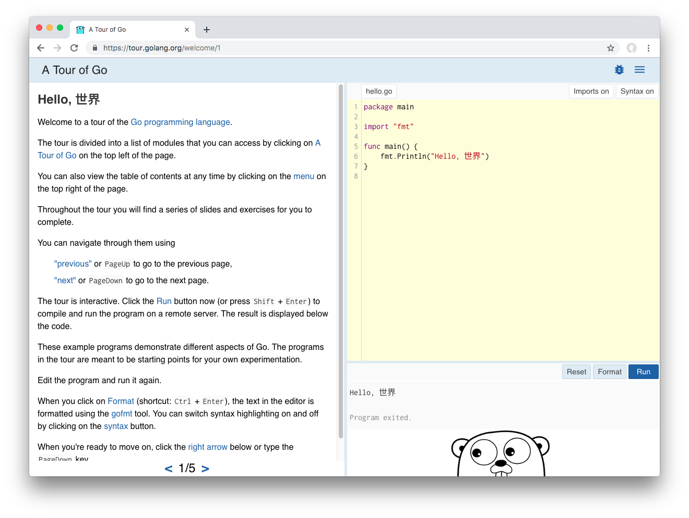
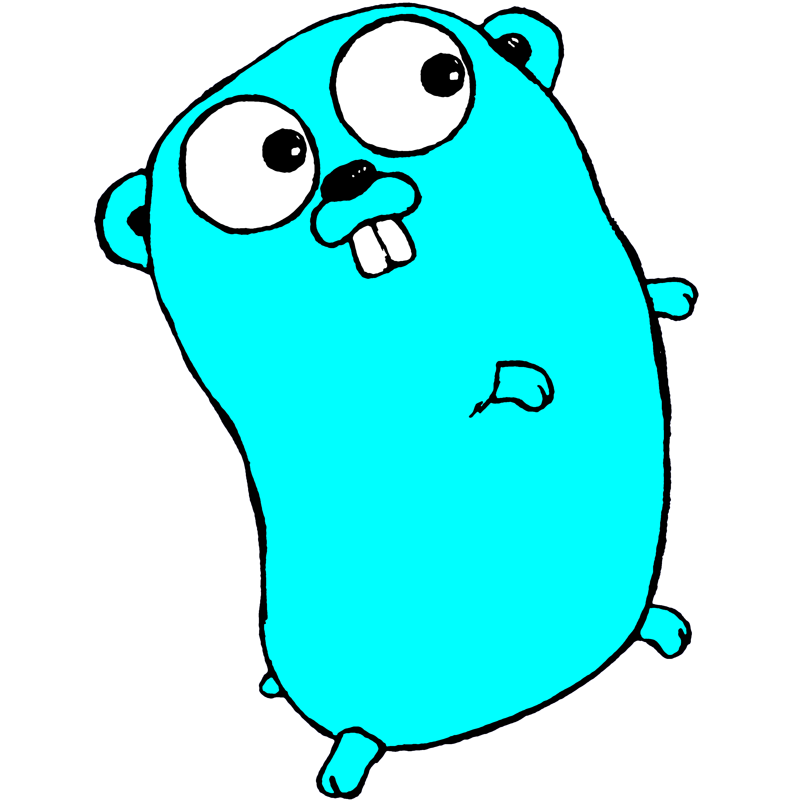

# The Go Language: What Makes it Different?

# Introduction

## About me

::: incremental

* Author, _Head First Go_
* Treehouse instructor
* Unlike the Rust and Zig speakers, _not_ a language implementer! 😛

:::

::: notes

(Carol Goulding and Andy Kelley)

:::

## Talk goals

* Get an overview of the language.
* We only have 45 minutes.
* We'll be moving fast.
* You are _not_ going to learn Go by the end of the session.

## Where to Learn Go

`https://tour.golang.org`



(We'll repeat that link at the end.)

## Another humble recommendation


## Talk overview

::: incremental

* A Sneak Peek
* Why Go?
* Syntax
* OOP-*like* Concepts
* Goroutines and Channels

:::

## Talk overview

Review these slides at:

`https://github.com/jaymcgavren/presentations`

We'll show that URL again at the end.


# A Sneak Peek

## Sneak peek: Hello, world

``` go
package main

import "fmt"

func main() {
	fmt.Println("Hello, Philly!")
}
```

## Sneak peek: A tiny web app

``` go
package main

import (
	"log"
	"net/http"
)

func helloHandler(writer http.ResponseWriter, request *http.Request) {
	writer.Write([]byte("<h1>Hello, web!</h1>"))
}

func main() {
	http.HandleFunc("/hello", helloHandler)
	err := http.ListenAndServe("localhost:8080", nil)
	log.Fatal(err)
}
```

## Sneak peek: goroutines and channels

``` go
package main

import (
	"fmt"
	"io/ioutil"
	"net/http"
	"time"
)

func responseSize(url string, channel chan int) {
	fmt.Println("Getting", url)
	response, _ := http.Get(url)
	defer response.Body.Close()
	body, _ := ioutil.ReadAll(response.Body)
	channel <- len(body)
}
```

## Sneak peek: goroutines and channels

``` go
func main() {
	sizes := make(chan int)
	go responseSize("https://example.com/", sizes)
	go responseSize("https://golang.org/", sizes)
	go responseSize("https://golang.org/doc", sizes)
	fmt.Println(<-sizes)
	fmt.Println(<-sizes)
	fmt.Println(<-sizes)
}
```

## Sneak peek

We'll take a more detailed look at each of these programs later.


# Why Go?

## Go at a glance

::: incremental

* C-like syntax
* Compiles to native code
* Type-safe
* Garbage collected
* Concurrency built into language

:::

## OK, but what can you do with Go?

## Docker


## Docker

* "'go build' will embed everything you need. (No more 'install this in order to run my stuff'.)"
* "Extensive standard library and data types."
* "Strong duck typing."

—Jérôme Petazzoni, "Docker and Go: why did we decide to write Docker in Go?"

::: notes

https://www.slideshare.net/jpetazzo/docker-and-go-why-did-we-decide-to-write-docker-in-go

:::

## Kubernetes


## Kubernetes

* "Code in Go isn't overly complex. People don't create FactoryFactory objects."
* "Something with the feel of C with more advanced features like anonymous functions is a great combo."
* "Garbage Collection: We all know how to clean up after our selves but it is so nice to not have to worry about it."

—Joe Beda, "Kubernetes + Go = Crazy Delicious"

## Go values stability

"It is intended that programs written to the Go 1 specification will continue to compile and run correctly, unchanged, over the lifetime of that specification."

—The Go "compatibility promise"

`https://golang.org/doc/go1compat`

## My favorite summary

"It's just a boring, really reliable, good language."

—Ben DiFrancesco, overheard at PhillyETE

## StackOverflow 2019 developer survey - popularity

1. JavaScript (67.8%)
1. Python (41.7%)
1. Java (41.1%)
1. C# (31.0%)
1. PHP (26.4%)
1. C++ (23.5%)
1. C (20.6%)
1. Ruby (8.4%)
1. **Go** (8.2%)
1. Swift (6.6%)
1. Kotlin (6.4%)
1. Rust (3.2%)

::: notes

* Stack Overflow 2019 Developer Survey - percentage of developers saying they use a language
* Markup, shell, and database query languages omitted

:::

## History

* Designed by small team at Google in 2007
* Made open source in 2009
* Version 1.0 in 2012

## Rationale

Simplicity: "we had become frustrated by the undue complexity required to use the languages we worked with to develop server software"

Concurrency: "multi[-core] processors were becoming universal but most languages offered little help to program them efficiently and safely"

Automatic memory management: "to make resource management tractable in a large concurrent program, garbage collection... was required"

—https://golang.org/doc/faq

## Left out (on purpose)

* Object constructors
* Method overloading
* Class inheritance (mostly)
* Exceptions

## NO EXCEPTIONS?!

Desire to avoid exception abuse: "We believe that coupling exceptions to a control structure, as in the try-catch-finally idiom, results in convoluted code. It also tends to encourage programmers to label too many ordinary errors, such as failing to open a file, as exceptional."

Alternatives provided: "For plain error handling, Go's multi-value returns make it easy to report an error without overloading the return value."

—https://golang.org/doc/faq

## Go and object-oriented programming

No inheritance: "Although Go has types and methods and allows an object-oriented style of programming, there is no type hierarchy."

Alternatives provided: "There are... ways to embed types in other types to provide something analogous—but not identical—to subclassing."

And even improvements: "methods in Go are more general than in C++ or Java: they can be defined for any sort of data, even built-in types"

—https://golang.org/doc/faq

## Concurrency support

One thread, many goroutines: "multiplex independently executing functions—coroutines—onto a set of threads... The result, which we call goroutines, can be very cheap..."

Create all you want: "It is practical to create hundreds of thousands of goroutines in the same address space"

—https://golang.org/doc/faq

* It's like having multiple function calls running simultanously.
* Multi-core processor? Goroutines will help you make use of it.

## Neat stuff

* First-class functions
* Built-in UTF8 support, `rune` type
* Interfaces fully decoupled from types ("compile time duck typing")
* Included tools:
    * `go get`: download and install packages
    * `go fmt`: formats code for you
    * `go test`: runs tests for you

## "go fmt"

* Automatically fixes code style
* Acts as community's style guide
* No more arguing tabs vs. spaces!

## "go fmt"

Before

``` go
package main

import "fmt"

func main() {
repeatLine("hello", 3     )
}

func repeatLine( line string ,times  int) {
	for i := 0; i < times; i++ {
fmt.Println(line)
	}
}
```

## "go fmt"

``` go
$ go fmt repeat.go
```

## "go fmt"

After

``` go
package main

import "fmt"

func main() {
	repeatLine("hello", 3)
}

func repeatLine(line string, times int) {
	for i := 0; i < times; i++ {
		fmt.Println(line)
	}
}
```

## Playground

* You don't even have to install Go to try it!
* Edit and run Go code in your browser
* Link at end of talk


# Syntax

## Go file layout

* Package clause
* Imports
* Code

``` go
package main 

import "fmt" 

func main() {
	fmt.Println("Hello, Go!")
}
```

## Imports

``` go
package main

import (
	"fmt"
	"math"
	"strings"
)

func main() {
	fmt.Println(math.Floor(2.75))
	fmt.Println(strings.Title("head first go"))
}
```

## Unused imports not allowed

``` go
package main 

import (
	"fmt"
    "os"
)

func main() {
	fmt.Println("Hello, Go!")
}
```

Compile error:

```
temp.go:5:5: imported and not used: "os"
```

## "goimports"

* Wrapper for `go fmt`
* Automatically adds/removes imports

Install:

``` go
$ go get golang.org/x/tools/cmd/goimports
```

Do a web search for "goimports" for directions on integrating with your editor.

## "goimports"

Before saving

``` go
package main

func main() {
	fmt.Println(math.Floor(2.75))
	fmt.Println(strings.Title("head first go"))
}
```

## "goimports"

After saving

``` go
package main

import (
        "fmt"
        "math"
        "strings"
)

func main() {
        fmt.Println(math.Floor(2.75))
        fmt.Println(strings.Title("head first go"))
}
```

## Variables

``` go
var myInteger int
myInteger = 1
var myFloat float64
myFloat = 3.1415
fmt.Println(myInteger)                 // => 1
fmt.Println(myFloat)                   // => 3.1415
fmt.Println(reflect.TypeOf(myInteger)) // => int
fmt.Println(reflect.TypeOf(myFloat))   // => float64
```

## Short Variable Declarations

``` go
myInteger := 1
myFloat := 3.1415
fmt.Println(myInteger)                 // => 1
fmt.Println(myFloat)                   // => 3.1415
fmt.Println(reflect.TypeOf(myInteger)) // => int
fmt.Println(reflect.TypeOf(myFloat))   // => float64
```

## Must use every variable you declare

``` go
subtotal := 24.70
tax := 1.89
fmt.Println(subtotal)
```

Compile error:

```
prog.go:9:2: tax declared and not used
```

## Zero values

``` go
package main

import (
	"fmt"
)

func main() {
	var myFloat float64
	fmt.Printf("%#v\n", myFloat)  // => 0
	var myBool bool
	fmt.Printf("%#v\n", myBool)   // => false
	var myString string
	fmt.Printf("%#v\n", myString) // => ""
}
```

## Zero values

``` go
var myFloat float64
fmt.Println(myFloat + 2.5) // => 2.5
var myBool bool
fmt.Println(!myBool) // => true
var myString string
fmt.Println("(" + myString + ")") // => ()
```

## "for"

``` go
for i := 1; i <= 3; i++ {
	fmt.Println(i)
}
```

Output:

```
1
2
3
```

## "for" ... "range"

``` go
mySlice := []string{"one", "two", "three"}
for i, value := range mySlice {
	fmt.Println(i, value)
}
```

Output:

``` go
0 one
1 two
2 three
```

## What if we skip using the index?

``` go
mySlice := []string{"one", "two", "three"}
for i, value := range mySlice {
	fmt.Println(value)
}
```

Compile error:

```
prog.go:9:6: i declared and not used
```

## Use the blank identifier to ignore values

* Discards the value.
* Provides clear visual indicator that a value's being ignored!

``` go
mySlice := []string{"one", "two", "three"}
for _, value := range mySlice {
	fmt.Println(value)
}
```

Output:

``` go
one
two
three
```

## Multiple return values

``` go
func main() {
	flag := strconv.ParseBool("true")
	flag = strconv.ParseBool("foobar")
	fmt.Println(flag)
}
```

Compile error:

```
prog.go:9:7: assignment mismatch: 1 variable but strconv.ParseBool returns 2 values
prog.go:10:7: assignment mismatch: 1 variable but strconv.ParseBool returns 2 values
```

## Multiple return values

``` go
func main() {
	flag, err := strconv.ParseBool("true")
	if err != nil {
		log.Fatal(err)
	}
	fmt.Println(flag)
	flag, err = strconv.ParseBool("foobar")
	if err != nil {
		log.Fatal(err)
	}
	fmt.Println(flag)
}
```

Output:

```
true
2009/11/10 23:00:00 strconv.ParseBool: parsing "foobar": invalid syntax
```

## Error handling

"In Go, error handling is important. The language's design and conventions encourage you to explicitly check for errors where they occur (as distinct from the convention in other languages of throwing exceptions and **sometimes** catching them)." (Emphasis mine)

-Andrew Gerrand, https://blog.golang.org/error-handling-and-go

## Writing functions with multiple return values

``` go
func parseBools(values []string) ([]bool, error) {
	var bools []bool
	for i, value := range values {
		parsed, err := strconv.ParseBool(value)
		if err != nil {
			return nil, fmt.Errorf(
                "invalid value %s at index %d", value, i)
		}
		bools = append(bools, parsed)
	}
	return bools, nil
}
```

## Writing functions with multiple return values

``` go
func main() {
	bools, err := parseBools(
        []string{"true", "false", "foobar"})
	if err != nil {
		log.Fatal(err)
	}
	fmt.Println(bools)
}
```

Output:

```
2009/11/10 23:00:00 invalid value foobar at index 2
```

## First-class functions

``` go
func thrice(callback func()) {
	callback()
	callback()
	callback()
}
func refrain() {
	fmt.Print("give it away, ")
}
func main() {
	thrice(refrain)
	fmt.Println("now!")
}
```

Output:

```
give it away, give it away, give it away, now!
```

## Anonymous functions

``` go
func thrice(callback func()) {
	callback()
	callback()
	callback()
}
func main() {
	thrice(func() { fmt.Print("give it away, ") })
	fmt.Println("now!")
}
```

## First-class functions: a simple web app

``` go
package main

import "net/http"

func helloHandler(writer http.ResponseWriter, request *http.Request) {
	// Note: error return value ignored!
	writer.Write([]byte("<h1>Hello, web!</h1>"))
}
func bonjourHandler(writer http.ResponseWriter, request *http.Request) {
	writer.Write([]byte("<h1>Bonjour, web!</h1>"))
}
```

## First-class functions: a simple web app

``` go
func main() {
	http.HandleFunc("/hello", helloHandler)
	http.HandleFunc("/bonjour", bonjourHandler)
	// Note: error return value ignored!
	http.ListenAndServe("localhost:8080", nil)
}
```

::: notes

`samples/web_app.go`

:::


# OOP-*like* Concepts

## Structs

Anonymous struct types...

``` go
var bucket struct {
	number float64
	word   string
	toggle bool
}
bucket.number = 3.14
bucket.word = "pie"
bucket.toggle = true
fmt.Println(bucket.number) // => 3.14
fmt.Println(bucket.word)   // => pie
fmt.Println(bucket.toggle) // => true
```

## Custom types

`type myType` followed by an underlying type declares a new type.

``` go
type myType struct {
	number float64
	word   string
	toggle bool
}
```

## Custom types

``` go
func main() {
	var bucket myType
	bucket.number = 3.14
	bucket.word = "pie"
	bucket.toggle = true
	fmt.Println(bucket.number) // => 3.14
	fmt.Println(bucket.word)   // => pie
	fmt.Println(bucket.toggle) // => true
}
```

## Other underlying types

A custom type can have an underlying basic type

``` go
type Liters float64
type Gallons float64

func main() {
	var carFuel Gallons
	var busFuel Liters
	// Defining a type defines a conversion
	// from the underlying type to the new type
	carFuel = Gallons(10.0)
	busFuel = Liters(240.0)
	fmt.Println(carFuel) // => 10
	fmt.Println(busFuel) // => 240
}
```

## Methods

``` go
type MyType string

// Specify a "receiver parameter" within a function
// definition to make it a method. The receiver 
// parameter's type will be the type the method 
// gets defined on.
func (m MyType) sayHi() {
	fmt.Println("Hi")
}
```

## Methods

``` go
type MyType string

func (m MyType) sayHi() {
	fmt.Println("Hi")
}

func main() {
	value := MyType("a MyType value")
	value.sayHi() // => Hi
	anotherValue := MyType("another value")
	anotherValue.sayHi() // => Hi
}
```

## Receiver parameter acts like just another parameter

``` go
type MyType string

func (m MyType) sayHi() {
	fmt.Println("Hi from", m)
}

func main() {
	value := MyType("a MyType value")
	value.sayHi() // => Hi from a MyType value
	anotherValue := MyType("another value")
	anotherValue.sayHi() // => Hi from another value
}
```

## Underlying type is _not_ a superclass

The underlying type specifies how a type's data will be stored, so this is OK...

``` go
type MyType string

func (m MyType) sayHi() {
	fmt.Println("Hi from", m)
}

type MyType2 MyType

func main() {
	value2 := MyType2("a MyType2 value")
	fmt.Println(value2)
}
```

## Underlying type is _not_ a superclass

But a type does _not_ inherit methods from its underlying type.

``` go
type MyType string

func (m MyType) sayHi() {
	fmt.Println("Hi from", m)
}

type MyType2 MyType

func main() {
	value2 := MyType2("a MyType2 value")
	value2.sayHi()
}
```

Compile error:

``` go
prog.go:15:8: value2.sayHi undefined (type MyType2 has no field or method sayHi)
```

## Underlying type is _not_ a superclass

"Although Go has types and methods and allows an object-oriented style of programming, there is no type hierarchy."

—https://golang.org/doc/faq

* There is no method inheritance!
* But there's another way to get the same benefits...

## Embedding structs is like inheriting fields

``` go
type Coordinates struct {
	Latitude  float64
	Longitude float64
}

type Landmark struct {
	Name string
	// An "anonymous field"
	// Has no name of its own, just a type
	Coordinates
}
```

``` go
func main() {
	var l Landmark
	l.Name = "The Googleplex"
	// Fields for "embedded struct" are "promoted"
	l.Latitude = 37.42
	l.Longitude = -122.08
	fmt.Println(l.Name, l.Latitude, l.Longitude)
	// => The Googleplex 37.42 -122.08
}
```

## Promotion of embedded types' methods

``` go
func (c Coordinates) Location() string {
	return fmt.Sprintf("(%0.2f, %0.2f)",
		c.Latitude, c.Longitude)
}

func main() {
	var l Landmark
	l.Name = "The Googleplex"
	l.Latitude = 37.42
	l.Longitude = -122.08
	// Methods from embedded type are
	// promoted to outer type
	fmt.Println(l.Location())
	// => (37.42, -122.08)
}
```

## Promotion of embedded types' methods

* Embed additional types to gain additional methods.
* You've heard "favor composition over inheritance"...
* Go implements that principle at the language level.

``` go
type Coordinates struct {
	Latitude  float64
	Longitude float64
}
func (c Coordinates) Location() string {
	return fmt.Sprintf("(%0.2f, %0.2f)",
		c.Latitude, c.Longitude)
}
type Landmark struct {
	Name string
	Coordinates
}
```

## Interfaces

(This part is my favorite!)

## Interfaces

A type with `Play` and `Stop` methods...

``` go
type TapePlayer struct {
	Batteries string
}
func (t TapePlayer) Play(song string) {
	fmt.Println("Playing", song)
}
func (t TapePlayer) Stop() {
	fmt.Println("Stopped!")
}
```

## Interfaces

_Another_ type with `Play` and `Stop` methods...

``` go
type TapeRecorder struct {
	Microphones int
}
func (t TapeRecorder) Play(song string) {
	fmt.Println("Playing", song)
}
func (t TapeRecorder) Record() {
	fmt.Println("Recording")
}
func (t TapeRecorder) Stop() {
	fmt.Println("Stopped!")
}
```

## Interfaces

A function that accepts a `TapePlayer`...

``` go
func playList(device TapePlayer, songs []string) {
	for _, song := range songs {
		device.Play(song)
	}
	device.Stop()
}
```

## Interfaces

``` go
func main() {
	mixtape := []string{"Jessie's Girl", "Whip It", "9 to 5"}
	var player TapePlayer
	playList(player, mixtape)
}
```

Output:

```
Playing Jessie's Girl
Playing Whip It
Playing 9 to 5
Stopped!
```

## Interfaces

But don't try to pass a `TapeRecorder` to `playList`!

``` go
func main() {
	mixtape := []string{"Jessie's Girl", "Whip It", "9 to 5"}
	var recorder TapeRecorder
	playList(recorder, mixtape)
}
```

Compile error:

```
prog.go:40:10: cannot use recorder (type TapeRecorder) as type TapePlayer in argument to playList
```

## Interfaces

Define a `Player` interface with the methods you want:

``` go
type Player interface {
    // Must have a Play method with
    // a single string parameter
	Play(string)
    // Must have a Stop method with
    // no parameters
	Stop()
}
```

* Notice we don't have to modify the `TapePlayer` or `TapeRecorder` type definitions!
* Any type with `Play(string)` and `Stop()` methods automatically _satisfies_ this interface.

## Interfaces

Modify the `playList` function to accept a value of the `Player` (interface) type:

``` go
func playList(device Player, songs []string) {
	for _, song := range songs {
		device.Play(song)
	}
	device.Stop()
}
```

## Interface

Now, you can pass in a `TapePlayer` _or_ a `TapeRecorder` (or any other type with `Play` and `Stop` methods)!

``` go
func main() {
	mixtape := []string{"Jessie's Girl", "Whip It", "9 to 5"}
	var player TapePlayer
	playList(player, mixtape)
	var recorder TapeRecorder
	playList(recorder, mixtape)
}
```

## Interfaces

Output:

```
Playing Jessie's Girl
Playing Whip It
Playing 9 to 5
Stopped!
Playing Jessie's Girl
Playing Whip It
Playing 9 to 5
Stopped!
```

## Interfaces

"Structural typing is like compile time duck typing. It makes Go feel like a dynamic language, such as Ruby or Python."

-Jared Carroll, "[Structural Typing: Compile Time Duck Typing](https://blog.carbonfive.com/2012/09/23/structural-typing-compile-time-duck-typing/)"


# Goroutines and Channels

## A non-concurrent program

``` go
// responseSize retrieves "url" and prints
// the response length in bytes.
func responseSize(url string) {
	fmt.Println("Getting", url)
	// Note: errors ignored with _!
	response, _ := http.Get(url)
	defer response.Body.Close()
	body, _ := ioutil.ReadAll(response.Body)
	fmt.Println(len(body))
}
```

## A non-concurrent program

``` go
func main() {
    // Note the time we started.
	start := time.Now()
	responseSize("https://example.com/")
	responseSize("https://golang.org/")
	responseSize("https://golang.org/doc")
    // Print how long everything took.
	fmt.Println(time.Since(start).Seconds(), "seconds")
}
```

## A non-concurrent program

Output:

```
Getting https://example.com/
1270
Getting https://golang.org/
8158
Getting https://golang.org/doc
12558
1.5341211000000001 seconds
```

If only we could make additional calls to `responseSize` while we were waiting for HTTP responses...

## Goroutines

* `responseSize` function unchanged.
* Just add `go` keyword before each call to it.

``` go
func main() {
	start := time.Now()
	go responseSize("https://example.com/")
	go responseSize("https://golang.org/")
	go responseSize("https://golang.org/doc")
	fmt.Println(time.Since(start).Seconds())
}
```

## Goroutines

Output:

``` go
3.1e-06
```

* Run time so brief the duration is printed in scientific notation.
* None of the `responseSize` goroutines get to even request their URL.
* Problem is, `main` goroutine exits, ending the program, without waiting for `responseSize` goroutines.

## Channels

* Modify `responseSize` to accept a "channel" as a parameter.

``` go
// A channel type is written as "chan" followed by data type.
func responseSize(url string, channel chan int) {
	fmt.Println("Getting", url)              // Unchanged
	response, _ := http.Get(url)             // Unchanged
	defer response.Body.Close()              // Unchanged
	body, _ := ioutil.ReadAll(response.Body) // Unchanged
    // Send body length value via channel.
	channel <- len(body)
}
```

## Channels

``` go
func main() {
	start := time.Now() // Unchanged
    // Make a channel to carry ints.
	sizes := make(chan int)
    // Pass channel to each call to responseSize.
	go responseSize("https://example.com/", sizes)
	go responseSize("https://golang.org/", sizes)
	go responseSize("https://golang.org/doc", sizes)
    // Read and print values from channel.
	fmt.Println(<-sizes)
	fmt.Println(<-sizes)
	fmt.Println(<-sizes)
	fmt.Println(time.Since(start).Seconds()) // Unchanged
}
```

## Channels

```
Getting https://golang.org/doc
Getting https://golang.org/
Getting https://example.com/
1270
8158
12558
0.695384291
```

* Finishes in half the time of the original! (YMMV.)
* The channel accomplishes two things:
    * Channel reads cause `main` goroutine to block until `responseSize` goroutines send, so they have time to finish before program ends.
    * The channel transmits data from the `responseSize` goroutines back to the `main` goroutine.


# Defer, Panic, and Recover

## "defer"

It's usually polite to end conversations with "goodbye":

``` go
func Socialize() {
	fmt.Println("Hello!")
	fmt.Println("Nice weather, eh?")
	fmt.Println("Goodbye!")
}

func main() {
	Socialize()
}
```

Output:

```
Goodbye!
Hello!
Nice weather, eh?
```

## "defer"

Write `defer` before a function call, and it will be "deferred" until enclosing function ends.

``` go
func Socialize() {
	// This call will be made when Socialize ends.
	defer fmt.Println("Goodbye!")
	fmt.Println("Hello!")
	fmt.Println("Nice weather, eh?")
}
```

Output:

```
Hello!
Nice weather, eh?
Goodbye!
```

## "defer" calls made no matter what

``` go
func Socialize() error {
	// Deferred call is made even if Socialize
	// exits early (say, due to an error).
	defer fmt.Println("Goodbye!")
	fmt.Println("Hello!")
	return fmt.Errorf("I don't want to talk.")
	// The below code won't be run!
	fmt.Println("Nice weather, eh?")
	return nil
}

func main() {
	err := Socialize()
	if err != nil {
		log.Fatal(err)
	}
}
```

## "defer" calls made no matter what

Output:

```
Hello!
Goodbye!
2019/04/22 11:22:29 I don't want to talk.
exit status 1
```

## A (somewhat) more realistic example

``` go
func PrintLines(fileName string) error {
	file, err := os.Open(fileName)
	if err != nil {
		return err
	}
	defer file.Close()
	scanner := bufio.NewScanner(file)
	for scanner.Scan() {
		fmt.Println(scanner.Text())
	}
	if scanner.Err() != nil {
		return scanner.Err()
	}
	return nil
}
```

## A (somewhat) more realistic example

``` go
func main() {
	err := PrintLines("lorem_ipsum.txt")
	if err != nil {
		log.Fatal(err)
	}
}
```

## "panic"

* `panic` usually signals an _unanticipated_ error.
* This example is just to show its mechanics.

``` go
func Socialize() {
	fmt.Println("Hello!")
	panic("I need to get out of here!")
	// The below code won't be run!
	fmt.Println("Nice weather, eh?")
	fmt.Println("Goodbye!")
}
```

## "panic"

Output:

``` go
Hello!
panic: I need to get out of here.

goroutine 1 [running]:
main.Socialize()
        /Users/jay/socialize4_panic.go:9 +0x79
main.main()
        /Users/jay/socialize4_panic.go:16 +0x20
exit status 2
```

## "panic" and "defer"

``` go
func Socialize() {
	defer fmt.Println("Goodbye!")
	fmt.Println("Hello!")
	panic("I need to get out of here!")
	// The below code won't be run!
	fmt.Println("Nice weather, eh?")
}
```

## "panic" and "defer"

Output:

```
Hello!
Goodbye!
panic: I need to get out of here!

goroutine 1 [running]:
main.Socialize()
        /Users/jay/socialize5_panic_defer.go:10 +0xd5
main.main()
        /Users/jay/socialize5_panic_defer.go:16 +0x20
exit status 2
```

## "recover"

``` go
func CalmDown() {
	// Halt the panic.
	panicValue := recover()
	// Print value passed to panic().
	fmt.Println(panicValue)
}

func Socialize() {
	defer fmt.Println("Goodbye!")
	defer CalmDown()
	fmt.Println("Hello!")
	panic("I need to get out of here!")
	// The below code won't be run!
	fmt.Println("Nice weather, eh?")
}
```

## "recover"

Output:

```
Hello!
I need to get out of here!
Goodbye!
```

* Deferred `CalmDown` prints the `panic` value.
* Deferred `Println` prints "Goodbye!".

## "panic" should not be used like an exception

I know of one place in the standard library that `panic` is used in normal program flow: in a recursive parsing function that panics to unwind the call stack after a parsing error. (The function then recovers and handles the error normally.)

## "panic" should not be used like an exception

Generally, `panic` should be used only to indicate "impossible" situations:

``` go
func awardPrize() {
	doorNumber := rand.Intn(3) + 1
	if doorNumber == 1 {
		fmt.Println("You win a cruise!")
	} else if doorNumber == 2 {
		fmt.Println("You win a car!")
	} else if doorNumber == 3 {
		fmt.Println("You win a goat!")
	} else {
        // This should never happen.
		panic("invalid door number")
	}
}
```

## "panic" should not be used like an exception

* If you know an error could happen, use normal control flow statements to handle it.
* Google "golang errors are values" (which should take you to `https://blog.golang.org/errors-are-values`) for some tips on making error handling more pleasant.


# Defer, Panic, and Recover

## "defer"

It's usually polite to end conversations with "goodbye":

``` go
func Socialize() {
	fmt.Println("Hello!")
	fmt.Println("Nice weather, eh?")
	fmt.Println("Goodbye!")
}

func main() {
	Socialize()
}
```

Output:

```
Goodbye!
Hello!
Nice weather, eh?
```

## "defer"

Write `defer` before a function call, and it will be "deferred" until enclosing function ends.

``` go
func Socialize() {
	// This call will be made when Socialize ends.
	defer fmt.Println("Goodbye!")
	fmt.Println("Hello!")
	fmt.Println("Nice weather, eh?")
}
```

Output:

```
Hello!
Nice weather, eh?
Goodbye!
```

## "defer" calls made no matter what

``` go
func Socialize() error {
	// Deferred call is made even if Socialize
	// exits early (say, due to an error).
	defer fmt.Println("Goodbye!")
	fmt.Println("Hello!")
	return fmt.Errorf("I don't want to talk.")
	// The below code won't be run!
	fmt.Println("Nice weather, eh?")
	return nil
}

func main() {
	err := Socialize()
	if err != nil {
		log.Fatal(err)
	}
}
```

## "defer" calls made no matter what

Output:

```
Hello!
Goodbye!
2019/04/22 11:22:29 I don't want to talk.
exit status 1
```

## A (somewhat) more realistic example

``` go
func PrintLines(fileName string) error {
	file, err := os.Open(fileName)
	if err != nil {
		return err
	}
	defer file.Close()
	scanner := bufio.NewScanner(file)
	for scanner.Scan() {
		fmt.Println(scanner.Text())
	}
	if scanner.Err() != nil {
		return scanner.Err()
	}
	return nil
}
```

## A (somewhat) more realistic example

``` go
func main() {
	err := PrintLines("lorem_ipsum.txt")
	if err != nil {
		log.Fatal(err)
	}
}
```

## "panic"

* `panic` usually signals an _unanticipated_ error.
* This example is just to show its mechanics.

``` go
func Socialize() {
	fmt.Println("Hello!")
	panic("I need to get out of here!")
	// The below code won't be run!
	fmt.Println("Nice weather, eh?")
	fmt.Println("Goodbye!")
}
```

## "panic"

Output:

``` go
Hello!
panic: I need to get out of here.

goroutine 1 [running]:
main.Socialize()
        /Users/jay/socialize4_panic.go:9 +0x79
main.main()
        /Users/jay/socialize4_panic.go:16 +0x20
exit status 2
```

## "panic" and "defer"

``` go
func Socialize() {
	defer fmt.Println("Goodbye!")
	fmt.Println("Hello!")
	panic("I need to get out of here!")
	// The below code won't be run!
	fmt.Println("Nice weather, eh?")
}
```

## "panic" and "defer"

Output:

```
Hello!
Goodbye!
panic: I need to get out of here!

goroutine 1 [running]:
main.Socialize()
        /Users/jay/socialize5_panic_defer.go:10 +0xd5
main.main()
        /Users/jay/socialize5_panic_defer.go:16 +0x20
exit status 2
```

## "recover"

``` go
func CalmDown() {
	// Halt the panic.
	panicValue := recover()
	// Print value passed to panic().
	fmt.Println(panicValue)
}

func Socialize() {
	defer fmt.Println("Goodbye!")
	defer CalmDown()
	fmt.Println("Hello!")
	panic("I need to get out of here!")
	// The below code won't be run!
	fmt.Println("Nice weather, eh?")
}
```

## "recover"

Output:

```
Hello!
I need to get out of here!
Goodbye!
```

* Deferred `CalmDown` prints the `panic` value.
* Deferred `Println` prints "Goodbye!".

## "panic" should not be used like an exception

I know of one place in the standard library that `panic` is used in normal program flow: in a recursive parsing function that panics to unwind the call stack after a parsing error. (The function then recovers and handles the error normally.)

## "panic" should not be used like an exception

Generally, `panic` should be used only to indicate "impossible" situations:

``` go
func awardPrize() {
	doorNumber := rand.Intn(3) + 1
	if doorNumber == 1 {
		fmt.Println("You win a cruise!")
	} else if doorNumber == 2 {
		fmt.Println("You win a car!")
	} else if doorNumber == 3 {
		fmt.Println("You win a goat!")
	} else {
        // This should never happen.
		panic("invalid door number")
	}
}
```

## "panic" should not be used like an exception

* If you know an error could happen, use normal control flow statements to handle it.
* Google "golang errors are values" (which should take you to `https://blog.golang.org/errors-are-values`) for some tips on making error handling more pleasant.


# Defer, Panic, and Recover

## "defer"

It's usually polite to end conversations with "goodbye":

``` go
func Socialize() {
	fmt.Println("Hello!")
	fmt.Println("Nice weather, eh?")
	fmt.Println("Goodbye!")
}

func main() {
	Socialize()
}
```

Output:

```
Goodbye!
Hello!
Nice weather, eh?
```

## "defer"

Write `defer` before a function call, and it will be "deferred" until enclosing function ends.

``` go
func Socialize() {
	// This call will be made when Socialize ends.
	defer fmt.Println("Goodbye!")
	fmt.Println("Hello!")
	fmt.Println("Nice weather, eh?")
}
```

Output:

```
Hello!
Nice weather, eh?
Goodbye!
```

## "defer" calls made no matter what

``` go
func Socialize() error {
	// Deferred call is made even if Socialize
	// exits early (say, due to an error).
	defer fmt.Println("Goodbye!")
	fmt.Println("Hello!")
	return fmt.Errorf("I don't want to talk.")
	// The below code won't be run!
	fmt.Println("Nice weather, eh?")
	return nil
}

func main() {
	err := Socialize()
	if err != nil {
		log.Fatal(err)
	}
}
```

## "defer" calls made no matter what

Output:

```
Hello!
Goodbye!
2019/04/22 11:22:29 I don't want to talk.
exit status 1
```

## A (somewhat) more realistic example

``` go
func PrintLines(fileName string) error {
	file, err := os.Open(fileName)
	if err != nil {
		return err
	}
	defer file.Close()
	scanner := bufio.NewScanner(file)
	for scanner.Scan() {
		fmt.Println(scanner.Text())
	}
	if scanner.Err() != nil {
		return scanner.Err()
	}
	return nil
}
```

## A (somewhat) more realistic example

``` go
func main() {
	err := PrintLines("lorem_ipsum.txt")
	if err != nil {
		log.Fatal(err)
	}
}
```

## "panic"

* `panic` usually signals an _unanticipated_ error.
* This example is just to show its mechanics.

``` go
func Socialize() {
	fmt.Println("Hello!")
	panic("I need to get out of here!")
	// The below code won't be run!
	fmt.Println("Nice weather, eh?")
	fmt.Println("Goodbye!")
}
```

## "panic"

Output:

``` go
Hello!
panic: I need to get out of here.

goroutine 1 [running]:
main.Socialize()
        /Users/jay/socialize4_panic.go:9 +0x79
main.main()
        /Users/jay/socialize4_panic.go:16 +0x20
exit status 2
```

## "panic" and "defer"

``` go
func Socialize() {
	defer fmt.Println("Goodbye!")
	fmt.Println("Hello!")
	panic("I need to get out of here!")
	// The below code won't be run!
	fmt.Println("Nice weather, eh?")
}
```

## "panic" and "defer"

Output:

```
Hello!
Goodbye!
panic: I need to get out of here!

goroutine 1 [running]:
main.Socialize()
        /Users/jay/socialize5_panic_defer.go:10 +0xd5
main.main()
        /Users/jay/socialize5_panic_defer.go:16 +0x20
exit status 2
```

## "recover"

``` go
func CalmDown() {
	// Halt the panic.
	panicValue := recover()
	// Print value passed to panic().
	fmt.Println(panicValue)
}

func Socialize() {
	defer fmt.Println("Goodbye!")
	defer CalmDown()
	fmt.Println("Hello!")
	panic("I need to get out of here!")
	// The below code won't be run!
	fmt.Println("Nice weather, eh?")
}
```

## "recover"

Output:

```
Hello!
I need to get out of here!
Goodbye!
```

* Deferred `CalmDown` prints the `panic` value.
* Deferred `Println` prints "Goodbye!".

## "panic" should not be used like an exception

I know of one place in the standard library that `panic` is used in normal program flow: in a recursive parsing function that panics to unwind the call stack after a parsing error. (The function then recovers and handles the error normally.)

## "panic" should not be used like an exception

Generally, `panic` should be used only to indicate "impossible" situations:

``` go
func awardPrize() {
	doorNumber := rand.Intn(3) + 1
	if doorNumber == 1 {
		fmt.Println("You win a cruise!")
	} else if doorNumber == 2 {
		fmt.Println("You win a car!")
	} else if doorNumber == 3 {
		fmt.Println("You win a goat!")
	} else {
        // This should never happen.
		panic("invalid door number")
	}
}
```

## "panic" should not be used like an exception

* If you know an error could happen, use normal control flow statements to handle it.
* Google "golang errors are values" (which should take you to `https://blog.golang.org/errors-are-values`) for some tips on making error handling more pleasant.


# Closing

## What we didn't have time for

* Packages and modules
* "testing" package
* Buffered channels
* Runes and UTF8 support

## Go Gopher

By Renee French, used under a CC-Attribution-3.0 license.



## Other resources

* These slides: `https://github.com/jaymcgavren/presentations`
* Go Tour: `https://tour.golang.org`
* Go Playground: `https://play.golang.org`
* Head First Go: `https://headfirstgo.com`

### Questions?

`https://2019.phillyemergingtech.com/qa/`


::: notes

Repeat each question before answering!

:::
