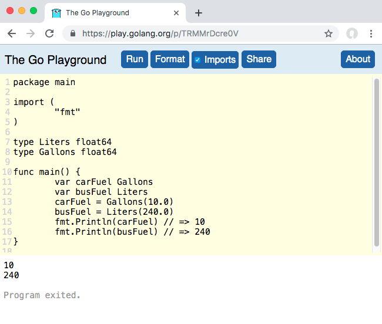

# The Go Language: What Makes it Different?

# Introduction

## About me

* Author, _Head First Go_
* Treehouse instructor

## Talk goals

* We only have 45 minutes.
* You are _not_ going to learn Go today.
* We'll be moving fast.
* But you'll get an overview of the language.

## Where to Learn Go

`https://tour.golang.org`


(We'll repeat that link at the end.)

## Another humble recommendation


## Talk overview

TODO major sections
TODO questions
TODO slides are posted


# A sneak peek

## Sneak peek: Hello, world

``` go
package main

import "fmt"

func main() {
	fmt.Println("Hello, Philadelphia!")
}
```

## Sneak peek: A tiny web app

``` go
package main

import (
	"log"
	"net/http"
)

func helloHandler(writer http.ResponseWriter, request *http.Request) {
	writer.Write([]byte("<h1>Hello, web!</h1>"))
}

func main() {
	http.HandleFunc("/hello", helloHandler)
	err := http.ListenAndServe("localhost:8080", nil)
	log.Fatal(err)
}
```

## Sneak peek: goroutines and channels

``` go
package main

import (
	"fmt"
	"io/ioutil"
	"net/http"
	"time"
)

func responseSize(url string, channel chan int) {
	fmt.Println("Getting", url)
	response, _ := http.Get(url)
	defer response.Body.Close()
	body, _ := ioutil.ReadAll(response.Body)
	channel <- len(body)
}
```

## Sneak peek: goroutines and channels

``` go
func main() {
	sizes := make(chan int)
	go responseSize("https://example.com/", sizes)
	go responseSize("https://golang.org/", sizes)
	go responseSize("https://golang.org/doc", sizes)
	fmt.Println(<-sizes)
	fmt.Println(<-sizes)
	fmt.Println(<-sizes)
}
```

<!-- TODO packages -->


# Why Go?

## Go at a glance

* C-like syntax
* Compiles to native code
* Type-safe
* Garbage collected
* Concurrency built into language

## Languages in order of creation

| Year | Language |
| ---- | -------- |
| 1972 | C |
| 1983 | C++ |
| 1991 | Python |
| 1995 | Java |
| 1995 | JavaScript |
| 1995 | PHP |
| 1995 | Ruby |
| 2000 | C# |
| 2009 | **Go** |
| 2011 | Kotlin |
| 2014 | Swift |

https://en.wikipedia.org/wiki/Timeline_of_programming_languages

## Languages in (subjective) order of execution speed

https://benchmarksgame-team.pages.debian.net/benchmarksgame/performance/mandelbrot.html

| Run Time | Language |
| -------- | -------- |
| 1.5s | C++ |
| 1.65s | C |
| 2.2s | Rust |
| 3.22 | Swift |
| 5.5s | **Go** |
| 5.5s | C# (.NET Core) |
| 6.84s | Java |
| 18.13s | JavaScript (Node.js) |
| 118.28s | PHP |
| 265.56s | Python 3 |
| >420s | Ruby |

## Languages in (subjective) order of execution speed

https://benchmarksgame-team.pages.debian.net/benchmarksgame/performance/binarytrees.html

| Run Time | Language |
| -------- | -------- |
| 3.1s | Rust |
| 3.48s | C |
| 3.77s | C++ |
| 5.05s | Swift |
| 7.85s | C# (.NET Core) |
| 8.32s | Java |
| 26.94s | **Go** |
| 45.89s | JavaScript (Node.js) |
| 58.93s | PHP |
| 64.07s | Ruby |
| 81.74s | Python 3 |

## Languages in (subjective) order of deployment ease

1. Native binary: C++, C, **Go**, Rust
1. Standalone *or* framework/VM dependent: C#, Kotlin
1. VM-dependent: JavaScript, Java
1. Interpreter-dependent: Python, PHP, Ruby

## Languages in order of popularity

1. JavaScript (67.8%)
1. Python (41.7%)
1. Java (41.1%)
1. C# (31.0%)
1. PHP (26.4%)
1. C++ (23.5%)
1. C (20.6%)
1. Ruby (8.4%)
1. **Go** (8.2%)
1. Swift (6.6%)
1. Kotlin (6.4%)
1. Rust (3.2%)

Stack Overflow 2019 Developer Survey - percentage of developers saying they use a language

::: notes
Markup, shell, and database query languages omitted
:::

## Rationale

"we had become frustrated by the undue complexity required to use the languages we worked with to develop server software"

"multi[-core] processors were becoming universal but most languages offered little help to program them efficiently and safely"

"to make resource management tractable in a large concurrent program, garbage collection... was required"

—https://golang.org/doc/faq

## Some overgeneralizations

* Go always favors simplicity.
    * If a feature complicates code, or slows down compilation or execution, it's left out.
* Go values conceptual consistency.
    * Blocks work the same at all levels (func/for/if)
    * Same naming rules for everything (variables/functions/types)

## Left out (on purpose)

* Constructors
* Method overloading
* Class inheritance (mostly)
* Exceptions

## NO EXCEPTIONS?!

"We believe that coupling exceptions to a control structure, as in the try-catch-finally idiom, results in convoluted code. It also tends to encourage programmers to label too many ordinary errors, such as failing to open a file, as exceptional."

"For plain error handling, Go's multi-value returns make it easy to report an error without overloading the return value."

—https://golang.org/doc/faq

## Why Goroutines?

"multiplex independently executing functions—coroutines—onto a set of threads"

"The result, which we call goroutines, can be very cheap"

"It is practical to create hundreds of thousands of goroutines in the same address space"

—https://golang.org/doc/faq

## Go and object-oriented programming

"Although Go has types and methods and allows an object-oriented style of programming, there is no type hierarchy."

"There are... ways to embed types in other types to provide something analogous—but not identical—to subclassing."

"methods in Go are more general than in C++ or Java: they can be defined for any sort of data, even built-in types"

—https://golang.org/doc/faq

## Neat stuff

* First-class functions
* Built-in UTF8 support
* Interfaces fully decoupled from types
* `go get` package manager standard
* `go format` command formats code for you
* Unit testing in standard library

## "go fmt"

Before

``` go
package main

import "fmt"

func main() {
repeatLine("hello", 3     )
}

func repeatLine( line string ,times  int) {
	for i := 0; i < times; i++ {
fmt.Println(line)
	}
}
```

## "go fmt"

``` go
$ go fmt repeat.go
```

## "go fmt"

After

``` go
package main

import "fmt"

func main() {
	repeatLine("hello", 3)
}

func repeatLine(line string, times int) {
	for i := 0; i < times; i++ {
		fmt.Println(line)
	}
}
```

## Playground



::: notes
Example saved session: https://play.golang.org/p/TRMMrDcre0V
:::


# Syntax

## Go file layout

* Package clause
* Imports
* Code

``` go
package main 

import "fmt" 

func main() {
	fmt.Println("Hello, Go!")
}
```

## Imports

``` go
package main

import (
	"fmt"
	"math"
	"strings"
)

func main() {
	fmt.Println(math.Floor(2.75))
	fmt.Println(strings.Title("head first go"))
}
```

## Other packages

``` go
package keyboard

import (
	"bufio"
	"os"
	"strconv"
	"strings"
)

func GetFloat() (float64, error) {
	// GetFloat code here...
}
```

## Unused imports not allowed

``` go
package main 

import (
	"fmt"
    "os"
)

func main() {
	fmt.Println("Hello, Go!")
}
```

Compile error:

```
temp.go:5:5: imported and not used: "os"
```

## "goimports"

* Automatically adds/removes imports
* Wrapper for `go fmt`

Install:

``` go
$ go get golang.org/x/tools/cmd/goimports
```

Do a web search for "goimports" for directions on integrating with your editor.

## "goimports"

Before saving

``` go
package main

func main() {
	fmt.Println(math.Floor(2.75))
	fmt.Println(strings.Title("head first go"))
}
```

## "goimports"

After saving

``` go
package main

import (
        "fmt"
        "math"
        "strings"
)

func main() {
        fmt.Println(math.Floor(2.75))
        fmt.Println(strings.Title("head first go"))
}
```

## Variables

``` go
var myInteger int
myInteger = 1
var myFloat float64
myFloat = 3.1415
fmt.Println(myInteger)                 // => 1
fmt.Println(myFloat)                   // => 3.1415
fmt.Println(reflect.TypeOf(myInteger)) // => int
fmt.Println(reflect.TypeOf(myFloat))   // => float64
```

## Short Variable Declarations

``` go
myInteger := 1
myFloat := 3.1415
fmt.Println(myInteger)                 // => 1
fmt.Println(myFloat)                   // => 3.1415
fmt.Println(reflect.TypeOf(myInteger)) // => int
fmt.Println(reflect.TypeOf(myFloat))   // => float64
```

## Type Safety

``` go
myInteger := 1
myFloat := 3.1415
myInteger = "3"
```

Compile error: 

```
prog.go:6:14: cannot use "3" (type string) as type int in assignment
```

## Type Safety

``` go
myInteger := 1
myFloat := 3.1415
fmt.Println(myInteger + myFloat)
```

Compile error: 

```
prog.go:8:24: invalid operation: myInteger + myFloat (mismatched types int and float64)
```

## Casting

``` go
myInteger := 1
myFloat := 3.1415
fmt.Println(float64(myInteger) + myFloat)
// => 4.141500000000001
```

## Must use every variable you declare

``` go
subtotal := 24.70
tax := 1.89
fmt.Println(subtotal)
```

Compile error:

```
prog.go:9:2: tax declared and not used
```

## Zero values

``` go
package main

import (
	"fmt"
)

func main() {
	var myFloat float64
	fmt.Printf("%#v\n", myFloat)  // => 0
	var myBool bool
	fmt.Printf("%#v\n", myBool)   // => false
	var myString string
	fmt.Printf("%#v\n", myString) // => ""
}
```

## Zero values

``` go
var myFloat float64
fmt.Println(myFloat + 2.5) // => 2.5
var myBool bool
fmt.Println(!myBool) // => false
var myString string
fmt.Println("(" + myString + ")") // => ()
```

## "if" is unsurprising

``` go
if 1 < 2 {
	fmt.Println("Universe is OK")
} else {
	fmt.Println("We have a problem")
}
```

## "for" is unsurprising

``` go
for i := 1; i <= 3; i++ {
	fmt.Println(i)
}
```

## "for" is unsurprising... mostly

``` go
mySlice := []string{"one", "two", "three"}
for i, value := range mySlice {
	fmt.Println(i, value)
}
```

Output:

``` go
0 one
1 two
2 three
```

## What if we skip using the index?

``` go
mySlice := []string{"one", "two", "three"}
for i, value := range mySlice {
	fmt.Println(value)
}
```

Compile error:

```
prog.go:9:6: i declared and not used
```

## Use the blank identifier to ignore values

(Provides clear visual indicator that a value's being ignored!)

``` go
mySlice := []string{"one", "two", "three"}
for _, value := range mySlice {
	fmt.Println(value)
}
```

Output:

``` go
one
two
three
```

## Functions

``` go
func quote(text string) {
	lines := strings.Split(text, "\n")
	for _, line := range lines {
		fmt.Println(">", line)
	}
}

func main() {
	originalMessage :=
`You still haven't finished your
PhillyETE slides?? ...Fine. Just
PLEASE have them ready Tuesday!`
	quote(originalMessage)
	fmt.Println("I will, I promise!")
}
```

## Return values

``` go
// Specify return value type after parameters
func quote(text string) []string {
	lines := strings.Split(text, "\n")
	var quoted []string
	for _, line := range lines {
		quoted = append(quoted, "> "+line)
	}
	return quoted
}
```

## Return values

``` go
func main() {
	originalMessage :=
`You still haven't finished your
PhillyETE slides?? ...Fine. Just
PLEASE have them ready Tuesday!`
	quoted := quote(originalMessage)
	for _, line := range quoted {
		fmt.Println(line)
	}
}
```

## Multiple return values

``` go
func main() {
	flag := strconv.ParseBool("true")
	flag = strconv.ParseBool("foobar")
	fmt.Println(flag)
}
```

Compile error:

```
prog.go:9:7: assignment mismatch: 1 variable but strconv.ParseBool returns 2 values
prog.go:10:7: assignment mismatch: 1 variable but strconv.ParseBool returns 2 values
```

## Multiple return values

``` go
func main() {
	flag, err := strconv.ParseBool("true")
	if err != nil {
		log.Fatal(err)
	}
	flag, err = strconv.ParseBool("foobar")
	if err != nil {
		log.Fatal(err)
	}
	fmt.Println(flag)
}
```

Output:

```
2009/11/10 23:00:00 strconv.ParseBool: parsing "foobar": invalid syntax
```

## Error handling

"In Go, error handling is important. The language's design and conventions encourage you to explicitly check for errors where they occur (as distinct from the convention in other languages of throwing exceptions and **sometimes** catching them)." (Emphasis mine)

Andrew Gerrand, https://blog.golang.org/error-handling-and-go

## Writing functions with multiple return values

``` go
func parseBools(values []string) ([]bool, error) {
	var bools []bool
	for i, value := range values {
		parsed, err := strconv.ParseBool(value)
		if err != nil {
			return nil, fmt.Errorf("invalid value %s at index %d", value, i)
		}
		bools = append(bools, parsed)
	}
	return bools, nil
}
```

## Writing functions with multiple return values

``` go
func main() {
	bools, err := parseBools([]string{"true", "false", "foobar"})
	if err != nil {
		log.Fatal(err)
	}
	fmt.Println(bools)
}
```

Output:

```
2009/11/10 23:00:00 invalid value foobar at index 2
```

## First-class functions

``` go
func thrice(callback func()) {
	callback()
	callback()
	callback()
}
func refrain() {
	fmt.Print("give it away, ")
}
func main() {
	thrice(refrain)
	fmt.Println("now!")
}
```

Output:

```
give it away, give it away, give it away, now!
```

## First-class functions

``` go
package main

import "net/http"

// The * is a pointer type; we'll explain shortly!
func helloHandler(writer http.ResponseWriter, request *http.Request) {
	// Note: error return value ignored!
	writer.Write([]byte("<h1>Hello, web!</h1>"))
}
func bonjourHandler(writer http.ResponseWriter, request *http.Request) {
	writer.Write([]byte("<h1>Bonjour, web!</h1>"))
}
```

## First-class functions

``` go
func main() {
	http.HandleFunc("/hello", helloHandler)
	http.HandleFunc("/bonjour", bonjourHandler)
	// Note: error return value ignored!
	http.ListenAndServe("localhost:8080", nil)
}
```


# More Types

## Go is pass-by-value

We saw a pointer type earlier... let's talk about those.

``` go
func helloHandler(writer http.ResponseWriter, request *http.Request) {
	writer.Write([]byte("<h1>Hello, web!</h1>"))
}
func bonjourHandler(writer http.ResponseWriter, request *http.Request) {
	writer.Write([]byte("<h1>Bonjour, web!</h1>"))
}
```

## Go is pass-by-value

``` go
func Increment(value int) {
	value += 1
}

func main() {
	value := 9
	Increment(value)
	fmt.Println(value) // => 9
}
```

## Pointer types

``` go
// *mytype is a pointer type
func Increment(myPointer *int) {
	// Read "*myPointer" aloud as "value at myPointer"
	*myPointer += 1
}

func main() {
	value := 9
    // Read "&value" aloud as "address of value"
	Increment(&value)
	fmt.Println(value) // => 10
}
```

## Pointer types

There is no pointer arithmetic! (Whew!) 😌

## Arrays

``` go
var primes [3]int
primes[0] = 2
primes[1] = 3
fmt.Println(primes[0]) // => 2
fmt.Println(primes[1]) // => 3
fmt.Println(primes)    // => [2 3 0]
// primes[2] is at zero value
```

* Can't grow when needed
* To me, they're just a foundation for slices

## Slices

``` go
var primes []int        // Zero value is nil
primes = make([]int, 3) // Create a slice
primes[0] = 2
primes[1] = 3
fmt.Println(primes[0])  // => 2
fmt.Println(primes[1])  // => 3
fmt.Println(primes)     // => [2 3 0]
```

## Slices and "append"

``` go
var primes []int
primes = append(primes, 2)
primes = append(primes, 3)
fmt.Println(primes[0]) // => 2
fmt.Println(primes[1]) // => 3
fmt.Println(primes)    // => [2 3]
primes = append(primes, 5)
fmt.Println(primes)    // => [2 3 5]
```

## Maps

``` go
func main() {
	ranks := make(map[string]int)
	ranks["gold"] = 1
	ranks["silver"] = 2
	ranks["bronze"] = 3
	fmt.Println(ranks["bronze"]) // => 3
	fmt.Println(ranks["gold"])   // => 1
}
```

## Structs

Anonymous struct types...

``` go
var bucket struct {
	number float64
	word   string
	toggle bool
}
bucket.number = 3.14
bucket.word = "pie"
bucket.toggle = true
fmt.Println(bucket.number) // => 3.14
fmt.Println(bucket.word)   // => pie
fmt.Println(bucket.toggle) // => true
```

## Custom types

But referring to a struct type by its full definition gets unwieldy...

``` go
var bucket1 struct {
	number float64
	word   string
	toggle bool
}
var bucket2 struct {
	number float64
	word   string
	toggle bool
}
fmt.Println(reflect.TypeOf(bucket1))
fmt.Println(reflect.TypeOf(bucket2))
```

Output:

``` go
struct { number float64; word string; toggle bool }
struct { number float64; word string; toggle bool }
```

## Custom types

Instead, it's better to declare it as a new type.

``` go
type myType struct {
	number float64
	word   string
	toggle bool
}

func main() {
	var bucket1 myType
	var bucket2 myType
	fmt.Println(reflect.TypeOf(bucket1))
	fmt.Println(reflect.TypeOf(bucket2))
}
```

Output:

``` go
main.myType
main.myType
```

## Custom types

Then you can do all the same stuff using the defined type.

``` go
type myType struct {
	number float64
	word   string
	toggle bool
}

func main() {
	var bucket myType
	bucket.number = 3.14
	bucket.word = "pie"
	bucket.toggle = true
	fmt.Println(bucket.number) // => 3.14
	fmt.Println(bucket.word)   // => pie
	fmt.Println(bucket.toggle) // => true
}
```

## Other underlying types

``` go
type Liters float64
type Gallons float64

func main() {
	var carFuel Gallons
	var busFuel Liters
	// Defining a type defines a conversion
	// from the underlying type to the new type
	carFuel = Gallons(10.0)
	busFuel = Liters(240.0)
	fmt.Println(carFuel) // => 10
	fmt.Println(busFuel) // => 240
}
```

## Can do math/comparisons with values of same type

``` go
type Liters float64
type Gallons float64

func main() {
	fmt.Println(Liters(1.2) + Liters(3.4))    // => 4.6
	fmt.Println(Gallons(1.2) == Gallons(1.2)) // => true
	fmt.Println(Liters(3.4) < Liters(1.2))    // => false
}
```

## Can do math/comparisons with literal values

``` go
type Liters float64
type Gallons float64

func main() {
	fmt.Println(Liters(1.2) + 3.4)   // => 4.6
	fmt.Println(Gallons(1.2) == 1.2) // => true
	fmt.Println(Liters(3.4) < 1.2)   // => false
}
```

## _Cannot_ do math/comparisons with other types

``` go
type Liters float64
type Gallons float64

func main() {
	fmt.Println(Liters(1.2) + Gallons(3.4))
	fmt.Println(Gallons(1.2) == Liters(1.2))
}
```

Compile errors: 

``` go
prog.go:11:26: invalid operation: Liters(1.2) + Gallons(3.4) (mismatched types Liters and Gallons)
prog.go:12:27: invalid operation: Gallons(1.2) == Liters(1.2) (mismatched types Gallons and Liters)
```

## Need to convert first

``` go
type Liters float64
type Gallons float64

func main() {
	// Convert Liters to Gallons before adding to Gallons
	fmt.Println(Gallons(Liters(1.2)*0.264) + Gallons(3.4))
    // => 3.7168
	// Convert Gallons to Liters before comparing to Liters
	fmt.Println(Liters(Gallons(1.2)*3.785) == Liters(1.2))
    // => false
}
```


# OOP-*like* Concepts

## Methods

``` go
type MyType string

func (m MyType) sayHi() {
	fmt.Println("Hi")
}

func main() {
	value := MyType("a MyType value")
	value.sayHi() // => Hi
	anotherValue := MyType("another value")
	anotherValue.sayHi() => Hi
}
```

::: notes
* Very similar to function definition
* Add receiver parameter before function name
* Receiver parameter type is type method will be defined on
:::

## Receiver parameter acts like just another parameter

``` go
type MyType string

func (m MyType) sayHi() {
	fmt.Println("Hi from", m)
}

func main() {
	value := MyType("a MyType value")
	value.sayHi() // => Hi from a MyType value
	anotherValue := MyType("another value")
	anotherValue.sayHi() // => Hi from another value
}
```

## Underlying type is _not_ a superclass

``` go
type MyType string

func (m MyType) sayHi() {
	fmt.Println("Hi from", m)
}

type MyType2 MyType

func main() {
	value2 := MyType2("a MyType2 value")
	fmt.Println(value2)
}
```

::: notes
* Underlying type specifies how type's data is stored, so this is OK
:::

## Underlying type is _not_ a superclass

``` go
type MyType string

func (m MyType) sayHi() {
	fmt.Println("Hi from", m)
}

type MyType2 MyType

func main() {
	value2 := MyType2("a MyType2 value")
	value2.sayHi()
}
```

Compile error:

``` go
prog.go:15:8: value2.sayHi undefined (type MyType2 has no field or method sayHi)
```

## Underlying type is _not_ a superclass

"Although Go has types and methods and allows an object-oriented style of programming, there is no type hierarchy."

—https://golang.org/doc/faq

* There is no method inheritance!
* But there's another way to get the same benefits...

## Embedding structs

``` go
type Coordinates struct {
	Latitude  float64
	Longitude float64
}

type Landmark struct {
	Name string
	// An "anonymous field"
	// Has no name of its own, just a type
	Coordinates
}

func main() {
	var l Landmark
	l.Name = "The Googleplex"
	// Fields for "embedded struct" are "promoted"
	l.Latitude = 37.42
	l.Longitude = -122.08
	fmt.Println(l.Name, l.Latitude, l.Longitude)
	// => The Googleplex 37.42 -122.08
}
```

## Promotion of embedded types' methods

``` go
func (c Coordinates) Location() string {
	return fmt.Sprintf("(%0.2f, %0.2f)",
		c.Latitude, c.Longitude)
}

func main() {
	var l Landmark
	l.Name = "The Googleplex"
	l.Latitude = 37.42
	l.Longitude = -122.08
	// Methods from embedded type are
	// promoted to outer type
	fmt.Println(l.Location())
	// => (37.42, -122.08)
}
```

## Interfaces

A type with `Play` and `Stop` methods...

``` go
type TapePlayer struct {
	Batteries string
}
func (t TapePlayer) Play(song string) {
	fmt.Println("Playing", song)
}
func (t TapePlayer) Stop() {
	fmt.Println("Stopped!")
}
```

## Interfaces

_Another_ type with `Play` and `Stop` methods...

``` go
type TapeRecorder struct {
	Microphones int
}
func (t TapeRecorder) Play(song string) {
	fmt.Println("Playing", song)
}
func (t TapeRecorder) Record() {
	fmt.Println("Recording")
}
func (t TapeRecorder) Stop() {
	fmt.Println("Stopped!")
}
```

## Interfaces

A function that accepts a `TapePlayer`, but not a `TapeRecorder`...

``` go
func playList(device TapePlayer, songs []string) {
	for _, song := range songs {
		device.Play(song)
	}
	device.Stop()
}
```

## Interfaces

``` go
func main() {
	mixtape := []string{"Jessie's Girl", "Whip It", "9 to 5"}
	var player TapePlayer
	playList(player, mixtape)
}
```

Output:

```
Playing Jessie's Girl
Playing Whip It
Playing 9 to 5
Stopped!
```

## Interfaces

``` go
func main() {
	mixtape := []string{"Jessie's Girl", "Whip It", "9 to 5"}
	var recorder TapeRecorder
	playList(recorder, mixtape)
}
```

Compile error:

```
prog.go:40:10: cannot use recorder (type TapeRecorder) as type TapePlayer in argument to playList
```

## Interfaces

Define a `Player` interface with the methods you want:

``` go
type Player interface {
    // Must have a Play method with
    // a single string parameter
	Play(string)
    // Must have a Stop method with
    // no parameters
	Stop()
}
```

Notice we don't have to modify the `TapePlayer` or `TapeRecorder` type definitions!

::: notes
* No return values specified, so neither method can have a return value
:::

## Interfaces

Modify the `playList` function to accept a value of the `Player` (interface) type:

``` go
func playList(device Player, songs []string) {
	for _, song := range songs {
		device.Play(song)
	}
	device.Stop()
}
```

## Interface

Now, you can pass in a `TapePlayer` _or_ a `TapeRecorder` (or any other type with `Play` and `Stop` methods)!

``` go
func main() {
	mixtape := []string{"Jessie's Girl", "Whip It", "9 to 5"}
	var player TapePlayer
	playList(player, mixtape)
	var recorder TapeRecorder
	playList(recorder, mixtape)
}
```

## Interfaces

Output:

```
Playing Jessie's Girl
Playing Whip It
Playing 9 to 5
Stopped!
Playing Jessie's Girl
Playing Whip It
Playing 9 to 5
Stopped!
```

<!-- ## "error" interface -->

<!-- ## "stringer" interface -->

<!-- ## Empty interface -->

<!-- ## Type assertions -->


# Error handling

## "defer"

It's usually polite to end conversations with "goodbye":

``` go
func Socialize() {
	fmt.Println("Hello!")
	fmt.Println("Nice weather, eh?")
	fmt.Println("Goodbye!")
}

func main() {
	Socialize()
}
```

Output:

```
Goodbye!
Hello!
Nice weather, eh?
```

## "defer"

Write `defer` before a function call, and it will be "deferred" until enclosing function ends.

``` go
func Socialize() {
	// This call will be made when Socialize ends.
	defer fmt.Println("Goodbye!")
	fmt.Println("Hello!")
	fmt.Println("Nice weather, eh?")
}
```

Output:

```
Hello!
Nice weather, eh?
Goodbye!
```

## "defer" calls made no matter what

``` go
func Socialize() error {
	// Deferred call is made even if Socialize
	// exits early (say, due to an error).
	defer fmt.Println("Goodbye!")
	fmt.Println("Hello!")
	return fmt.Errorf("I don't want to talk.")
	// The below code won't be run!
	fmt.Println("Nice weather, eh?")
	return nil
}

func main() {
	err := Socialize()
	if err != nil {
		log.Fatal(err)
	}
}
```

## "defer" calls made no matter what

Output:

```
Hello!
Goodbye!
2019/04/22 11:22:29 I don't want to talk.
exit status 1
```

## A (somewhat) more realistic example

``` go
func PrintLines(fileName string) error {
	file, err := os.Open(fileName)
	if err != nil {
		return err
	}
	defer file.Close()
	scanner := bufio.NewScanner(file)
	for scanner.Scan() {
		fmt.Println(scanner.Text())
	}
	if scanner.Err() != nil {
		return scanner.Err()
	}
	return nil
}
```

## A (somewhat) more realistic example

``` go
func main() {
	err := PrintLines("lorem_ipsum.txt")
	if err != nil {
		log.Fatal(err)
	}
}
```

## "panic"

* `panic` usually signals an _unanticipated_ error.
* This example is just to show its mechanics.

``` go
func Socialize() {
	fmt.Println("Hello!")
	panic("I need to get out of here!")
	// The below code won't be run!
	fmt.Println("Nice weather, eh?")
	fmt.Println("Goodbye!")
}
```

## "panic"

Output:

``` go
Hello!
panic: I need to get out of here.

goroutine 1 [running]:
main.Socialize()
        /Users/jay/socialize4_panic.go:9 +0x79
main.main()
        /Users/jay/socialize4_panic.go:16 +0x20
exit status 2
```

## "panic" and "defer"

``` go
func Socialize() {
	defer fmt.Println("Goodbye!")
	fmt.Println("Hello!")
	panic("I need to get out of here!")
	// The below code won't be run!
	fmt.Println("Nice weather, eh?")
}

```

## "panic" and "defer"

Output:

```
Hello!
Goodbye!
panic: I need to get out of here!

goroutine 1 [running]:
main.Socialize()
        /Users/jay/socialize5_panic_defer.go:10 +0xd5
main.main()
        /Users/jay/socialize5_panic_defer.go:16 +0x20
exit status 2
```

## "recover"

``` go
func CalmDown() {
	// Halt the panic.
	panicValue := recover()
	// Print value passed to panic().
	fmt.Println(panicValue)
}

func Socialize() {
	defer fmt.Println("Goodbye!")
	defer CalmDown()
	fmt.Println("Hello!")
	panic("I need to get out of here!")
	// The below code won't be run!
	fmt.Println("Nice weather, eh?")
}
```

## "recover"

Output:

```
Hello!
I need to get out of here!
Goodbye!
```

* Deferred `CalmDown` prints the `panic` value.
* Deferred `Println` prints "Goodbye!".

## "panic" should not be used like an exception

I know of one place in the standard library that `panic` is used in normal program flow: in a recursive parsing function that panics to unwind the call stack after a parsing error. (The function then recovers and handles the error normally.)

## "panic" should not be used like an exception

Aside from that, panic is used only to indicate "impossible" situations:

``` go
func awardPrize() {
	doorNumber := rand.Intn(3) + 1
	if doorNumber == 1 {
		fmt.Println("You win a cruise!")
	} else if doorNumber == 2 {
		fmt.Println("You win a car!")
	} else if doorNumber == 3 {
		fmt.Println("You win a goat!")
	} else {
        // This should never happen
		panic("invalid door number")
	}
}
```

## "panic" should not be used like an exception

If you know an error could happen, use normal control flow statements to handle it.


# Concurrency

## A non-concurrent program

``` go
// responseSize retrieves "url" and prints
// the response length in bytes.
func responseSize(url string) {
	fmt.Println("Getting", url)
	// Note: errors ignored with _!
	response, _ := http.Get(url)
	defer response.Body.Close()
	body, _ := ioutil.ReadAll(response.Body)
	fmt.Println(len(body))
}
```

## A non-concurrent program

``` go
func main() {
    // Note the time we started.
	start := time.Now()
	responseSize("https://example.com/")
	responseSize("https://golang.org/")
	responseSize("https://golang.org/doc")
    // Print how long everything took.
	fmt.Println(time.Since(start).Seconds(), "seconds")
}
```

## A non-concurrent program

Output:

```
Getting https://example.com/
1270
Getting https://golang.org/
8158
Getting https://golang.org/doc
12558
1.5341211000000001 seconds
```

## Goroutines

* `responseSize` function unchanged.
* Just add `go` keyword before each call to it.

``` go
func main() {
	start := time.Now()
	go responseSize("https://example.com/")
	go responseSize("https://golang.org/")
	go responseSize("https://golang.org/doc")
	fmt.Println(time.Since(start).Seconds())
}
```

## Goroutines

Output:

``` go
3.1e-06
```

* None of the `responseSize` goroutines get to even request their URL.
* Run time so brief the duration is printed in scientific notation.
* Problem is, `main` goroutine exits, ending the program, without waiting for `responseSize` goroutines.

## Channels

* Modify `responseSize` to accept a "channel" as a parameter.

``` go
// A channel type is written as "chan" followed by data type.
func responseSize(url string, channel chan int) {
	fmt.Println("Getting", url)              // Unchanged
	response, _ := http.Get(url)             // Unchanged
	defer response.Body.Close()              // Unchanged
	body, _ := ioutil.ReadAll(response.Body) // Unchanged
    // Send body length value via channel.
	channel <- len(body)
}
```

## Channels

``` go
func main() {
	start := time.Now() // Unchanged
    // Make a channel to carry ints.
	sizes := make(chan int)
    // Pass channel to each call to responseSize.
	go responseSize("https://example.com/", sizes)
	go responseSize("https://golang.org/", sizes)
	go responseSize("https://golang.org/doc", sizes)
    // Read and print values from channel.
	fmt.Println(<-sizes)
	fmt.Println(<-sizes)
	fmt.Println(<-sizes)
	fmt.Println(time.Since(start).Seconds()) // Unchanged
}
```

## Channels

Output:

```
Getting https://golang.org/doc
Getting https://golang.org/
Getting https://example.com/
1270
8158
12558
0.695384291
```

* Finishes in half the time of the original! (YMMV.)
* Channel reads cause `main` goroutine to block until `responseSize` goroutines send, so they have time to finish before program ends.

## Channels for structs

Can't tell which size belongs to which page:

```
Getting https://golang.org/doc
Getting https://golang.org/
Getting https://example.com/
1270
8158
12558
0.695384291
```

## Channels for structs

Create `Page` struct type to bundle URL with corresponding size:

``` go
type Page struct {
	URL  string
	Size int
}
```

## Channels for structs

Update `responseSize` to accept a `chan Page`:

``` go
func responseSize(url string, channel chan Page) {
	fmt.Println("Getting", url)              // Unchanged
	response, _ := http.Get(url)             // Unchanged
	defer response.Body.Close()              // Unchanged
	body, _ := ioutil.ReadAll(response.Body) // Unchanged
	channel <- Page{URL: url, Size: len(body)}
}
```

## Channels for structs

* Update `main` to pass `chan Page` to `responseSize`.
* Read `Page` from channel and print its `URL` and `Size`.

``` go
func main() {
	start := time.Now()
	pages := make(chan Page)
	urls := []string{"https://example.com/",
		"https://golang.org/", "https://golang.org/doc"}
	for _, url := range urls {
		go responseSize(url, pages)
	}
	for i := 0; i < len(urls); i++ {
		page := <-pages
		fmt.Printf("%s: %d\n", page.URL, page.Size)
	}
	fmt.Println(time.Since(start).Seconds())
}
```

## Channels for structs

Output:

``` go
Getting https://golang.org/doc
Getting https://example.com/
Getting https://golang.org/
https://example.com/: 1270
https://golang.org/: 8158
https://golang.org/doc: 12558
0.750049545
```

URLs are paired with sizes!


<!-- # Packages -->

<!-- ## Exported -->

<!-- ## Unexported -->

<!-- ## "go build" -->

<!-- ## The Go workspace -->

<!-- * `bin` -->
<!-- * `pkg` -->
<!-- * `src` -->

<!-- Package directories -->

<!-- ## Import paths -->

<!-- ## "go get" -->

<!-- ## "go doc" -->

<!-- * Doc comments -->

<!-- ## Web documentation -->


# Closing

## The leftovers

"testing" package

Gorilla

Buffalo

Buffered channels

## Other resources

<!-- TODO Samples from this presentation -->

* These slides: `https://github.com/jaymcgavren/presentations`
* Go Tour: `https://tour.golang.org`
* Go Playground: `https://play.golang.org`
* Me, on Twitter: `https://twitter.com/jaymcgavren`
* Head First Go: `https://headfirstgo.com`

### Questions?

::: notes
Repeat each question before answering!
:::
