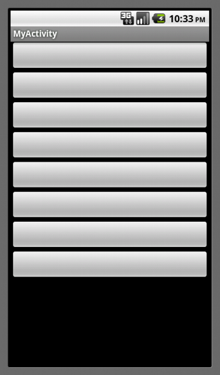
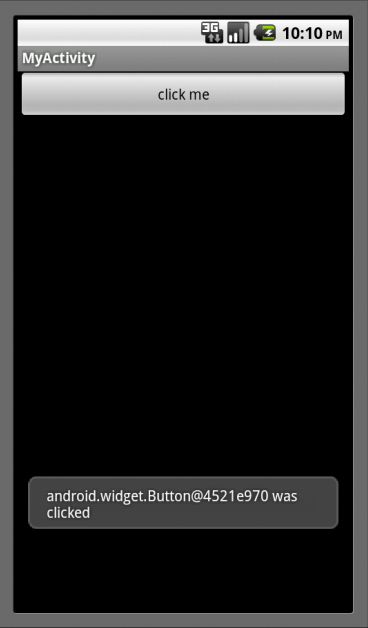
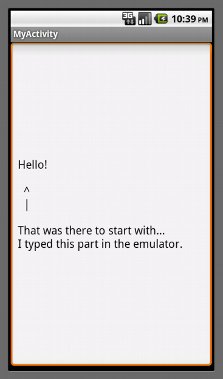
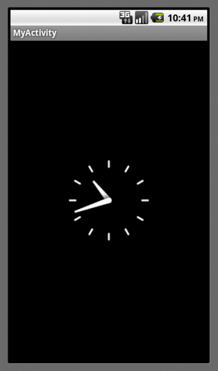
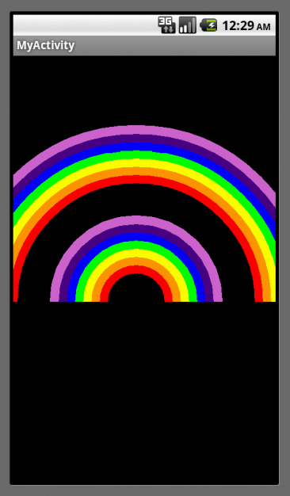
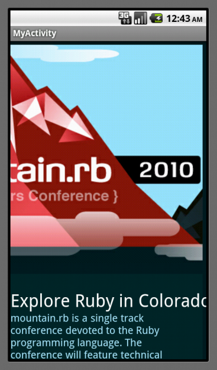
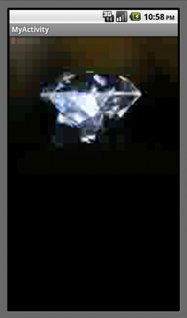

!SLIDE subsection
#Android API

!SLIDE bullets
* GUI
* Hardware
* Notifications
* Canvas
* WebView
* Multimedia
* Log

!SLIDE
#GUI: Layouts
    @@@ruby
    layout = LinearLayout.new(self)
    layout.orientation = LinearLayout::VERTICAL
    8.times {layout.add_view(Button.new(self))}
    self.content_view = layout
!SLIDE center transition=scrollUp

!SLIDE
#GUI: Buttons
    @@@ruby
    def on_create(bundle)
      layout = LinearLayout.new(self)
      layout.orientation = LinearLayout::VERTICAL
      button = Button.new(self)
      button.text = "click me"
      layout.add_view(button)
      self.content_view = layout
      request_callback CB_CLICK
      button.on_click_listener = self
    end
    def on_click(view)
      Toast.make_text(self, "#{view} was clicked", 5000).show
    end
!SLIDE center transition=scrollUp

!SLIDE
#GUI: Text Fields
    @@@ruby
    edit = EditText.new(self)
    edit.text = "Hello!"
    self.content_view = edit
!SLIDE center transition=scrollUp

!SLIDE
#GUI: AnalogClock
    @@@ruby
    self.content_view = AnalogClock.new(self)
!SLIDE center transition=scrollUp

!SLIDE
#Hardware: TouchEvent
##Set up to receive events
    @@@ruby
    class MyView < RubotoView
      def initialize(parent)
        super
        request_callback CB_TOUCH_EVENT
      end
    end
!SLIDE transition=scrollUp
#Hardware: TouchEvent
##Handler method
    @@@ruby
    def on_touch_event(event)
      0.upto 10 do |id|
        index = event.find_pointer_index(id)
        break if index == -1
        x = event.getX(index)
        y = event.getY(index)
        Log.d(
          "ONTOUCH",
          "Pointer #{id}: #{x}, #{y}"
        )
      end
      true
    end

!SLIDE
#Hardware: Sensors
    @@@ruby
    Sensor::TYPE_ACCELEROMETER,
    Sensor::TYPE_MAGNETIC_FIELD
    Sensor::TYPE_ORIENTATION

!SLIDE
#Hardware: Vibrator
    @@@ruby
    get_system_service(VIBRATOR_SERVICE)
    vibrate(duration1, duration2, -1)

!SLIDE
#Notifications: Toast
    @@@ruby
    Toast.make_text(
      self,
      "#{view} was clicked",
      5000
    ).show

!SLIDE
#Canvas

!SLIDE transition=scrollUp
    @@@ruby
    class MyActivity
      PALETTE = [
        Color::RED, Color.rgb(255, 150, 0),
        Color::YELLOW, Color::GREEN, Color::BLUE,
        Color.rgb(75, 0, 130), Color.rgb(200, 100, 200)
      ]
      def on_create(bundle)
        request_callback CB_DRAW
        self.content_view = RubotoView.new(self)
      end

!SLIDE transition=scrollUp
    @@@ruby
      def on_draw(view, canvas)
        paint = Paint.new
        paint.style = Paint::Style::STROKE
        paint.stroke_width = 11
        @radius = 40
        2.times do
          draw_arcs(canvas, paint)
          @radius += 40
        end
      end

!SLIDE transition=scrollUp
    @@@ruby
      def draw_arcs(canvas, paint)
        PALETTE.each do |color|
          paint.color = color
          rect = RectF.new(
            150 - @radius, 300 - @radius,
            150 + @radius, 300 + @radius
          )
          canvas.draw_arc(rect, 180, 180, false, paint)
          @radius += 10
        end
      end

!SLIDE center transition=scrollUp

!SLIDE
#WebView
    @@@ruby
    web = WebView.new(self)
    web.load_url 'http://mountainrb.com'
    self.content_view = web

!SLIDE transition=scrollUp
#Don't forget!
#in AndroidManifest.xml:

    @@@xml
    <uses-permission
      android:name="android.permission.INTERNET"
    />
!SLIDE center transition=scrollUp

!SLIDE
#Multimedia: Audio
    @@@ruby
    def on_create(bundle)
      request_callback CB_PAUSE
      file = File.new("sdcard/test.mp3")
      uri = Uri.from_file(file)
      player = MediaPlayer.create(self, uri)
      player.start
    end
    def on_pause
      player.stop
    end
!SLIDE
#Multimedia: Video
    @@@ruby
    view = VideoView.new(self)
    view.video_path = "sdcard/test.mp4"
    self.content_view = view
    view.start
!SLIDE center transition=scrollUp

!SLIDE
#Log
    Log.d("My Activity", "here's what's up...")
!SLIDE commandline incremental
    $ adb logcat
    D/dalvikvm(  119): GC_EXPLICIT freed 1050 objects / 61056 bytes in 91ms
    I/dalvikvm(  253): Shrank stack (to 0x41869300, curFrame is 0x418695cc)
    D/My Activity(  253): here's what's up...
