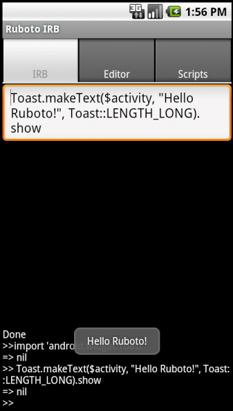

!SLIDE subsection
#What is Ruboto?

!SLIDE bullets
#Two forms

!SLIDE bullets
#ruboto-irb
* interactive environment on phone

!SLIDE center transition=scrollUp

!SLIDE bullets
#ruboto-core
* Means of packaging Ruby scripts for Android as an .apk

!SLIDE commandline transition=scrollUp
    $ ruboto gen app --package com.my.app --path myapp \
    --name MyApp --target android-8 --activity MyActivity
!SLIDE commandline incremental transition=scrollUp
    $ find -type f myapp
    myapp/AndroidManifest.xml
    myapp/assets/scripts/my_activity.rb
    myapp/assets/scripts/ruboto.rb
    myapp/Rakefile
    myapp/src/com/my/app/MyActivity.java
    ...

!SLIDE bullets
# Uses JRuby

!SLIDE bullets
#Caveat - slow startup
* Binding Java classes is inefficient
* ~2s startup time "definitely achievable"
* --@headius

!SLIDE center
#Java -> Ruby Automapping

!SLIDE
#method definitions
    @@@ java
    public void onClick(View target)
!SLIDE transition=fade
#method definitions
    @@@ ruby
    def on_click(target)
!SLIDE
#method calls
    @@@ java
    this.setContentView(view)
!SLIDE transition=fade
#method calls
    @@@ ruby
    self.content_view = view
!SLIDE
#constants
    @@@ java
    LinearLayout.VERTICAL
!SLIDE transition=fade
#constants
    @@@ ruby
    LinearLayout::VERTICAL
!SLIDE
#Java
    @@@ java
    import android.widget.Toast;
    Toast toast = Toast.makeText(
        getApplicationContext(),
        "Thank you very much!",
        Toast.LENGTH_SHORT
    );
    toast.show();
!SLIDE transition=fade
#Ruby
    @@@ ruby
    java_import 'android.widget.Toast'
    toast = Toast.make_text(
        $activity,
        "Domo arigato!",
        Toast::LENGTH_SHORT
    )
    toast.show
