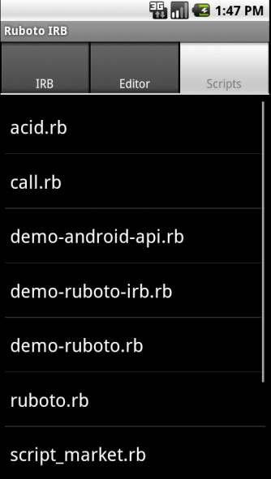
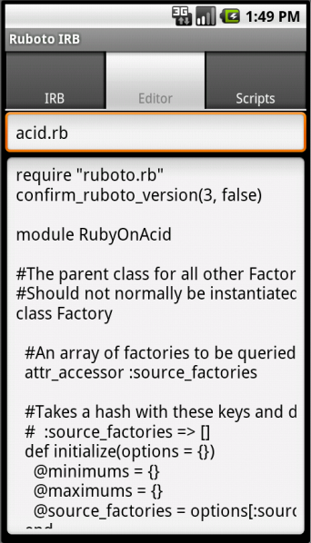
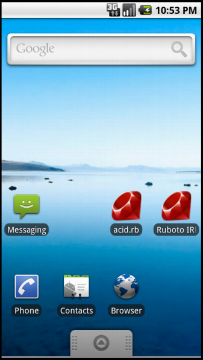

!SLIDE subsection

# Features #

!SLIDE
# IRB for live coding... #
!SLIDE center transition=fade

!SLIDE
# Script selector loads from /sdcard/jruby/ #
!SLIDE center transition=fade

!SLIDE center
# Editor too. #
Here be Carpal Tunnel.
!SLIDE center transition=fade

!SLIDE center
# Shortcuts #
Acts like a (slow-loading) first-class app!

!SLIDE center transition=fade

!SLIDE center transition=fade

