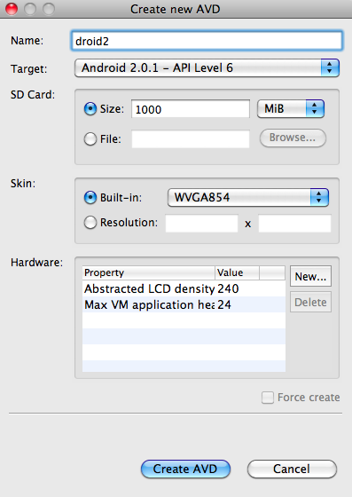
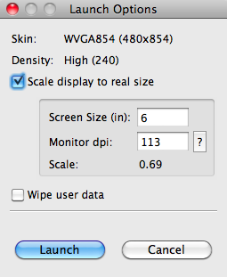
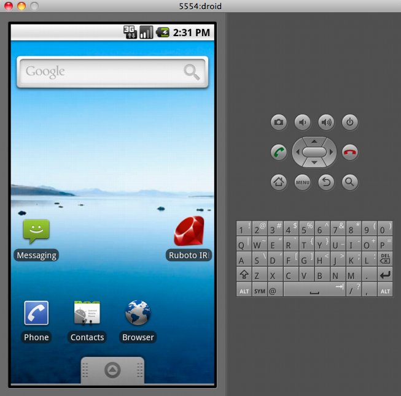

!SLIDE subsection
# Installation #

!SLIDE bullets incremental transition=fade
# No purchase necessary to play! #
* Grab the Android SDK (which includes an emulator).
* Get a pre-made Ruboto APK off of GitHub downloads.
* (Links at end).
!SLIDE center transition=fade

!SLIDE center transition=fade

!SLIDE
# Install Ruboto-IRB to the AVD. #

!SLIDE commandline incremental
# Use the SDK's "adb" debugger tool. #
	$ adb install ~/Downloads/IRB-0.2-preview1.apk
	-bash: adb: command not found

!SLIDE commandline incremental
# Oh, and make sure the SDK toolset is on your PATH. #
	$ export PATH=$PATH:$HOME/android-sdk-mac_86/tools/
	$ adb install ~/Downloads/IRB-0.2-preview1.apk
!SLIDE center transition=fade

