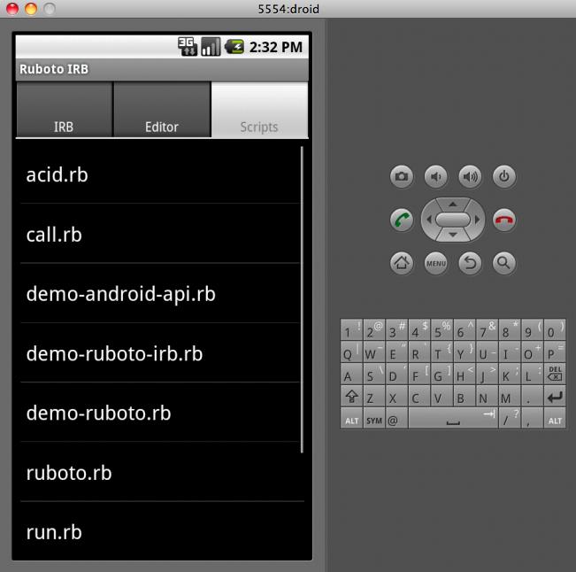
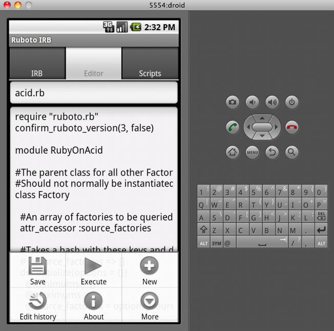
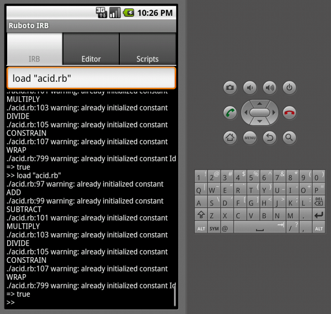

!SLIDE subsection
#Loading Code

!SLIDE
#No gems (yet)!

!SLIDE commandline incremental
#I originally pushed my entire library to the phone...
	$ adb push . /sdcard/jruby/rubotoonacid

!SLIDE center
#This works ok...
/sdcard/jruby is in $RUBYLIB.

!SLIDE commandline incremental
#But a single script is more distributable for now.
	$ find lib/rubyonacid -type f -exec cat {} \; \
	-exec echo "" \; | grep -v "require '" >> acid.rb;\
	cat $HOME/Projects/rubotoonacid/examples/ruboto.rb >> acid.rb

!SLIDE center
Scott Moyer called this "one script to rule them all". Muhuhuhaha...

!SLIDE commandline incremental
#May have to tweak declaration order by hand.
	$ edit acid.rb

!SLIDE commandline incremental
#Now there's just one file for users to download.
	$ adb push acid.rb /sdcard/jruby/
	80 KB/s (23712 bytes in 0.286s)
!SLIDE center transition=fade

!SLIDE
#You can execute from menu...
!SLIDE center transition=fade

!SLIDE
#But "load" commands from IRB auto-load new versions and don't require mousing.
!SLIDE center transition=fade

