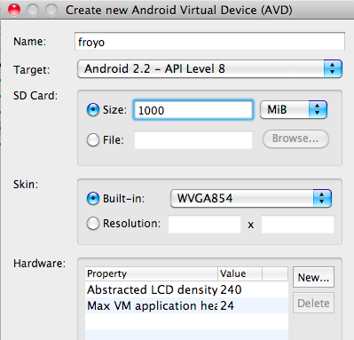
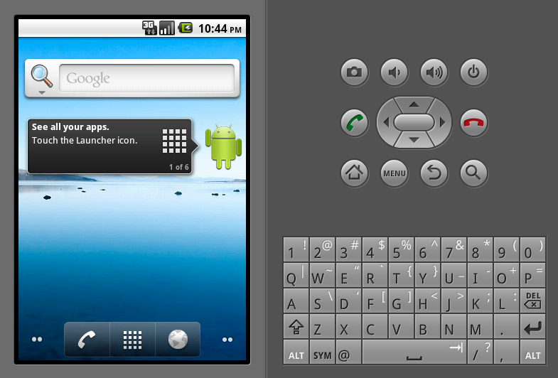

!SLIDE subsection
#Setup

!SLIDE bullets
#ruboto-irb
* Search "ruboto" on the Android Market.

!SLIDE bullets
#ruboto-core
* install jruby
* install gem
* install android SDK

!SLIDE commandline incremental

    $ sudo gem install rvm

    $ rvm-install

    $ exit

!SLIDE commandline incremental

    $ rvm install jruby

    $ rvm use jruby

    $ gem install ruboto-core #no sudo!

!SLIDE bullets
* http://developer.android.com/
!SLIDE center transition=scrollUp

    
!SLIDE commandline incremental

    $ unzip ~/Downloads/android-sdk_*.zip -d ~/Applications
     creating: /Users/jay/Applications/android-sdk-mac_86/
     creating: /Users/jay/Applications/android-sdk-mac_86/platforms/
    inflating: /Users/jay/Applications/android-sdk-mac_86/SDK Readme.txt
    ...
    
    $ export PATH=$PATH:${HOME}/Applications/android-sdk/tools/
    
    $ android
    Starting Android SDK and AVD Manager

!SLIDE center transition=scrollUp
#Create a new AVD

!SLIDE center transition=scrollUp
#Launch the emulator

!SLIDE commandline incremental
#Create app
    $ ruboto gen app --package com.my.app --path myapp \
    --name MyApp --target android-8 --activity MyActivity

    $ cd myapp
    
    $ mate .

!SLIDE commandline incremental
#Build/install app
    $ rake
    
    $ adb install -r bin/MyApp-debug.apk

!SLIDE center transition=scrollUp

!SLIDE commandline incremental
#Update as needed
    $ rake update_scripts
    
    $ adb push load_me.mp3 /sdcard
