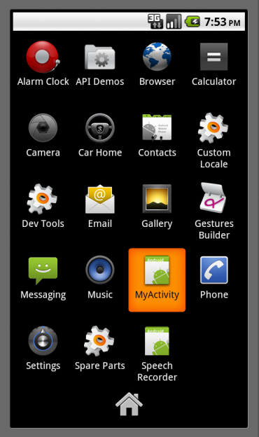

!SLIDE subsection
#Setup

!SLIDE bullets
#ruboto-irb
* Search "ruboto" on the Android Market.

!SLIDE bullets
#ruboto-core
* install jruby
* install gem
* install android SDK

!SLIDE commandline incremental

    $ sudo gem install rvm

    $ rvm-install

    $ exit

!SLIDE commandline incremental

    $ rvm install jruby

    $ rvm use jruby

    $ gem install ruboto-core #no sudo!

!SLIDE bullets
* http://developer.android.com/
!SLIDE center transition=scrollUp

    
!SLIDE commandline incremental

    $ unzip ~/Downloads/android-sdk_*.zip -d ~/Applications
     creating: /Users/jay/Applications/android-sdk-mac_86/
     creating: /Users/jay/Applications/android-sdk-mac_86/platforms/
    inflating: /Users/jay/Applications/android-sdk-mac_86/SDK Readme.txt
    ...
    
    $ export PATH=$PATH:${HOME}/Applications/android-sdk/tools/

!SLIDE commandline incremental transition
#Create a new AVD
    $ android -s create avd -f -n MyApp -t android-8
    Android 2.2 is a basic Android platform.
    Do you wish to create a custom hardware profile [no]
    Created AVD 'MyApp' based on Android 2.2,
    with the following hardware config:
    hw.lcd.density=160

!SLIDE commandline incremental transition
#Launch the emulator
    $ emulator -avd MyApp

!SLIDE center transition=scrollUp

!SLIDE commandline incremental
#Create app
    $ ruboto gen app --package com.my.app --path myapp \
    --name MyApp --target android-8 --activity MyActivity

    $ cd myapp
    
    $ mate .

!SLIDE commandline incremental
#Using Rake
    $ rake -T
    rake clean                   # Remove any temporary products.
    rake clobber                 # Remove any generated file.
    rake compile_stdlib          # precompile ruby stdlib
    rake install:restart         # Build, install, and restart the application
    ...
    
!SLIDE commandline incremental transition=scrollUp
#Build/install/run app
    $ rake
    
    $ rake install:restart

!SLIDE center transition=scrollUp

!SLIDE commandline incremental
#Update as needed
    $ rake update_scripts:restart
    
    $ adb push load_me.mp3 /sdcard
