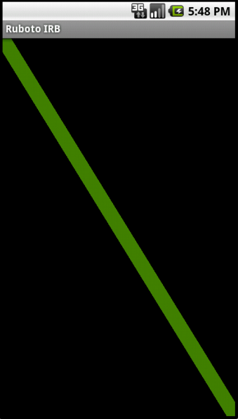

!SLIDE subsection
#Writing Code

!SLIDE
#Java
    @@@ java
    Toast toast = Toast.makeText(
        getApplicationContext(),
        "Thank you very much!",
        Toast.LENGTH_SHORT
    );
    toast.show();

!SLIDE
#Ruby
    @@@ ruby
    import 'android.widget.Toast'
    toast = Toast.make_text(
        $activity,
        "Domo arigato!",
        Toast::LENGTH_SHORT
    )
    toast.show

!SLIDE
#ruboto.rb conveniences

!SLIDE bullets incremental
#$activity
* The current Activity this script is running within.
* There are other $variables, but they're all passed to callbacks anyway, so don't use 'em.

!SLIDE bullets incremental
#ruboto.rb Callbacks
* Each takes a block to be called when its event occurs.
!SLIDE bullets incremental transition=scrollUp
* start_ruboto_activity: Call this first. Set up other handlers within this block.
* setup_content: Should return a RubotoView.new(ruboto_activity) to use as container.
!SLIDE bullets incremental transition=scrollUp
* handle_create {|bundle|}: Called upon Activity creation, right after setup_content block.
* handle_start {}
* handle_pause {}
* handle_resume {}
!SLIDE bullets incremental transition=scrollUp
* handle_stop {}
* handle_key {|view, key_code, event|}
* handle_click {|view|}
* handle_draw {|view, canvas|}

!SLIDE
#Fun stuff from the Android API

!SLIDE bullets incremental
#Intent
* Switch Activities
* CRUD content
* Dial/SMS contacts, do searches...
!SLIDE transition=scrollUp
    @@@ ruby
    java_import "android.content.Intent"
    java_import "android.net.Uri"
    $activity.start_activity (
        Intent.new(
            Intent::ACTION_VIEW,
            Uri.parse("content://contacts/people")
        )
    )

!SLIDE bullets incremental
#Canvas
* Draw ovals, rectangles, arcs, lines...
* Work with clips
* Copy in bitmaps
!SLIDE transition=scrollUp
    @@@ ruby
    handle_draw do |view, canvas|
      paint = Paint.new
      paint.color = Color.argb(128, 128, 255, 0)
      paint.stroke_width = 20
      canvas.draw_line(
        0, 0,
        view.get_width, view.get_height,
        paint
      )
    end
!SLIDE center transition=scrollUp

!SLIDE bullets incremental
#Sensors
* Accelerometer
* Compass
* Orientation
!SLIDE transition=scrollUp
    @@@ ruby
    setup_content do
      sensor_manager = get_system_service(
        Context::SENSOR_SERVICE
      )
      sensor = sensor_manager.get_default_sensor(
        Sensor::TYPE_ACCELEROMETER
      )
      sensor_manager.register_listener(
        self, sensor, SensorManager::SENSOR_DELAY_UI
      )
      @view = TextView.new($myactivity)
    end
!SLIDE transition=scrollUp
    @@@ ruby
    handle_sensor_changed do |event|
      @view.text = event.values.join("/")
    end
