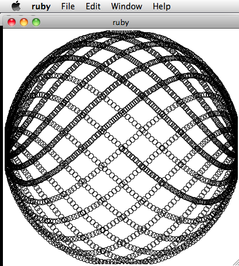

!SLIDE subsection
#Other libraries

!SLIDE bullets
#Win32OLE

* Control Windows applications from Ruby
* Google your app's OLE docs to learn its API
* RubyOSA is a (non-standard) OSX equivalent

!SLIDE transition=scrollUp
    @@@ruby
    require 'win32ole'

    WIN32OLE.new('musicPlayer.Application').Play

!SLIDE bullets
#Logger

* Log to STDOUT, STDERR, files, etc.
* Like Log4J

!SLIDE transition=scrollUp
    @@@ruby
    require 'logger'
    require 'open-uri'
    file_size = 100000; file_count = 10
    logger = Logger.new('spider.log',
      file_count, file_size)
    begin
      open('http://www.yahoo.com') do |u|
        logger.info u.status
      end
    rescue Exception => e
      logger.warn e
    end

!SLIDE commandline incremental

    $ cat spider.log 
    # Logfile created on Wed Mar 02 11:36:23 -0700 2011 by logger.rb/22285
    W, [2011-03-02T11:36:27.441786 #26423]  WARN -- : getaddrinfo: nodename nor servname provided, or not known (SocketError)
    /usr/local/lib/ruby/1.8/net/http.rb:560:in `initialize'
    /usr/local/lib/ruby/1.8/net/http.rb:560:in `open'
    ...

!SLIDE bullets
#Test::Unit

* Like JUnit
* You ARE unit testing your code, right?
* RSpec is better for big apps

!SLIDE transition=scrollUp
    @@@ruby
    require 'test/unit'
    class MyTest < Test::Unit::TestCase
      def test_one
        assert_equal("cat", :cat.to_s)
        assert_in_delta(0.01, 0.009, 0.002)
      end
      def test_two
        assert_equal(4, 2 + 2)
        assert_equal(5, 2 + 2)
      end
    end

!SLIDE transition=scrollUp
    Loaded suite -
    Started
    .F
    Finished in 0.014912 seconds.

      1) Failure:
    test_two(MyTest) [-:9]:
    <5> expected but was
    <4>.

    2 tests, 4 assertions, 1 failures, 0 errors

!SLIDE bullets
#Other assertions

* assert_not_equal
* assert_kind_of
* assert_nil
* assert_raise
* assert_nothing_raised

!SLIDE bullets
# OptionParser

* See also GetoptLong

!SLIDE transition=scrollUp
    @@@ruby
    require 'optparse'
    require 'win32ole'
    player = WIN32OLE.new(
      'musicPlayer.Application'
    )
    opt = OptionParser.new

    opt.separator("Program help:")
    opt.on("-h", "--help",
      TrueClass, "Display help.") do
        puts opt.help
        exit
      end

!SLIDE transition=scrollUp
    @@@ruby
    opt.separator("Playback controls:")
    opt.on("--play",
      TrueClass, "Play track.") do
        player.play
      end
    opt.on("--volume number",
      Integer, "Set volume.") do |value|
        puts "Setting volume to #{value}"
        player.volume = value
      end
    
    opt.parse(ARGV)

!SLIDE commandline incremental

    $ ruby option_parser.rb --help
    Usage: option_parser [options]
    Program help:
        -h, --help                       Display help.
    Playback controls:
            --play                       Play track.
            --volume number              Set volume.

!SLIDE commandline incremental

    $ ruby option_parser.rb --volume 5
    Setting volume to 5

!SLIDE bullets
#Tk

* GUI library
* Buttons, fields, sliders, everything
* Windows, OS X, Linux

!SLIDE transition=scrollUp
    @@@ruby
    require 'tk'
    canvas = TkCanvas.new(
      :width => 400,
      :height => 400
    )
    canvas.pack

!SLIDE transition=scrollUp
    @@@ruby
    radius=200
    a = 0
    3000.times do
      x = radius * Math.sin(a) + radius
      y = radius * Math.cos(a)
        * Math.sin(0.9 * a) + radius
      TkcOval.new(canvas, x, y, x + 9, y + 9)
      a += 0.03
    end
    canvas.mainloop

!SLIDE center transition=scrollUp

