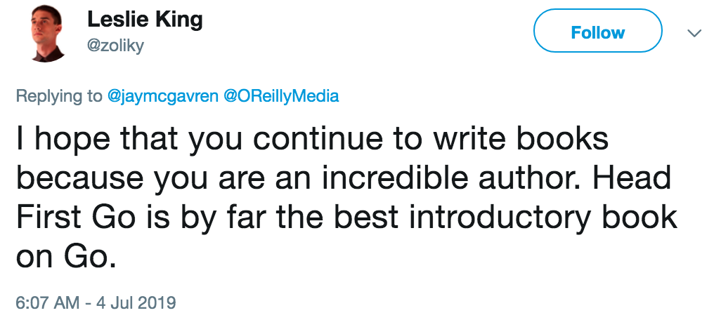

# Crafting Effective Technical Tutorials

## About Me

* Name: Jay McGavren
* Author of Head First Ruby and Head First Go
* Total 4 years creating training for Code School, then Treehouse


## Why Listen To Me?

I dunno, I don't _feel_ like my content should be that extraordinary...

## Head First Ruby Amazon Reviews


(The 2-star guy is mad the book isn't on Kindle Cloud Reader.)

## Head First Go Amazon Reviews


## A Tweet About Head First Go



# The Science (and pseudoscience) I Use

## Impress them Early

## Tell a Story

"If I stood up and read the entire ECMAScript spec to you, I'd be technically sophisticated but a terrible speaker."

"The truth is that humans are story-driven. Good talks focus on solving problems. Great talks tell stories that change perspectives."

[https://dev.to/samjulien/speaker-stuff-no-one-tells-you-about-applying-to-conferences-l3n](https://dev.to/samjulien/speaker-stuff-no-one-tells-you-about-applying-to-conferences-l3n)

## Tell a Story

A story format gives viewers context for what you're teaching.

* What kind problem does this knowledge help solve?
* Have we learned everything we need to yet? ("No, look, there's this bug over here!")
* Gives a sense of closure at end of lesson.

## Avoid Split Attention

<!-- Efficiency in Learning p. 84 -->

Don't make readers look all over the page to assimilate information. Put related information together!

### Replace:

| Verb | Output |
| ---- | ------ |
| `%f` | Floating-point number |
| `%d` | Decimal integer |
| `%s` | String |
| `%t` | Boolean (`true` or `false`) |

``` go
fmt.Printf("%f\n", 1.234)
fmt.Printf("%d\n", 1)
fmt.Printf("%s\n", "a string")
fmt.Printf("%t\n", true)
```

Output:

``` go
1.234000
1
a string
true
```

### With:

``` go
// Floating point numbers: %f
fmt.Printf("%f\n", 1.234)      // => 1.234000
// Decimal integers:       %d
fmt.Printf("%d\n", 1)          // => 1
// Strings:                %s
fmt.Printf("%s\n", "a string") // => a string
// Boolean values:         %t
fmt.Printf("%t\n", true)       // => true
```

## Minimize Page Flipping

## _Do_ Repeat Yourself

## Limit "Trivia"

* Bad: Who created the Go Language?
* Good: Is Go compiled or interpreted?

## Pick and Choose Topics

* Attention is a finite resource!
* What is _your_ target audience ready to learn? (Not "able", "ready"!)
* What does _your_ target audience need to know?

## Use Clear Motivating Examples

TODO

```go
func Camp() error {
	var fire Fire
	fire.Light()
	// All you have to do is defer a call to Extinguish
	// right after you make a call to Light! Extinguish
	// will be called when Camp exits, whether Camp does
	// so normally or due to an error.
	defer fire.Extinguish()
	return fmt.Errorf("spotted a bear")
	fmt.Println("Toasting marshmallows")
	return nil
}
```

## Manage Knowledge Dependencies


## Manage Knowledge Dependencies

Simple example: I realized I needed `%%` when demonstrating `Printf` format widths:

``` go
fmt.Printf("%%7.3f: %7.3f\n", 12.3456) // => %7.3f:  12.346
fmt.Printf("%%7.2f: %7.2f\n", 12.3456) // => %7.2f:   12.35
fmt.Printf("%%7.1f: %7.1f\n", 12.3456) // => %7.1f:    12.3
fmt.Printf("%%.1f: %.1f\n", 12.3456)   // => %.1f: 12.3
fmt.Printf("%%.2f: %.2f\n", 12.3456)   // => %.2f: 12.35
```

## Manage Knowledge Dependencies

...So I just went back and added it to the other verbs.

``` go
...
fmt.Printf("%s\n", "a string") // => a string
// Boolean values:         %t
fmt.Printf("%t\n", true)       // => true
// Literal % sign:         %%
fmt.Printf("%%\n")             // => %
```

## Manage Knowledge Dependencies

Prerequisite knowledge _has_ to be taught, or readers will be confused.

* Try to fit it in at the time you're teaching similar concepts.
* But if you have to, introduce it as an aside/detour.

## Avoid Ambiguous Pronouns

Bad:

Does "it" refer to Extinguish or Camp? Even a beginner can probably figure it out, but why make them expend the mental effort?

```go
func Camp() error {
	var fire Fire
	fire.Light()
	// All you have to do is defer a call to Extinguish
	// right after you make a call to Light! Extinguish
	// will be called when Camp exits, whether it does
	// so normally or due to an error.
	defer fire.Extinguish()
	return fmt.Errorf("spotted a bear")
	fmt.Println("Toasting marshmallows")
	return nil
}
```

Good: s/it/Camp/

```go
func Camp() error {
	var fire Fire
	fire.Light()
	// All you have to do is defer a call to Extinguish
	// right after you make a call to Light! Extinguish
	// will be called when Camp exits, whether Camp does
	// so normally or due to an error.
	defer fire.Extinguish()
	return fmt.Errorf("spotted a bear")
	fmt.Println("Toasting marshmallows")
	return nil
}
```

## Offer Practice

TODO

## Further Reading

* __Efficiency in Learning__, Clarke et al.
* __Memory and the Human Lifespan__, Steve Joordens, Ph.D.: `https://www.thegreatcourses.com/courses/memory-and-the-human-lifespan.html`
* "A Guide to Better Technical Writing", Wade Christensen: `https://astuteape.com/writing/a-guide-to-better-technical-writing/`
* My book!


## Review These Slides

TODO set up link from jay.mcgavren.com
