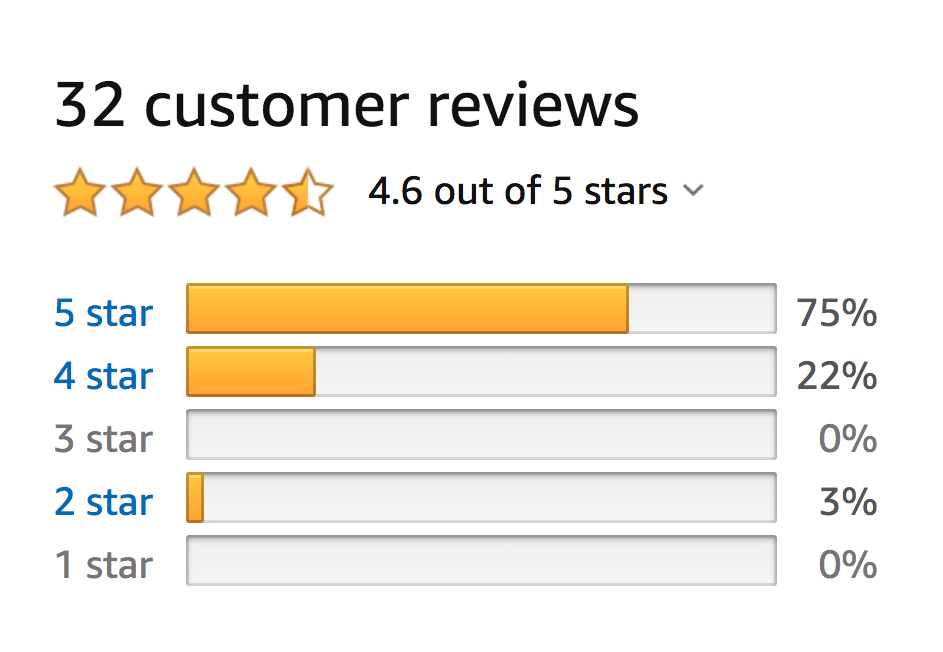
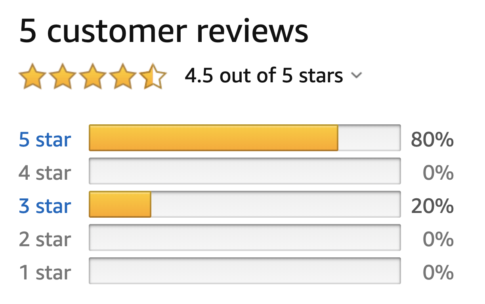
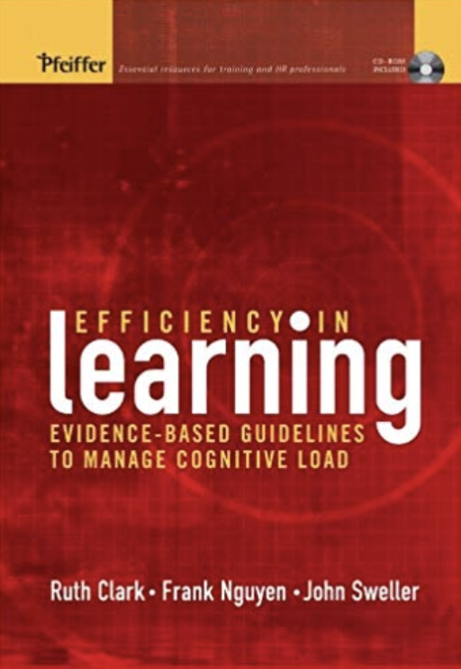
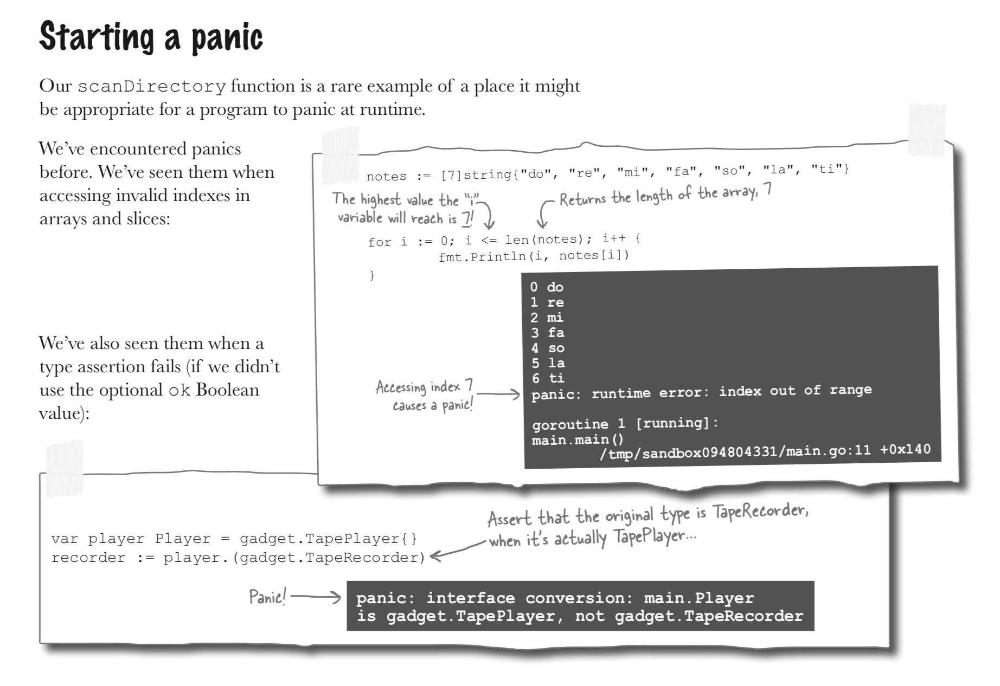
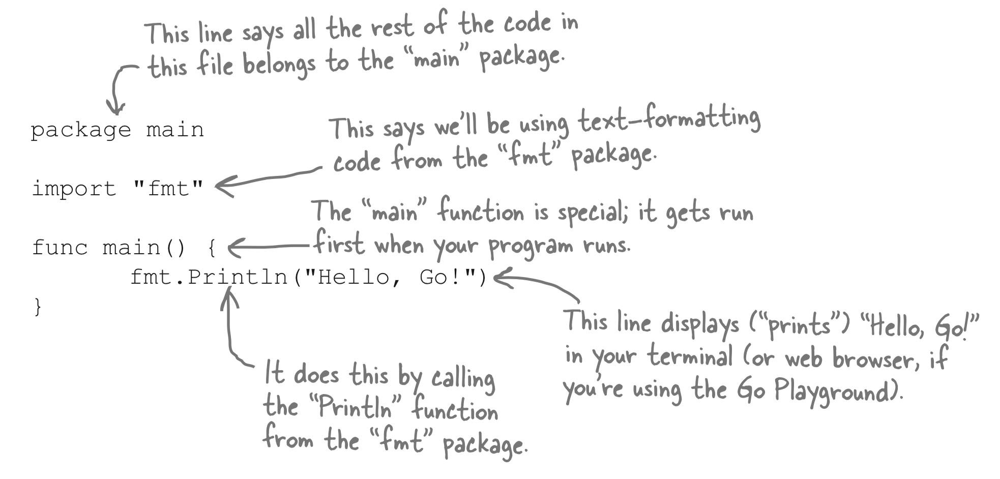
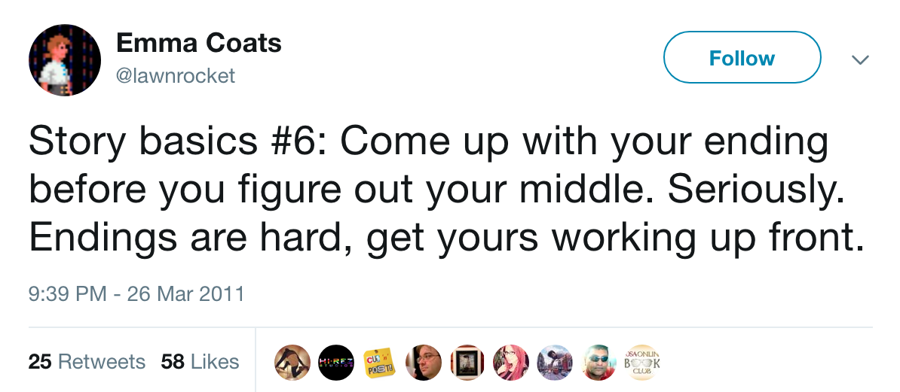
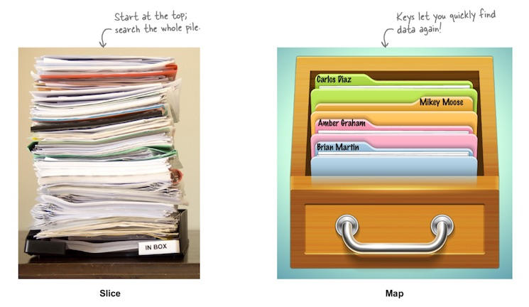

# Teaching Tech

## About Me

* Author of _Head First Ruby_ and _Head First Go_
* Total 4 years creating training for Code School, then Treehouse


## Why Listen To Me?

* I dunno!
* I don't _feel_ like my content should be that extraordinary...

## Head First Ruby Amazon Reviews



(The 2-star guy is mad the book isn't on Kindle Cloud Reader.) `¯\_(ツ)_/¯`

## Head First Go Amazon Reviews



(The 3-star guy is mad at the setup process for the Go toolchain.) `¯\_(ツ)_/¯`

# The Science (and pseudoscience) I Use

## The Science



## References

R.K. Atkinson, (2002). Optimizing learning from examples using animated pedagogical agents. Journal of Educational Psychology, 94(2), 416–427.

R.K. Atkinson,, S.H., Derry, A., Renkl, & D. Wrotham, (2000). Learning from examples: Instructional principles from the worked examples research. Review of Educational Research, 70(2), 181–214.

R.K., Atkinson, A., Renkl, & M.M. Merrill, (2003). Transition from studying examples to solving problems: Effects of self-explanation prompts and fading worked out steps. Journal of Educational Psychology, 95(4), 774–783.

A. Baddeley, (1992). Working memory. Science, 255, 556–559.

R., Brunken, J., Plass, & D. Leutner, (2003). Direct measurement of cognitive load in multimedia learning. Educational Psychologist, 38, 53–61.

R., Carlson, P., Chandler, & J. Sweller, (2003). Journal of Educational Psychology, 95(3), 629–640.

J.M. Carroll, (1992). Minimalist documentation. In H.D. Stolovitch & E.J. Keeps (Eds.), Handbook of human performance technology. San Francisco, CA: Jossey-Bass.

N., Cerpa, P., Chandler, & J. Sweller, (1996). Some conditions under which integrated computer-based training software can facilitate learning. J. Educational Computing Research, 14(4), 344–367.

P., Chandler, & J. Sweller, (1991). Cognitive load theory and the format of instruction. Cognition and Instruction, 8(4), 293–332.

P., Chandler, & J. Sweller, (1992). The split attention effect as a factor in the design of instruction. British Journal of Educational Psychology, 62, 233–246.

P., Chandler, & J. Sweller, (1996). Cognitive load while learning to use a computer program. Applied Cognitive Psychology, 10, 141–170.

W.G., Chase, & H.A. Simon, (1973). The mind's eye in chess. In W.G. Chase (Ed.), Visual information processing. London: Academic Press.

M.T.H. Chi, (2000). Self-explaining expository texts: The dual processes of generating inferences and repairing mental models. In R. Glaser (Ed.), Advances in instructional psychology educational design and cognitive science (Vol. 5). Mahwah, NJ: Lawrence Erlbaum.

## References

M.T.H., Chi, M., Bassok, M.W., Lewis, P., Reimann, & R. Glaser, (1989). Self-explanations: How students study and use examples in learning to solve problems. Cognitive Science, 13, 145–182.

R.C. Clark, (1999). Developing technical training (2nd ed.). Silver Spring: MD: International Society for Performance Improvement.

R.C. Clark, (2003). Building expertise (2nd ed.). Silver Spring, MD: International Society for Performance Improvement.

R.C. Clark, (in press). Evidence-based practice and professionalization of HPT. In J. Pershing (Ed.), Handbook of performance technology (3rd ed.). Silver Spring: MD: International Society of Performance Improvement.

R.C., Clark, & C. Lyons, (2004). Graphics for learning. San Francisco, CA: Pfeiffer.

R.C., Clark, & R.E. Mayer, (2003). e-Learning and the science of instruction. San Francisco, CA: Pfeiffer.

A., Collins, J.S., Brown, & S.E. Newman, (1989). Cognitive apprenticeship: Teaching the craft of reading, writing, and mathematics. In L.B. Resnick (Ed.), Knowing, learning, and instruction: Essays in honor of Robert Glaser (pp. 453–493). Mahwah, NJ: Lawrence Erlbaum.

G., Cooper, & J. Sweller, (1987). The effects of schema acquisition and rule automation on mathematical problem-solving transfer. Journal of Educational Psychology, 79, 347–362.

G., Cooper, S., Tindall-Ford, P., Chandler, & J. Sweller, (2001). Learning by imagining. Journal of Experimental Psychology: Applied, 7(1), 68–82.

S.D., Craig, B., Gholson, & D.M. Driscoll, (2002). Animated pedagogical agents in multimedia educational environments: Effects of agent properties, picture features, and redundancy. Journal of Educational Psychology, 94(2), 428–434.

H. Dolezalek, (2004). Industry report. Training, 41(9), 20–36.

J.E., Driskell, C., Copper, & A. Moran, (1994). Does mental practice enhance performance? Journal of Applied Psychology, 7, 481–492.

J.L., Etneir, & D.M. Landers, (1996). The influence of procedural variables on the efficacy of mental practice. The Sport Psychologist, 9, 48–57.

A., Fuat, A.P.S., Hungin, & J.J. Murphy, (2003). Barriers to accurate diagnosis and effective management of heart failure in primary care: Qualitative study. British Medical Journal, 326, p. 196.

## References

P., Gerjets, K., Scheiter, & R. Catrambone, (2004). Designing instructional examples to reduce intrinsic cognitive load: Molar versus modular presentation of solution procedures. Instructional Science, 32, 33–58.

M.L., Gick, & K.J. Holyoak, (1980). Analogical problem solving. Cognitive Psychology, 12, 306–355.

M.L., Gick, & K.J. Holyaok, (1983). Schema induction and analogical transfer. Cognitive Psychology, 15, 1–38.

P., Ginns, P., Chandler, & J. Sweller, (2003). When imagining information is effective. Contemporary Educational Psychology, 28, 229–251

V., Gyselinck, & H. Tardieu, (1999). The role of illustrations in text comprehension: What, when, for whom, and why? In H.V. Van Oostendrop & S.R. Goldman (Eds.), The construction of mental representations during reading. Mahwah, NJ: Lawrence Erlbaum.

S.F., Harp, & R.E. Mayer, (1997). The role of interest in learning from scientific text and illustrations: On the distinction between emotional interest and cognitive interest. Journal of Educational Psychology, 89(1), 92–102.

R.E. Haskell, (2001). Transfer of learning. New York: Academic Press.

J., Hartley, & M. Benjamin, (1998). An evaluation of structured abstracts in journals published by the British Psychological Society. British Journal of Educational Psychology, 68, 443–446.

M., Hegarty, N.H., Narayanan, & P. Freitas, (2002). Understanding machines from multimedia and hypermedia presentations. In J. Otero, J.A. Leson, & A.C. Graesser (Eds.), The psychology of science text comprehension. Mahwah, NJ: Lawrence Erlbaum.

C.E. Hmelo-Silver, (2004). Problem-based learning: What and how do students learn? Educational Psychology Review, 16(3), 235–266.

B., Hoffman, & D. Ritchie, (1997). Using multimedia to overcome the problems with problem based learning. Instructional Science, 25, 97–115.

M., Hojat, & G. Xu, (2004). A visitor's guide to effect sizes. Advances in Health Sciences Education, 9, 241–249.

H.G.K., Hummel, & R.J. Nadolski, (2002). Cueing for schema construction: Designing problem-solving multimedia practicals. Contemporary Educational Psychology, 27, 229–249.

## References

(This would go on for about 13 more slides...)


## Minimize Page Flipping

"Have you ever read a book in which the text describes a visual located on the _back of the page_? ... The annoyance you feel [is due to] extraneous cognitive load needed to search for and integrate related information that is _physically separated_."

-Efficiency in Learning

## _Do_ Repeat Yourself

* In _Head First Go_, I didn't tell readers to refer back to page X.
* I copied content from page X onto the current page.
* I used a "torn page" effect to make it clear which parts were repetitions.



## Avoid Split Attention

"Split attention occurs when two mutually dependent visual sources of information are laid out in a format that requires the learner to mentally integrate them."

-Efficiency in Learning

## Avoid Split Attention

Don't make readers look all over the page/slide to assimilate information. Put related information together!

### Replace:

| Verb | Output |
| ---- | ------ |
| `%f` | Floating-point number |
| `%d` | Decimal integer |
| `%s` | String |
| `%t` | Boolean (`true` or `false`) |

``` go
fmt.Printf("%f\n", 1.234)
fmt.Printf("%d\n", 1)
fmt.Printf("%s\n", "a string")
fmt.Printf("%t\n", true)
```

Output:

``` go
1.234000
1
a string
true
```

### With:

``` go
// Floating point numbers: %f
fmt.Printf("%f\n", 1.234)      // => 1.234000
// Decimal integers:       %d
fmt.Printf("%d\n", 1)          // => 1
// Strings:                %s
fmt.Printf("%s\n", "a string") // => a string
// Boolean values:         %t
fmt.Printf("%t\n", true)       // => true
```

## Avoid Split Attention

The Head First series annotates all code samples.



## Limit "Trivia"

* Bad: Who created the Go Language?
* Good: Is Go compiled or interpreted?

### Did You Know?

"Adding motivational content—even content topically related to the lesson—depresses learning."

-Efficiency in Learning

## Use Clear Motivating Examples

TODO description
TODO bad example

```go
func Camp() error {
	var fire Fire
	fire.Light()
	// All you have to do is defer a call to Extinguish
	// right after you make a call to Light! Extinguish
	// will be called when Camp exits, whether Camp does
	// so normally or due to an error.
	defer fire.Extinguish()
	return fmt.Errorf("spotted a bear")
	fmt.Println("Toasting marshmallows")
	return nil
}
```

## Tell a Story

TODO Incorporate Clark chapter 8 - "worked examples"

A story format gives viewers context for what you're teaching.

* What kind problem does this knowledge help solve?
* Have we learned everything we need to yet? ("No, look, there's this bug over here!")
* Gives a sense of closure at end of lesson.

## Tell a Story

"If I stood up and read the entire ECMAScript spec to you, I'd be technically sophisticated but a terrible speaker."

"The truth is that humans are story-driven. Good talks focus on solving problems. Great talks tell stories that change perspectives."

[https://dev.to/samjulien/speaker-stuff-no-one-tells-you-about-applying-to-conferences-l3n](https://dev.to/samjulien/speaker-stuff-no-one-tells-you-about-applying-to-conferences-l3n)

## Pick and Choose Topics

"Good instructional design sorts out the need-to-know from the nice-to-know and tosses out the nice-to-know."

-Efficiency in Learning

* Attention is a finite resource!
* What is _your_ target audience ready to learn? (Not "able", "ready"!)
* What does _your_ target audience need to know?

## Manage Knowledge Dependencies



## Manage Knowledge Dependencies

TODO Clark supporting quote

## Manage Knowledge Dependencies

Simple example: I realized I needed `%%` when demonstrating `Printf` format widths:

``` go
fmt.Printf("%%7.3f: %7.3f\n", 12.3456) // => %7.3f:  12.346
fmt.Printf("%%7.2f: %7.2f\n", 12.3456) // => %7.2f:   12.35
fmt.Printf("%%7.1f: %7.1f\n", 12.3456) // => %7.1f:    12.3
fmt.Printf("%%.1f: %.1f\n", 12.3456)   // => %.1f: 12.3
fmt.Printf("%%.2f: %.2f\n", 12.3456)   // => %.2f: 12.35
```

## Manage Knowledge Dependencies

...So I just went back and added it to the other verbs.

``` go
...
fmt.Printf("%s\n", "a string") // => a string
// Boolean values:         %t
fmt.Printf("%t\n", true)       // => true
// Literal % sign:         %%
fmt.Printf("%%\n")             // => %
```

## Manage Knowledge Dependencies

Prerequisite knowledge _has_ to be taught, or readers will be confused.

* Try to fit it in at the time you're teaching similar concepts.
* But if you have to, introduce it as an aside/detour.

## Break Topics Down

TODO example
TODO supporting quote

## Anticipate Viewer Questions

TODO supporting quote

### Original slide:

So, remember this excessively precise fractional number from before?

``` go
fmt.Println(1.0 / 3.0) // => 0.3333333333333333
```

`fmt.Printf` can help us round it off!

``` go
fmt.Printf("%0.3f\n", 1.0/3.0) // => 0.333
```

## Anticipate Viewer Questions

"But wait, what about `2.0 / 3.0`, which would be `0.6666666666666666`? Will `Printf` round the last decimal place up or just truncate it to `0.666`?"

* Leaving questions like this unanswered is worse than just leaving a gap in the viewer's knowledge.
* Not knowing distracts them from what you want to teach them next.
* Anticipating and answering questions instills faith in the technology ("oh, good, they thought of that") _and_ you, the teacher ("oh, good, the teacher thought of that").

## Anticipate Viewer Questions

### Updated slide:

So, remember this excessively precise fractional number from before?

``` go
fmt.Println(1.0 / 3.0) // => 0.3333333333333333
```

`fmt.Printf` can help us round it off!

``` go
fmt.Printf("%0.3f\n", 1.0/3.0) // => 0.333
```

Rounds last decimal up if appropriate:

``` go
fmt.Printf("%0.3f\n", 2.0/3.0) // => 0.667
```

## Reduce Extraneous Cognitive Load

* __Intrinsic cognitive load__: How inherently difficult your learning goal is.
* __Extraneous cognitive load__: Unnecessary mental work imposed by your materials.

## Reduce Extraneous Cognitive Load

TODO supporting quote

* Here's a demonstration of underlying arrays for slices.
* Audience can figure out easily enough that `myArray[2]` changes the third element of `myArray`.

``` go
myArray := [5]string{"a", "b", "c", "d", "e"}
slice1 := myArray[0:3]
slice2 := myArray[2:5]
// Change an element of the underlying array!
myArray[2] = "X"
// Apparent contents of both slices change!
fmt.Printf("%#v\n", slice1) // => []string{"a", "b", "X"}
fmt.Printf("%#v\n", slice2) // => []string{"X", "d", "e"}
```

## Reduce Extraneous Cognitive Load

* But why impose that extra bit of mental effort? Just add one `Printf` call and _show_ them the effect on `myArray`.
* Then they can instead focus their attention on how the elements of `myArray` appear through the slices!

``` go
myArray := [5]string{"a", "b", "c", "d", "e"}
slice1 := myArray[0:3]
slice2 := myArray[2:5]
// Change an element of the underlying array!
myArray[2] = "X"
fmt.Printf("%#v\n", myArray) // => [5]string{"a", "b", "X", "d", "e"}
// Apparent contents of both slices change!
fmt.Printf("%#v\n", slice1) // => []string{"a", "b", "X"}
fmt.Printf("%#v\n", slice2) // => []string{"X", "d", "e"}
```

## Reduce Extraneous Cognitive Load

Let's go meta! The slide two slides back originally looked like this:

* Audience can figure out easily enough that `myArray[2]` changes the third element of `myArray`.

``` go
myArray := [5]string{"a", "b", "c", "d", "e"}
slice1 := myArray[0:3]
slice2 := myArray[2:5]
// Change an element of the underlying array!
myArray[2] = "X"
// Apparent contents of both slices change!
fmt.Printf("%#v\n", slice1) // => []string{"a", "b", "X"}
fmt.Printf("%#v\n", slice2) // => []string{"X", "d", "e"}
```

## Reduce Extraneous Cognitive Load

But why make _you_ figure out that it's a demonstration of underlying arrays for slices? I just added a bullet explaining what it was so we could focus on the concept of extraneous cognitive load.

* __Here's a demonstration of underlying arrays for slices.__
* Audience can figure out easily enough that `myArray[2]` changes the third element of `myArray`.

``` go
myArray := [5]string{"a", "b", "c", "d", "e"}
slice1 := myArray[0:3]
slice2 := myArray[2:5]
// Change an element of the underlying array!
myArray[2] = "X"
// Apparent contents of both slices change!
fmt.Printf("%#v\n", slice1) // => []string{"a", "b", "X"}
fmt.Printf("%#v\n", slice2) // => []string{"X", "d", "e"}
```

## Avoid Ambiguous Pronouns

TODO consider striking
TODO supporting quote

Bad:

Does "it" refer to Extinguish or Camp? Even a beginner can probably figure it out, but why make them expend the mental effort?

```go
func Camp() error {
	var fire Fire
	fire.Light()
	// All you have to do is defer a call to Extinguish
	// right after you make a call to Light! Extinguish
	// will be called when Camp exits, whether it does
	// so normally or due to an error.
	defer fire.Extinguish()
	return fmt.Errorf("spotted a bear")
	fmt.Println("Toasting marshmallows")
	return nil
}
```

Good: s/it/Camp/

```go
func Camp() error {
	var fire Fire
	fire.Light()
	// All you have to do is defer a call to Extinguish
	// right after you make a call to Light! Extinguish
	// will be called when Camp exits, whether Camp does
	// so normally or due to an error.
	defer fire.Extinguish()
	return fmt.Errorf("spotted a bear")
	fmt.Println("Toasting marshmallows")
	return nil
}
```

## Leverage Existing Knowledge

* Save viewers mental effort by basing new learning on concepts they already know about.

    Heard of "dictionaries" or "hashes"? Maps are Go's equivalent.

* Make sure they know about the concepts you're basing new learning on.
* Compare _and_ contrast; let them know where the metaphor breaks down.

## Leverage Existing Knowledge

* What about viewers who've never heard of "dictionaries" or "hashes"?
* Find something they _do_ know about!
* This is from Head First Go:



## Leverage Existing Knowledge

For this week's training, I used similar formats for the slices and maps sections, to stress their similarities:

### Maps

* Though maps work differently than slices, the syntax is similar.
* You're going to get some deja vu from the slices section.

TODO list of slices slide titles, map slide titles

## Keep it Concrete

Which is better, this wall of text:

## Keep it Concrete

* Heard of "dictionaries" or "hashes"? Maps are Go's equivalent.
* Like arrays and slices, maps store a collection of values.
* But arrays and slices use indexes to access their elements. Indexes can only be sequential integers.
* Maps use keys to store values under. A map's keys can be _any_ type you want!

## Keep it Concrete

...Or this wall of text with a code sample?

## Keep it Concrete

* Heard of "dictionaries" or "hashes"? Maps are Go's equivalent.
* Like arrays and slices, maps store a collection of values.
* But arrays and slices use indexes to access their elements. Indexes can only be sequential integers.
* Maps use keys to store values under. A map's keys can be _any_ type you want!

``` go
ranks := make(map[string]int)
ranks["gold"] = 1
ranks["silver"] = 2
ranks["bronze"] = 3
fmt.Println(ranks["gold"], ranks["bronze"]) // => 1 3
```

## Offer Practice

"Practice exercises matched to the learning objectives are one hallmark of effective courseware."

-Efficiency in Learning

## Fill in the Blank

Your goal is to define an interface that will allow a function to accept either of two different types.

* Define two types, `Whistle` and `Horn`, each with an underlying type of `string`.
* Define a `MakeSound` method for `Whistle` that prints "Tweet!". It should accept no parameters and return no values.
* Define a `MakeSound` method for `Horn` that's just like the method for `Whistle`, except it prints "Honk!".
* Define a `NoiseMaker` interface type that requires a `MakeSound` method. The `Whistle` and `Horn` types should both satisfy this interface.
* Define a `Play` function that accepts a parameter with the `NoiseMaker` interface. `Play` should call `MakeSound` on the parameter it receives.

## Fill in the Blank

Your goal is to define an interface that will allow a function to accept either of two different types.

* Define two types, `Whistle` and `Horn`, each with an underlying type of `string`.
* Define a `MakeSound` method for `Whistle` that prints "Tweet!". It should accept no parameters and return no values.
* Define a `MakeSound` method for `Horn` that's just like the method for `Whistle`, except it prints "Honk!".
* _Define a `NoiseMaker` interface type that requires a `MakeSound` method. The `Whistle` and `Horn` types should both satisfy this interface._
* _Define a `Play` function that accepts a parameter with the `NoiseMaker` interface. `Play` should call `MakeSound` on the parameter it receives._

## Fill in the Blank

``` go
type Whistle string
func (w Whistle) MakeSound() {
	fmt.Println("Tweet!")
}
type Horn string
func (h Horn) MakeSound() {
	fmt.Println("Honk!")
}

// YOUR CODE HERE:
// Define a NoiseMaker interface type, which the above
// Whistle, Horn, and Robot types will all satisfy.
// It should require one method, MakeSound, which has
// no parameters and no return values.

// YOUR CODE HERE:
// Define a Play function that accepts a parameter with
// the NoiseMaker interface. Play should call MakeSound
// on the parameter it receives.

func main() {
	Play(Whistle("Toyco Canary")) // => Tweet!
	Play(Horn("Toyco Blaster"))   // => Honk!
}
```

## Fill in the Blank

``` go
// Replace the blanks ("____") in the below code so that it
// compiles, runs, and prints the message "Hello, Gophers!".
____ main

____ "fmt"

____ main() {
	fmt.Println____"Hello, Gophers!"____
}
```

# Wrapping Up

## Further Reading

* __Efficiency in Learning__: Clarke, Nguyen, and Sweller, Pfeiffer 2005
* __Memory and the Human Lifespan__, Steve Joordens, Ph.D.: `https://www.thegreatcourses.com/courses/memory-and-the-human-lifespan.html`
* "A Guide to Better Technical Writing", Wade Christensen: `https://astuteape.com/writing/a-guide-to-better-technical-writing/`
* My book!


## Review These Slides

Visit `https://twitter.com/jaymcgavren`

### Your Practice

Incorporate some of these ideas into your next talk or training!
